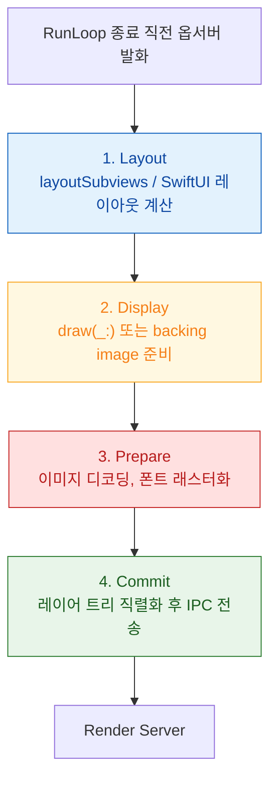

## 레이어 트리는 IPC 로 Render Server 에 커밋된다

### 개념 (What)

`view.frame` 이나 `layer.opacity` 를 바꿔도 화면은 즉시 변하지 않는다. 변경은 **레이어 트리에 기록만 되고**, RunLoop 한 바퀴가 끝날 때 **`CATransaction` 이 커밋**되면서 그 트리가 직렬화되어 Render Server 로 전송된다.

즉 앱 프로세스가 하는 일은 "그리기"가 아니라 **"무엇을 어떻게 그릴지 서술한 트리를 만들어 넘기는 것"** 이다.

### 왜 필요한가 (Why)

1. **같은 프레임의 중복 변경이 합쳐진다**: 한 RunLoop 안에서 같은 속성을 열 번 바꿔도 커밋은 한 번, 전송도 한 번이다.
2. **암시적 애니메이션의 근거**: 레이어 속성 변경이 자동으로 애니메이션되는 것은 커밋 시점에 트랜잭션이 그 변경을 애니메이션으로 해석하기 때문이다.
3. **프레임 예산의 절반이 여기 있다**: 커밋 구간이 프레임 마감을 넘기면 그 프레임은 드롭된다. 이 구간은 **메인 스레드에서, 동기적으로** 실행된다.

### 내부 메커니즘 (How)

커밋은 네 단계로 진행된다.

| 단계 | 하는 일 | 비용이 커지는 원인 |
| :--- | :--- | :--- |
| **Layout** | 프레임 계산 | 깊은 뷰 계층, 복잡한 Auto Layout 제약, 반복 무효화 |
| **Display** | 비트맵 생성 | `draw(_:)` 커스텀 그리기, Core Graphics 사용 |
| **Prepare** | 리소스 준비 | **큰 이미지 디코딩** — 가장 흔한 범인 |
| **Commit** | 직렬화 + 전송 | 레이어 개수가 많을수록 큼 |

#### Prepare 단계가 대표적인 범인인 이유

`UIImage(named:)` 는 파일만 참조하고, **실제 디코딩은 화면에 나타나기 직전 Prepare 단계에서** 일어난다. 즉 큰 JPEG 여러 장이 있는 리스트를 스크롤하면, 디코딩 비용이 전부 메인 스레드의 커밋 구간에 몰린다.

대응은 **디코딩 시점을 옮기는 것**이다.

- 백그라운드에서 미리 디코딩해 두기
- 목표 크기에 맞춰 다운샘플링해서 디코딩 (`CGImageSourceCreateThumbnailAtIndex` 계열)
- SwiftUI/UIKit 의 비동기 이미지 로딩 경로 사용

### 관찰 가능한 증거

- **Instruments의 Time Profiler**: 메인 스레드 스택에서 `CA::Transaction::commit` 아래에 무엇이 있는지 본다. `CGImageSourceCreateImageAtIndex` 계열이 보이면 디코딩 문제다.
- **Instruments의 Animation Hitches**: commit 구간과 Render Server 구간을 시간축에 나란히 보여준다. 어느 쪽이 마감을 넘겼는지 즉시 구분된다.
- **Core Animation 디버그 옵션**: 시뮬레이터/Xcode 에서 색상 오버레이로 offscreen 렌더링과 블렌딩 영역을 시각화할 수 있다.

> [!TIP] 커밋을 명시적으로 제어하기
> `CATransaction.begin()` / `commit()` 으로 트랜잭션을 직접 열면 애니메이션 지속 시간이나 완료 블록을 지정할 수 있고, `CATransaction.setDisableActions(true)` 로 암시적 애니메이션을 끌 수 있다. 대량의 레이어를 한 번에 바꿀 때 불필요한 애니메이션 비용을 없앤다.

### 연관 문서

- [Render Server 는 앱 프로세스와 독립적으로 합성한다](render-server-composition.md)
- [Offscreen 렌더링은 추가 패스와 컨텍스트 전환을 강제한다](offscreen-rendering-cost.md)
- [메인 스레드의 이벤트 처리와 화면 갱신은 RunLoop 한 바퀴 안에서 정해진 순서로 일어난다](../boot-and-runtime/runloop-drives-main-thread.md)
- [apple-rendering-and-media](../../02_ui_frameworks/apple-rendering-and-media.md) - 앱 관점 파이프라인

공식 문서: [Core Animation](https://developer.apple.com/documentation/quartzcore)
