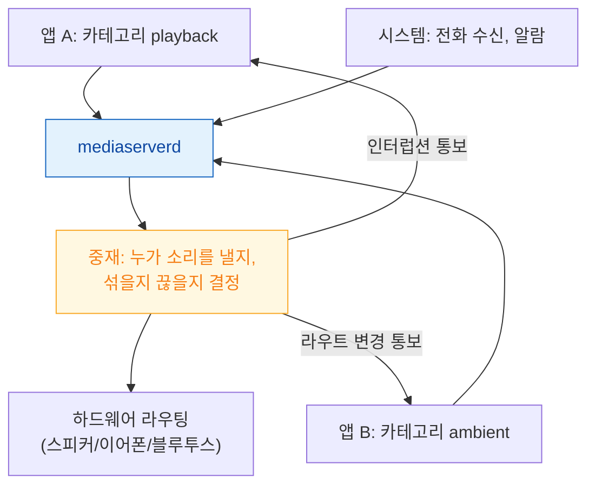

## mediaserverd 가 오디오 라우팅과 하드웨어 코덱을 소유한다

### 개념 (What)

앱은 오디오 하드웨어를 직접 만지지 않는다. **`mediaserverd`** 라는 시스템 데몬이 스피커·마이크·라우팅·하드웨어 코덱을 전부 소유하고, 앱들은 그 데몬에게 **자기 의도를 선언**한 뒤 중재 결과를 받는다.

`AVAudioSession` 은 그 선언 창구다. 카테고리, 모드, 옵션을 설정하는 것은 "이렇게 해 달라"는 **요청**이며, 실제 결과는 다른 앱들과 시스템 상태를 함께 고려한 중재 결과다.

### 왜 필요한가 (Why)

1. **"왜 소리가 안 나지"의 대부분이 여기서 온다**: 코드에 버그가 없어도 세션 카테고리가 맞지 않으면 무음 스위치에 걸리거나 다른 앱에 밀려 소리가 나지 않는다.
2. **인터럽션은 통보다**: 전화가 오면 내 앱의 오디오는 중단된다. 이것은 요청이 아니라 통보이며, 재개는 내가 명시적으로 처리해야 한다.
3. **하드웨어 코덱은 유한하다**: 하드웨어 비디오/오디오 디코더는 개수가 제한된다. 이미 다른 프로세스가 쓰고 있으면 소프트웨어 경로로 떨어지거나 실패한다.

### 내부 메커니즘 (How)



#### 카테고리가 결정하는 것

| 카테고리 | 무음 스위치 | 다른 앱 오디오 | 백그라운드 재생 | 용도 |
| :--- | :--- | :--- | :--- | :--- |
| `ambient` | **따름 (무음됨)** | 섞임 | 불가 | 게임 효과음 |
| `soloAmbient` | 따름 | 중단시킴 | 불가 | 기본값 |
| `playback` | **무시 (소리 남)** | 기본은 중단 | **가능** | 음악·동영상 |
| `record` | — | 중단시킴 | 가능 | 녹음 전용 |
| `playAndRecord` | 무시 | 옵션에 따름 | 가능 | 통화·화상회의 |

"무음 모드인데 소리가 나야 한다"면 `playback` 이어야 하고, "다른 앱 음악을 끊지 말아야 한다"면 `mixWithOthers` 옵션이 필요하다. **이 두 요구는 카테고리 하나로 동시에 표현되지 않으므로 옵션 조합을 봐야 한다.**

#### 반드시 처리해야 하는 통보

| 통보 | 언제 | 처리하지 않으면 |
| :--- | :--- | :--- |
| **Interruption** | 전화, 알람, 다른 앱 선점 | 인터럽션 후 오디오가 영영 재개되지 않음 |
| **Route change** | 이어폰 뽑기, 블루투스 연결 | 이어폰을 뽑았는데 스피커로 계속 재생됨 |
| **Media services reset** | `mediaserverd` 재시작 | **모든 오디오 객체가 무효화됨.** 전체 재구성 필요 |

세 번째가 특히 놓치기 쉽다. `mediaserverd` 가 재시작되면 앱이 들고 있던 오디오 엔진·플레이어·세션이 전부 무효가 된다. 이 통보를 받으면 처음부터 다시 만들어야 한다.

### 관찰 가능한 증거

```bash
# 오디오 세션 중재 로그 (기기 연결 후 macOS 에서)
log stream --device --predicate 'process == "mediaserverd"' --info

# 특정 앱의 오디오 세션 활성화/비활성화 추적
log show --last 5m --predicate 'subsystem == "com.apple.coreaudio"'
```

앱 코드에서는 `AVAudioSession.sharedInstance().currentRoute` 로 현재 실제 라우팅을, `secondaryAudioShouldBeSilencedHint` 로 다른 앱이 재생 중인지를 확인할 수 있다.

### 연관 문서

- [IOSurface 는 프로세스와 GPU 가 함께 보는 메모리다](iosurface-shared-gpu-memory.md)
- [apple-media-pipeline-deep](../../02_ui_frameworks/apple-media-pipeline-deep.md) - AVFoundation 캡처와 재생
- [RunningBoard assertion 이 프로세스의 실행 지속 여부를 결정한다](../ipc-and-process/runningboard-assertions.md) - 백그라운드 오디오가 assertion 으로 표현되는 지점

공식 문서: [AVAudioSession](https://developer.apple.com/documentation/avfaudio/avaudiosession)
