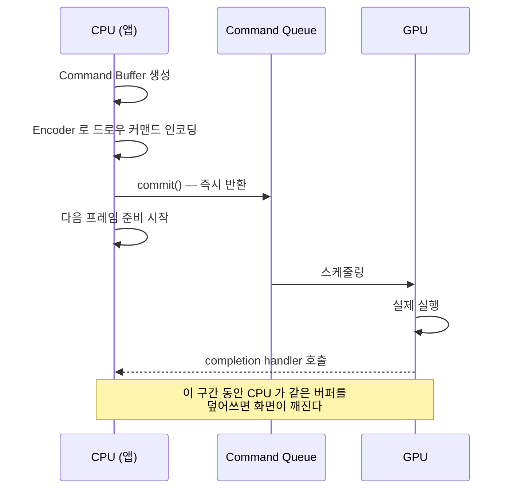

## Metal 커맨드 버퍼는 커밋될 뿐 즉시 실행되지 않는다

### 개념 (What)

Metal 에서 `commandBuffer.commit()` 은 **GPU 에게 일을 제출하는 것**이지 실행을 기다리는 것이 아니다. 함수는 즉시 반환하고, GPU 는 나중에 그 작업을 수행한다.

이 비동기성이 Metal 프로그래밍의 거의 모든 함정의 근원이다. **CPU 가 다음 프레임을 준비하는 동안 GPU 가 이전 프레임을 그리고 있다**는 것을 전제로 자원을 관리해야 한다.

### 왜 필요한가 (Why)

1. **CPU 와 GPU 를 겹쳐 돌리기 위해서**: 매 커밋마다 완료를 기다리면 둘 중 하나는 항상 놀게 된다. 병렬로 돌려야 프레임 예산을 다 쓸 수 있다.
2. **자원 충돌의 원인**: GPU 가 아직 읽고 있는 버퍼를 CPU 가 덮어쓰면 화면이 깨진다. 이 문제가 "가끔 이상하게 그려진다"는 재현 어려운 버그가 된다.
3. **셰이더 컴파일 시점 문제**: 파이프라인 상태 객체를 프레임 도중에 만들면 그 순간 컴파일이 일어나 큰 히치를 만든다.

### 내부 메커니즘 (How)



#### 삼중 버퍼링과 세마포어

표준 해법은 **버퍼를 여러 벌 돌려 쓰고, 세마포어로 앞서 나가는 것을 제한**하는 것이다.

```swift
// 3벌의 동적 버퍼를 순환 사용
let inFlightSemaphore = DispatchSemaphore(value: 3)

func draw() {
    // GPU 가 3프레임 이상 밀려 있으면 여기서 대기
    inFlightSemaphore.wait()

    let commandBuffer = commandQueue.makeCommandBuffer()!
    commandBuffer.addCompletedHandler { _ in
        // GPU 가 이 프레임을 끝냈으므로 슬롯 반환
        inFlightSemaphore.signal()
    }
    // ... 현재 슬롯의 버퍼에만 쓰기 ...
    commandBuffer.commit()   // 기다리지 않음
}
```

- **`value: 3`** 이 핵심이다. CPU 가 GPU 보다 최대 3 프레임까지만 앞서게 한다. 무제한이면 메모리가 늘고 지연이 커진다.
- `waitUntilCompleted()` 를 매 프레임 호출하면 병렬성이 사라진다. **디버깅 용도로만 쓴다.**

#### 파이프라인 상태 객체(PSO)

셰이더와 렌더 상태를 묶어 컴파일해 둔 객체다. 생성 비용이 크므로 **앱 시작 시나 로딩 화면에서 미리 만들어 둔다.** 프레임 도중 생성은 그대로 히치가 된다.

| 자원 | 생성 시점 |
| :--- | :--- |
| `MTLDevice`, `MTLCommandQueue` | 앱 시작 시 한 번 |
| `MTLRenderPipelineState` | 미리 (시작/로딩 시) |
| `MTLBuffer` (동적) | 미리 여러 벌 만들어 순환 사용 |
| `MTLCommandBuffer`, Encoder | **매 프레임** (가볍다) |

### 관찰 가능한 증거

- **Instruments의 Metal System Trace**: CPU 인코딩 구간과 GPU 실행 구간을 시간축에 나란히 보여준다. 둘이 겹치지 않으면 병렬화가 안 되고 있는 것이다.
- **Xcode GPU Frame Capture**: 한 프레임의 모든 드로우 콜, 렌더 패스, 자원 사용을 캡처한다. 렌더 패스 수가 예상보다 많으면 [offscreen 패스](offscreen-rendering-cost.md)가 끼어 있는 것이다.
- **Metal API Validation** (스킴 옵션): 자원 사용 규칙 위반을 런타임에 잡아준다. 개발 중에는 켜 둔다.

### 연관 문서

- [IOSurface 는 프로세스와 GPU 가 함께 보는 메모리다](iosurface-shared-gpu-memory.md)
- [Render Server 는 앱 프로세스와 독립적으로 합성한다](render-server-composition.md)
- [히치는 평균 FPS 가 아니라 사용자가 실제로 본 지연을 잰다](hitches-measure-user-visible-jank.md)

공식 문서: [Metal](https://developer.apple.com/documentation/metal)
