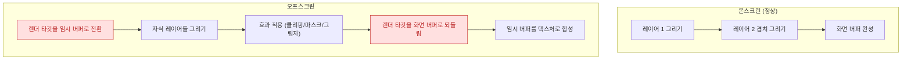

## Offscreen 렌더링은 추가 패스와 컨텍스트 전환을 강제한다

### 개념 (What)

보통 GPU 는 화면 프레임버퍼에 레이어들을 순서대로 겹쳐 그린다(온스크린). 그런데 어떤 효과는 **"먼저 다 그려 놓고 나서 그 결과 전체에 무언가를 적용"** 해야 한다. 이때 GPU 는 임시 버퍼를 만들어 거기 그린 뒤, 효과를 적용하고, 다시 화면 버퍼로 합성한다. 이것이 **offscreen 렌더링**이다.

비용의 본질은 픽셀 계산량이 아니라 **렌더 패스 전환**이다. GPU 는 렌더 타깃을 바꿀 때마다 파이프라인을 비우고 다시 채워야 한다. 타일 기반 GPU 에서 이 비용은 특히 크다.

### 왜 필요한가 (Why)

1. **작아 보이는 코드 한 줄이 프레임을 떨어뜨린다**: `cornerRadius` 와 `masksToBounds` 조합 한 줄이 리스트 셀마다 offscreen 패스를 만들면, 스크롤 시 수십 개의 추가 패스가 매 프레임 발생한다.
2. **원인이 코드에 안 보인다**: 프로파일러의 CPU 시간은 멀쩡하다. GPU 쪽에서만 나타나므로 Time Profiler 로는 찾을 수 없다.

### 무엇이 offscreen 을 유발하는가

| 유발 요인 | 왜 | 대안 |
| :--- | :--- | :--- |
| `cornerRadius` + `masksToBounds`(자식 내용까지 클리핑) | 자식을 다 그린 뒤 잘라야 함 | 미리 둥글게 처리된 이미지 사용, 또는 `CAShapeLayer` 마스크 대신 배경 이미지 |
| 그림자 (`shadowPath` 미지정) | 알파 채널을 분석해 그림자 모양을 계산해야 함 | **`layer.shadowPath` 를 명시**하면 모양을 알려주므로 분석 불필요 |
| `layer.mask` | 마스크 적용 대상을 먼저 완성해야 함 | 가능하면 도형 대신 미리 합성된 이미지 |
| 그룹 불투명도 (`allowsGroupOpacity`) | 자식들을 합친 뒤 알파 적용 | 필요 없으면 끈다 |
| `shouldRasterize` | 정의상 offscreen 버퍼 생성 | **변하지 않는 복잡한 레이어에만** 사용 (아래 참고) |

#### `shouldRasterize` 는 양날의 검

래스터화는 레이어를 비트맵으로 캐시한다. 내용이 자주 안 바뀌는 복잡한 레이어에는 이득이지만, **매 프레임 바뀌는 레이어에 쓰면 매 프레임 캐시를 다시 만들어** 오히려 느려진다. 캐시 적중 여부는 Xcode 의 Core Animation 디버그 옵션에서 색으로 확인할 수 있다.

빨간 두 단계가 실제 비용이다. 그리는 픽셀 수보다 **전환 횟수**가 지배적이다.

### 관찰 가능한 증거

**Xcode 실행 중 Debug 메뉴 또는 시뮬레이터 Debug 메뉴의 Core Animation 옵션:**

| 옵션 | 보여주는 것 |
| :--- | :--- |
| Color Offscreen-Rendered Yellow | offscreen 패스가 발생한 영역 |
| Color Blended Layers | 반투명 합성(오버드로) 영역 |
| Color Hits Green and Misses Red | 래스터화 캐시 적중/실패 |
| Color Misaligned Images | 픽셀 정렬이 안 맞아 리샘플링되는 이미지 |

**Instruments**: Animation Hitches 로 GPU 구간이 마감을 넘기는지 확인하고, Metal System Trace 로 실제 렌더 패스 수를 본다.

> [!TIP] 가장 효과 큰 한 줄
> 그림자를 쓰는 곳에 `layer.shadowPath = UIBezierPath(roundedRect: bounds, cornerRadius: r).cgPath` 를 추가하는 것이 보통 가장 비용 대비 효과가 크다. 알파 분석이 통째로 사라진다.

### 연관 문서

- [Render Server 는 앱 프로세스와 독립적으로 합성한다](render-server-composition.md)
- [히치는 평균 FPS 가 아니라 사용자가 실제로 본 지연을 잰다](hitches-measure-user-visible-jank.md)
- [레이어 트리는 IPC 로 Render Server 에 커밋된다](layer-tree-commit-to-render-server.md)
- [apple-rendering-and-media](../../02_ui_frameworks/apple-rendering-and-media.md) - 앱 관점 렌더링 파이프라인

공식 문서: [Core Animation](https://developer.apple.com/documentation/quartzcore)
