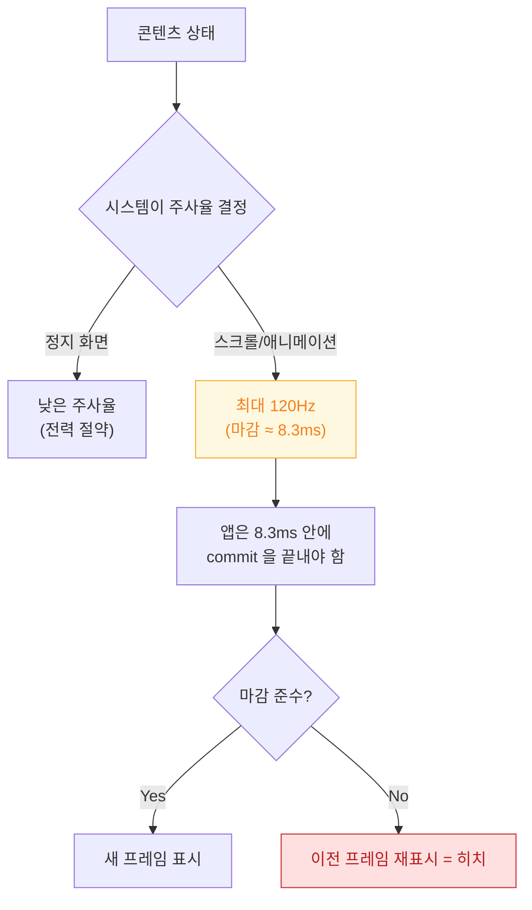

## 가변 주사율에서는 프레임 마감 시각 자체가 달라진다

### 개념 (What)

**ProMotion** 디스플레이는 화면 갱신 주기를 콘텐츠에 맞춰 바꾼다. 정지 화면에서는 매우 낮은 주사율로 내려가 전력을 아끼고, 스크롤이나 애니메이션 중에는 최대 120Hz 까지 올린다.

개발자 관점에서 핵심은 이것이다 — **"한 프레임에 쓸 수 있는 시간"이 고정값이 아니다.** 60Hz 에서는 약 16.7ms 이지만 120Hz 에서는 약 8.3ms 다. 60Hz 기준으로 통과하던 코드가 120Hz 에서는 마감을 넘길 수 있다.

### 왜 필요한가 (Why)

1. **테스트 기기에 따라 결과가 달라진다**: 60Hz 기기에서 부드럽던 것이 120Hz 기기에서 끊길 수 있다. 그 반대는 드물다.
2. **하드코딩된 프레임 시간이 틀린다**: 애니메이션 계산에 `1.0/60.0` 을 상수로 넣으면 가변 주사율에서 어긋난다.
3. **의도적으로 낮춰야 할 때가 있다**: 항상 120Hz 로 도는 것이 좋은 것이 아니다. 초당 30 프레임이면 충분한 콘텐츠를 120Hz 로 갱신하면 전력만 쓴다.

### 내부 메커니즘 (How)



#### `CADisplayLink` 로 마감 시각 알기

프레임 기반 작업(게임 루프, 커스텀 애니메이션)에서는 **다음 프레임이 언제 표시될지**를 시스템에서 받아 써야 한다.

```swift
let link = CADisplayLink(target: self, selector: #selector(step))
// 원하는 프레임률 범위를 선언한다 (최소/최대/선호)
link.preferredFrameRateRange = CAFrameRateRange(minimum: 30, maximum: 120, preferred: 120)
link.add(to: .main, forMode: .common)

@objc func step(_ link: CADisplayLink) {
    // 하드코딩된 1/60 대신 실제 예정 시각을 쓴다
    let frameDuration = link.targetTimestamp - link.timestamp
    advanceAnimation(by: frameDuration)
}
```

- `timestamp`: 직전 프레임이 표시된 시각
- `targetTimestamp`: 지금 준비 중인 프레임이 표시될 예정 시각
- **이 둘의 차이가 이번 프레임의 실제 예산**이다

#### iPhone 에서 120Hz 를 쓰려면

ProMotion 을 지원하는 iPhone 에서 앱이 최대 주사율까지 올라가려면 `Info.plist` 에 명시적 선언이 필요하다(`CADisableMinimumFrameDurationOnPhone`). 선언하지 않으면 상한이 제한된다. 이것은 **의도치 않은 전력 소모를 막기 위한 기본값**이다.

> [!IMPORTANT] 높은 주사율이 항상 좋은 것은 아니다
> `preferredFrameRateRange` 로 필요한 범위만 선언하는 것이 옳다. 동영상 재생처럼 소스 프레임률이 정해진 콘텐츠는 그 값을 선언해야 시스템이 불필요한 갱신을 피한다.

### 관찰 가능한 증거

- **Instruments의 Animation Hitches**: 실제 주사율과 각 프레임의 마감 준수 여부를 함께 보여준다.
- **Xcode Organizer**: 실사용자 기기에서의 스크롤 히치 비율. 기기 모델별로 나뉘므로 120Hz 기기만 나쁜지 확인할 수 있다.

### 연관 문서

- [히치는 평균 FPS 가 아니라 사용자가 실제로 본 지연을 잰다](hitches-measure-user-visible-jank.md)
- [Render Server 는 앱 프로세스와 독립적으로 합성한다](render-server-composition.md)
- [apple-animation-and-motion](../../02_ui_frameworks/apple-animation-and-motion.md) - 애니메이션 설계

공식 문서: [Optimizing ProMotion refresh rates for iPhone 13 Pro and iPad Pro](https://developer.apple.com/documentation/quartzcore/optimizing-promotion-refresh-rates-for-iphone-13-pro-and-ipad-pro)
