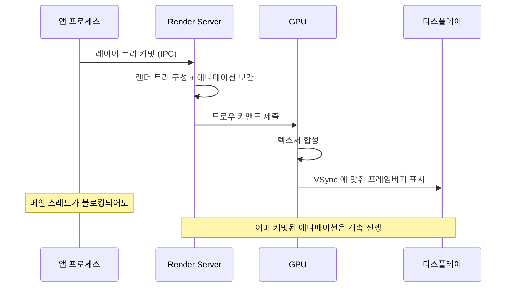

## Render Server 는 앱 프로세스와 독립적으로 합성한다

### 개념 (What)

앱이 커밋한 레이어 트리를 받아 실제로 GPU 합성을 수행하는 것은 **별도 프로세스**다. iOS 에서는 `backboardd`, macOS 에서는 `WindowServer` 가 그 역할을 한다.

이 분리가 만드는 가장 중요한 성질: **이미 커밋된 애니메이션은 앱의 메인 스레드가 막혀도 계속 돈다.** 애니메이션의 매 프레임 값을 앱이 계산하는 것이 아니라, Render Server 가 커밋받은 서술(시작값, 끝값, 타이밍 함수)로부터 스스로 보간하기 때문이다.

### 왜 필요한가 (Why)

1. **"애니메이션은 도는데 터치가 안 먹는다"의 설명**: 메인 스레드가 블로킹되면 새 커밋이 안 나가고 터치도 처리되지 않지만, 이미 넘어간 애니메이션은 Render Server 에서 계속 돈다. 이 현상을 보면 **앱이 살아 있다고 착각하기 쉽다**.
2. **보안 경계**: 다른 앱의 화면 내용에 접근할 수 없는 이유는 합성이 각 앱 프로세스가 아니라 시스템 프로세스에서 일어나기 때문이다.
3. **성능 책임의 분리**: 앱이 아무리 최적화해도 레이어 수가 많으면 Render Server 쪽에서 늦는다. 반대로 Render Server 가 여유로워도 앱의 커밋이 늦으면 프레임이 빠진다.

### 내부 메커니즘 (How)

1. **디코딩**: 받은 트리를 렌더 트리로 변환한다. 이 트리는 앱의 레이어 트리와 별개의 사본이다.
2. **보간**: 애니메이션이 있으면 현재 시각에 맞는 값을 계산한다. 앱은 이 과정에 관여하지 않는다.
3. **합성**: 각 레이어를 텍스처로 다루어 GPU 가 겹쳐 그린다. 레이어가 많고 반투명이 겹칠수록 비싸진다.
4. **표시**: VSync 신호에 맞춰 완성된 프레임버퍼를 화면에 내보낸다. 마감을 놓치면 이전 프레임이 한 번 더 표시된다(= 드롭).

#### 합성 비용을 키우는 것들

| 요인 | 왜 비싼가 |
| :--- | :--- |
| 레이어 개수 | 각각이 드로우 콜과 상태 전환을 만든다 |
| 겹치는 반투명 영역 | 블렌딩은 아래 픽셀을 읽어야 한다 (오버드로) |
| 큰 텍스처 | 메모리 대역폭을 먹는다 |
| [Offscreen 패스](offscreen-rendering-cost.md) | 별도 버퍼 생성과 컨텍스트 전환 |

> [!TIP] 불투명 배경을 명시하라
> `layer.isOpaque = true` 와 불투명 배경색을 지정하면 합성기가 아래를 읽지 않아도 된다. 반대로 배경이 투명한 뷰가 많이 겹치면 오버드로가 급증한다. Xcode 의 Core Animation 디버그 옵션에서 블렌딩 영역을 색으로 확인할 수 있다.

### 관찰 가능한 증거

- **Instruments의 Animation Hitches**: 앱의 commit 구간과 Render Server 구간을 나란히 표시한다. 어느 쪽이 마감을 넘겼는지 여기서 확정한다.
- **Core Animation 디버그 색상**(Xcode/시뮬레이터): 블렌딩 영역, offscreen 렌더링, 래스터화 캐시 적중 여부를 색으로 오버레이한다.
- **Metal System Trace**: GPU 쪽 실제 작업 시간을 본다.

### 연관 문서

- [레이어 트리는 IPC 로 Render Server 에 커밋된다](layer-tree-commit-to-render-server.md)
- [히치는 평균 FPS 가 아니라 사용자가 실제로 본 지연을 잰다](hitches-measure-user-visible-jank.md)
- [가변 주사율에서는 프레임 마감 시각 자체가 달라진다](promotion-variable-refresh-deadline.md)
- [SpringBoard 와 FrontBoard 가 앱의 전경·배경 전이를 소유한다](../ipc-and-process/springboard-frontboard-lifecycle.md)

공식 문서: [WWDC 2018: Advanced Debugging with Xcode and LLDB / Core Animation 세션 자료](https://developer.apple.com/videos/graphics-and-games/)
