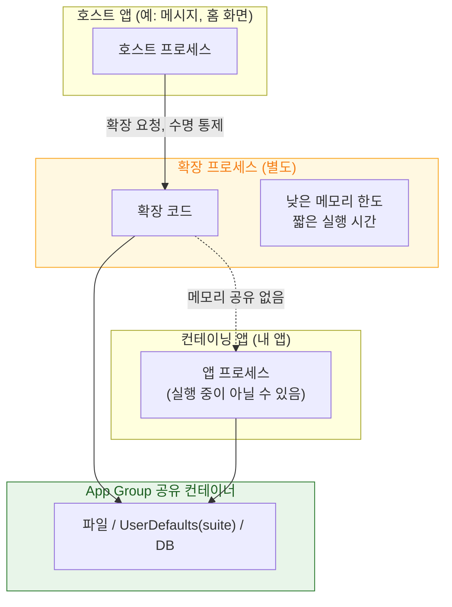

## 앱 확장은 호스트가 수명을 쥔 별도 프로세스다

### 개념 (What)

위젯, 공유 시트, 알림 서비스, 키보드 같은 **앱 확장(App Extension)** 은 내 앱 안에서 도는 코드가 아니다. **별도 프로세스**이며, 다음이 전부 독립적이다.

- 자기 번들, 자기 코드 서명, 자기 entitlement
- 자기 sandbox 컨테이너
- **호스트 앱보다 훨씬 낮은 자기 메모리 한도**
- 자기 수명 — 그런데 그 수명을 통제하는 것은 내 앱이 아니라 **확장을 띄운 호스트와 시스템**이다

컨테이닝 앱(확장을 담고 있는 내 앱)과 확장은 **서로의 메모리를 전혀 공유하지 않는다.** 싱글턴도, 전역 변수도, 캐시도 공유되지 않는다.

### 왜 필요한가 (Why)

1. **"확장에서만 안 된다"의 원인**: 컨테이닝 앱에서 잘 되던 코드가 확장에서 죽거나 실패하는 것은 대부분 메모리 한도나 sandbox 차이 때문이다. 같은 프로세스라고 가정하면 원인을 찾을 수 없다.
2. **데이터 공유 방법이 제한된다**: 두 프로세스이므로 데이터는 **App Group 공유 컨테이너**나 Keychain 공유 그룹을 통해야 한다.
3. **한도가 훨씬 빡빡하다**: 이미지 한 장 디코딩이 컨테이닝 앱에서는 문제없지만 확장에서는 즉시 종료 사유가 될 수 있다.

### 내부 메커니즘 (How)



#### 확장 종류별 제약의 성격

| 확장 | 실행 계기 | 주된 제약 |
| :--- | :--- | :--- |
| **위젯 (WidgetKit)** | 시스템이 타임라인에 따라 갱신 | 매우 짧은 실행, 낮은 메모리, 네트워크는 최소로 |
| **알림 서비스** | 푸시 도착 시 | **수 초 내 완료 필수**. 초과 시 원본 알림이 그대로 표시됨 |
| **공유 / 액션** | 사용자가 공유 시트에서 선택 | 호스트 앱이 화면을 소유 |
| **키보드** | 사용자가 키보드 전환 | 기본적으로 네트워크 차단 (Full Access 필요) |

> [!WARNING] 메모리 한도를 상수로 외우지 않는다
> 확장별 메모리 한도는 널리 인용되는 수치들이 있지만 **공개된 계약값이 아니며** OS 버전과 기기에 따라 달라진다. 반드시 최저 사양 지원 기기에서 실측한다. 특히 이미지 디코딩과 대용량 JSON 파싱이 한도를 넘기는 대표적 원인이다.

#### 데이터 공유 시 함정

- **`UserDefaults.standard` 는 공유되지 않는다.** App Group suite 를 써야 한다.
- **SQLite/Core Data 를 공유 컨테이너에 두면 잠금 충돌이 난다.** 확장이 잠금을 쥔 채 정지되면 컨테이닝 앱이 [`0xdead10cc`](watchdog-termination-codes.md) 로 죽을 수 있다.
- 파일 접근 조정은 [NSFileCoordinator](../storage/file-coordination-across-processes.md) 로 한다.

### 관찰 가능한 증거

Xcode 에서 확장을 디버깅하려면 **확장 스킴을 선택해 실행**하고 호스트 앱을 지정해야 한다. 컨테이닝 앱 스킴으로 실행하면 확장 프로세스에는 디버거가 붙지 않는다.

```bash
# 확장 프로세스의 종료 로그
log stream --device --predicate 'process == "runningboardd"' --info | grep -i extension
```

### 연관 문서

- [XPC 서비스는 별도 프로세스이자 별도 sandbox 이므로 크래시가 전파되지 않는다](xpc-service-isolation.md)
- [Jetsam 은 LRU 가 아니라 우선순위 밴드로 죽일 대상을 고른다](jetsam-memory-pressure-bands.md)
- [NSFileCoordinator 는 프로세스 간 파일 접근을 조정한다](../storage/file-coordination-across-processes.md)
- [apple-widgets-live-activities](../../02_ui_frameworks/apple-widgets-live-activities.md) - WidgetKit 구현

공식 문서: [App extensions](https://developer.apple.com/documentation/foundation/app-extensions)
