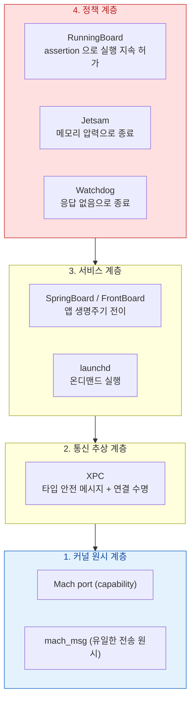

## 앱 프로세스의 통신과 수명은 Mach port, XPC, assertion, Jetsam 네 계층이 나눠 소유한다

"앱이 백그라운드에서 예고 없이 사라졌다"는 하나의 현상이지만 원인 계층은 넷이다. **assertion 이 없어서 재워진 것**, **Jetsam 이 메모리 때문에 죽인 것**, **워치독이 응답 없음으로 죽인 것**, **사용자가 강제 종료한 것**은 각각 다른 로그와 다른 처방을 갖는다. 이 클러스터는 그 계층을 나눈다.

### 1 계층 — 커널 원시 (모든 IPC 의 바닥)

- [Mach port 는 이름이 아니라 커널이 소유한 능력(capability)이다](mach-port-is-a-capability.md)
- [mach_msg 는 모든 상위 IPC 가 결국 통과하는 단일 전송 원시다](mach-msg-primitive.md)

### 2 계층 — XPC (앱이 실제로 쓰는 추상)

- [XPC 연결은 launchd 가 중개하며 상대가 죽으면 함께 무효화된다](xpc-connection-lifetime.md)
- [XPC 서비스는 별도 프로세스이자 별도 sandbox 이므로 크래시가 전파되지 않는다](xpc-service-isolation.md)

### 3 계층 — 생명주기 중재

- [SpringBoard 와 FrontBoard 가 앱의 전경·배경 전이를 소유한다](springboard-frontboard-lifecycle.md)
- [앱 확장은 호스트가 수명을 쥔 별도 프로세스다](app-extension-process-model.md)

### 4 계층 — 종료 정책 (앱이 사라지는 네 가지 이유)

- [RunningBoard assertion 이 프로세스의 실행 지속 여부를 결정한다](runningboard-assertions.md)
- [Jetsam 은 LRU 가 아니라 우선순위 밴드로 죽일 대상을 고른다](jetsam-memory-pressure-bands.md)
- [워치독 종료는 예외 코드로 원인 구간을 구분할 수 있다](watchdog-termination-codes.md)

### 진단 순서

1. 크래시 리포트가 있는가? 있으면 **예외 코드**를 먼저 본다 → [워치독 종료 코드](watchdog-termination-codes.md)
2. 크래시 리포트 대신 `JetsamEvent` 로그가 있는가? → [Jetsam](jetsam-memory-pressure-bands.md)
3. 둘 다 없이 그냥 사라졌는가? → assertion 만료로 정상 종료(suspend 후 회수)일 가능성이 높다 → [RunningBoard](runningboard-assertions.md)
4. `ApplicationExitInfo` 에 해당하는 것으로 iOS 에서는 `MXAppExitMetric`(MetricKit)이 종료 사유 분포를 집계한다.

### 경계

- `BGTaskScheduler` 로 백그라운드 작업을 **어떻게 예약하는지**는 [apple-background-tasks](../../04_system_services/apple-background-tasks.md) 에 둔다. 이 클러스터는 그 작업이 왜 실행되지 못하고 죽는지를 다룬다.
- 앱 관점의 XPC API 사용법은 [apple-interprocess-and-xpc](../../04_system_services/apple-interprocess-and-xpc.md) 에 둔다.

### 연관 문서

- [launchd 는 PID 1 로서 모든 프로세스의 조상이며 선언에 따라 필요할 때만 데몬을 띄운다](../boot-and-runtime/launchd-is-pid-1.md)
- [메모리 압축기는 iOS 에서 디스크 스왑을 대체한다](../kernel-and-driver/memory-compressor-and-swap.md)
- [apple-ios-system](../../07_platforms/apple-ios-system.md) - iOS 셸과 자원 회수 개괄
