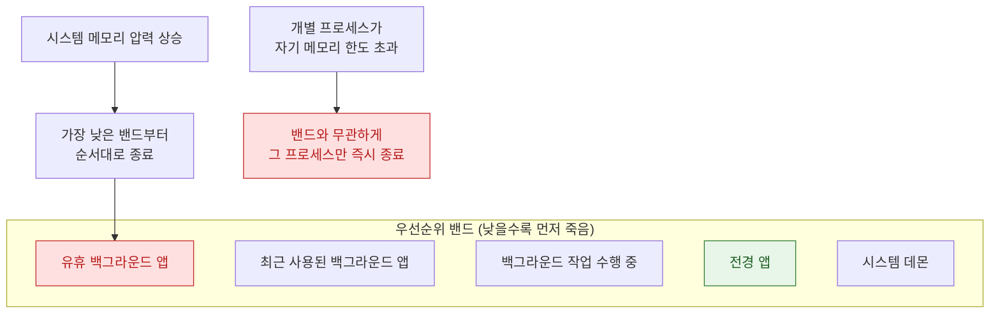

## Jetsam 은 LRU 가 아니라 우선순위 밴드로 죽일 대상을 고른다

### 개념 (What)

**Jetsam** 은 메모리가 부족할 때 프로세스를 종료해 페이지를 회수하는 커널 메커니즘이다. 데스크톱 유닉스의 OOM Killer 와 목적은 같지만 선택 기준이 다르다 — **"메모리를 가장 많이 쓰는 프로세스"나 "가장 오래 안 쓴 프로세스"가 아니라, 미리 정해진 우선순위 밴드에서 가장 낮은 것부터** 죽인다.

Jetsam 이 발동하는 경로는 두 가지이며, 이 둘을 구분하는 것이 진단의 출발점이다.

### 왜 필요한가 (Why)

1. **스왑 없는 환경의 전제**: iOS 는 전통적으로 디스크 스왑을 쓰지 않는다. 메모리가 부족하면 압축하고, 그래도 부족하면 종료하는 것 외에 선택지가 없다.
2. **전경 앱 보호**: 사용자가 지금 보고 있는 앱은 마지막까지 살려야 한다. 우선순위 밴드는 이 보장을 구조적으로 제공한다.
3. **두 가지 실패의 처방이 다르다**: 내 앱만 죽는 문제와 시스템 전체가 압력을 받는 문제는 완전히 다른 대응이 필요하다.

### 내부 메커니즘 (How)



#### 두 가지 종료 경로

| 경로 | 로그의 사유 | 의미 | 대응 |
| :--- | :--- | :--- | :--- |
| **시스템 메모리 부족** | `vm-pageshortage` 등 | 시스템 전체가 압력을 받아 낮은 밴드부터 회수 | 전체 사용량을 줄이고, 백그라운드 진입 시 캐시를 비운다 |
| **개별 한도 초과** | `per-process-limit` | **내 프로세스 하나가** 허용된 상한을 넘음 | 피크 사용량을 줄인다. 다른 앱 상황과 무관 |

`per-process-limit` 은 특히 중요하다. 기기 전체 메모리에 여유가 있어도 **그 프로세스에 허용된 한도**를 넘으면 죽는다. 앱 확장은 호스트 앱보다 훨씬 낮은 한도를 갖는다.

> [!WARNING] 한도 수치를 상수로 외우지 않는다
> 프로세스별 메모리 한도는 기기 모델, OS 버전, 프로세스 종류(앱 / 확장 / 위젯)에 따라 다르며 공개된 계약값이 아니다. **실제 대상 기기에서 측정**해야 하고, 특히 가장 낮은 사양의 지원 기기에서 확인해야 한다.

### 관찰 가능한 증거

**기기에서 직접**: `설정 > 개인정보 보호 및 보안 > 분석 및 향상 > 분석 데이터` 에서 `JetsamEvent-*.ips` 파일을 찾는다. 여기에 종료 사유와 당시 각 프로세스의 메모리 사용량이 들어 있다.

**Xcode/Instruments 에서**:

```
Instruments > Allocations : 힙 증가 추이와 누수 후보
Instruments > VM Tracker  : 더티 메모리와 물리 메모리 실사용
Xcode Debug Navigator     : 실행 중 메모리 게이지
```

`footprint`(macOS) 나 `vmmap` 으로 **dirty memory** 를 확인하는 것이 핵심이다. Jetsam 이 보는 것은 총 할당량이 아니라 회수할 수 없는 더티 페이지다.

**MetricKit**: `MXAppExitMetric` 의 `cumulativeMemoryResourceLimitExitCount` 가 실사용자 기기에서의 한도 초과 종료 횟수를 준다.

### 연관 문서

- [메모리 압축기는 iOS 에서 디스크 스왑을 대체한다](../kernel-and-driver/memory-compressor-and-swap.md)
- [RunningBoard assertion 이 프로세스의 실행 지속 여부를 결정한다](runningboard-assertions.md)
- [앱 확장은 호스트가 수명을 쥔 별도 프로세스다](app-extension-process-model.md)
- [apple-memory-management](../../01_language_concurrency/apple-memory-management.md) - ARC 와 앱 수준 메모리 최적화

공식 문서: [Diagnosing memory, thread, and crash issues early](https://developer.apple.com/documentation/xcode/diagnosing-memory-thread-and-crash-issues-early)
