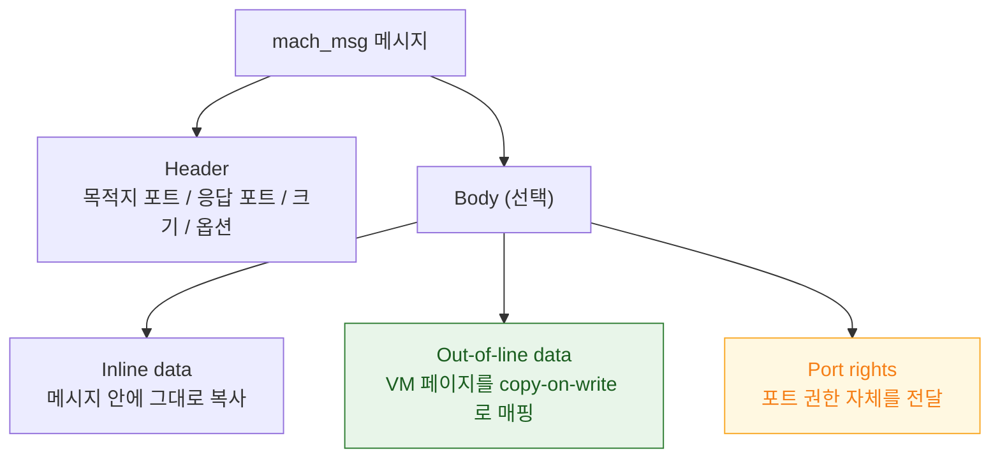

## mach_msg 는 모든 상위 IPC 가 결국 통과하는 단일 전송 원시다

### 개념 (What)

**`mach_msg`** 는 Mach 의 메시지 송수신을 담당하는 **단 하나의 시스템 콜**이다. 송신과 수신이 별개의 함수가 아니라, 플래그로 "보내기", "받기", "보내고 응답 기다리기"를 지정하는 하나의 호출이다.

XPC, `NSXPCConnection`, `dispatch` 의 일부, RunLoop 의 슬립, 심지어 커널 서비스 호출까지 — Apple 플랫폼의 프로세스 간 통신은 거의 전부 이 하나의 함수로 수렴한다.

### 왜 필요한가 (Why)

1. **왕복 1 회 최적화**: 요청을 보내고 응답을 기다리는 것이 두 번의 시스템 콜이면 컨텍스트 스위치가 두 배다. `MACH_SEND_MSG | MACH_RCV_MSG` 조합은 이것을 한 번에 처리한다.
2. **대용량 전송의 무복사**: 큰 데이터를 메시지에 그대로 담으면 복사 비용이 크다. Mach 는 이를 **가상 메모리 매핑 이전**으로 처리한다.
3. **RunLoop 슬립의 정체**: 메인 스레드가 유휴 상태일 때 실제로 하는 일은 `mach_msg` 로 커널에서 대기하는 것이다. 스택 트레이스에 `mach_msg_trap` 이 최상단에 보이면 그것은 **정상적으로 잠든 상태**이지 행(hang)이 아니다.

### 내부 메커니즘 (How)

#### 메시지 구조

| 전달 방식 | 동작 | 언제 |
| :--- | :--- | :--- |
| **Inline** | 메시지 버퍼에 바이트 복사 | 작은 데이터 |
| **Out-of-line** | 물리 페이지를 수신자 주소 공간에 copy-on-write 매핑. **실제 복사는 쓰기가 일어날 때까지 지연** | 큰 데이터 |
| **Port right** | 포트 권한 자체를 이동/복제 | 권한 위임, 응답 경로 전달 |

out-of-line 전송이 핵심이다. 수 MB 데이터를 보내도 물리 복사가 즉시 일어나지 않는다. 안드로이드 Binder 가 `mmap` 으로 1 회 복사를 달성한 것과 목적은 같지만, Mach 는 **VM 매핑 이전**이라 원리적으로 0 회 복사에 가깝다.

#### MIG: 스텁 생성기

`mach_msg` 를 손으로 쓰는 것은 오류가 나기 쉽다. **MIG(Mach Interface Generator)** 는 인터페이스 정의(`.defs`)로부터 클라이언트/서버 스텁 코드를 생성한다. 커널 서비스 호출의 상당수가 MIG 로 생성된 스텁을 거친다.

### 실무적 귀결 (스택 트레이스 읽기)

| 스택 최상단 | 의미 |
| :--- | :--- |
| `mach_msg_trap` + RunLoop 프레임 | **정상 유휴**. CPU 를 쓰지 않고 잠들어 있다 |
| `mach_msg_trap` + XPC 프레임 | 동기 XPC 응답 대기 중. **상대가 느리면 여기서 블로킹된다** |
| `MACH_SEND_INVALID_DEST` | 상대 프로세스가 이미 죽어 포트가 무효 |
| `MACH_RCV_TIMED_OUT` | 응답 대기 타임아웃 |

> [!IMPORTANT] 메인 스레드의 동기 XPC
> 메인 스레드에서 동기 XPC 호출을 하면 상대 데몬이 느릴 때 그대로 UI 가 멈춘다. 스택에서 `mach_msg_trap` 아래에 XPC 프레임이 보이는 행(hang)은 대부분 이 패턴이다.

### 연관 문서

- [Mach port 는 이름이 아니라 커널이 소유한 능력(capability)이다](mach-port-is-a-capability.md)
- [XPC 연결은 launchd 가 중개하며 상대가 죽으면 함께 무효화된다](xpc-connection-lifetime.md)
- [메인 스레드의 이벤트 처리와 화면 갱신은 RunLoop 한 바퀴 안에서 정해진 순서로 일어난다](../boot-and-runtime/runloop-drives-main-thread.md)
- [Mach VM 은 영역 단위로 매핑하고 물리 페이지 할당을 미룬다](../kernel-and-driver/mach-vm-and-memory-regions.md)

공식 문서: [Mach Overview (Kernel Programming Guide)](https://developer.apple.com/library/archive/documentation/Darwin/Conceptual/KernelProgramming/Mach/Mach.html)
