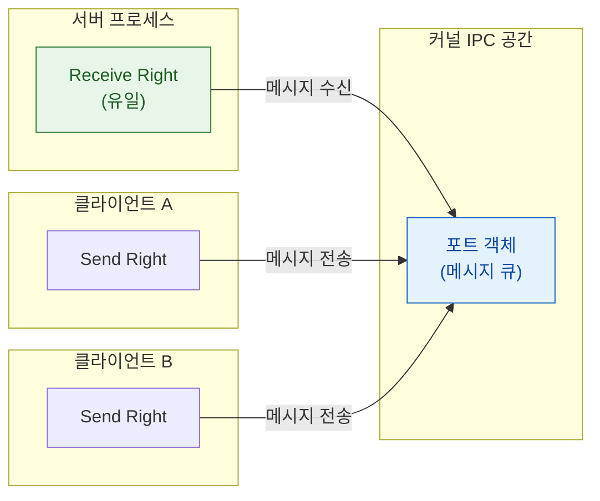

## Mach port 는 이름이 아니라 커널이 소유한 능력(capability)이다

### 개념 (What)

**Mach port** 는 커널이 소유하고 관리하는 **메시지 큐 객체**다. 사용자 공간 프로세스는 이 객체를 직접 보지 못하고, 자기 프로세스 안에서만 유효한 정수 **포트 이름(port name)** 으로 참조한다. 파일 디스크립터와 같은 구조다 — 숫자 3 이 프로세스마다 다른 파일을 가리키듯, 포트 이름 0x1234 도 프로세스마다 다른 포트를 가리킨다.

핵심은 이것이 **능력(capability)** 이라는 점이다. 포트 이름을 가지고 있다는 사실 자체가 곧 권한이다. 별도의 접근 제어 목록을 조회하지 않는다.

### 왜 필요한가 (Why)

1. **위조 불가능한 신원**: 포트 권한은 커널을 통해서만 얻을 수 있다. 정수를 추측해서 남의 서비스에 접근할 수 없다. 없는 이름은 그냥 유효하지 않다.
2. **권한 위임의 단위**: 포트 권한 자체를 메시지에 담아 다른 프로세스에 넘길 수 있다. "이 자원에 접근할 권리를 너에게 준다"가 하나의 동작으로 표현된다.
3. **수명 추적**: 수신 권한을 가진 프로세스가 죽으면 커널이 그 사실을 송신자들에게 알려줄 수 있다. XPC 연결이 상대의 죽음을 감지하는 근거다.

### 내부 메커니즘 (How)

#### 세 종류의 포트 권한

| 권한 | 개수 제약 | 의미 |
| :--- | :--- | :--- |
| **Receive right** | **포트당 정확히 하나** | 이 포트의 메시지를 꺼내 갈 수 있다. 사실상 소유권 |
| **Send right** | 여러 개 가능 | 이 포트로 메시지를 보낼 수 있다 |
| **Send-once right** | 1 회용 | 정확히 한 번만 보낼 수 있다. 응답용으로 쓰인다 |

- **수신 권한이 하나뿐**이라는 제약이 서비스의 정체성을 보장한다. 두 프로세스가 같은 서비스인 척할 수 없다.
- **send-once** 는 요청-응답 패턴에서 응답 경로로 쓰인다. 한 번 쓰면 소멸하므로 응답이 중복될 수 없고, 서버가 응답 없이 죽으면 커널이 대신 죽음 알림을 보낸다.

#### 부트스트랩: 첫 포트는 어디서 오나

포트 권한은 이미 가진 포트를 통해서만 전달받을 수 있다. 그러면 최초의 포트는 어떻게 얻는가? 프로세스는 생성될 때 **부트스트랩 포트**를 물려받고, 그 포트를 통해 `launchd` 에게 "이 이름의 서비스를 달라"고 요청한다. `launchd` 가 해당 서비스의 send right 를 응답으로 돌려준다.

이것이 [launchd 의 온디맨드 실행](../boot-and-runtime/launchd-is-pid-1.md)과 맞물리는 지점이다 — 요청이 오는 순간 서비스 프로세스가 없으면 그때 띄운다.

### 실무적 귀결

- 앱 개발자가 Mach port 를 직접 다루는 일은 거의 없다. **XPC 가 이 위의 추상**이고, `DispatchSource`, `NSMachPort`, 그리고 RunLoop 의 슬립/웨이크업도 전부 이 위에 있다.
- 다만 크래시 로그에 `mach_msg_trap` 이나 `MACH_SEND_INVALID_DEST` 가 보이면 **상대 프로세스가 이미 죽어 포트가 무효화된 상태**라는 뜻이다.

### 연관 문서

- [mach_msg 는 모든 상위 IPC 가 결국 통과하는 단일 전송 원시다](mach-msg-primitive.md)
- [XPC 연결은 launchd 가 중개하며 상대가 죽으면 함께 무효화된다](xpc-connection-lifetime.md)
- [XNU 는 Mach 가 자원을, BSD 가 인터페이스를 맡는 분업 구조다](../kernel-and-driver/xnu-mach-bsd-split.md)
- [binder-kernel-driver](../../../android/01_system_internals/ipc-and-process/binder-kernel-driver.md) - 안드로이드 대응: Binder 의 handle 과 커널 UID 주입

공식 문서: [Mach Overview (Kernel Programming Guide)](https://developer.apple.com/library/archive/documentation/Darwin/Conceptual/KernelProgramming/Mach/Mach.html)
