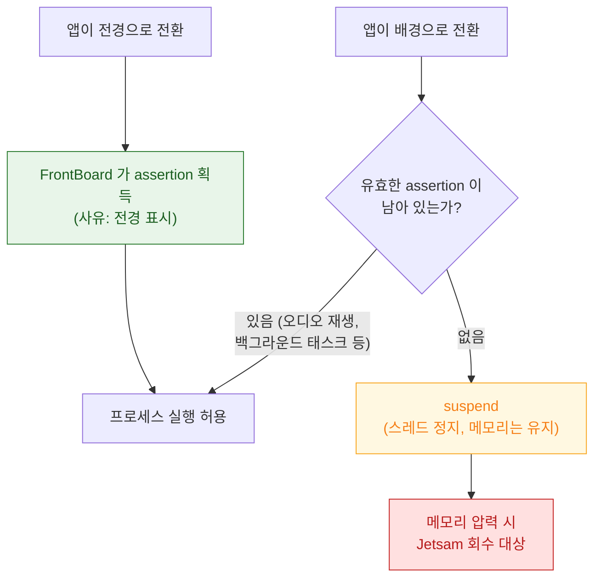

## RunningBoard assertion 이 프로세스의 실행 지속 여부를 결정한다

### 개념 (What)

iOS 에서 프로세스는 **"실행 중이면 계속 실행된다"가 기본값이 아니다.** 실행을 계속하려면 그 이유를 설명하는 **assertion** 이 있어야 하고, assertion 이 없어지면 시스템은 프로세스를 정지(suspend)시키거나 종료한다.

**RunningBoard** 는 이 assertion 을 중앙에서 관리하는 시스템 데몬이다. iOS 13 부터 이전의 분산된 관리 방식을 대체했으며, "누가, 왜, 얼마나 이 프로세스를 살려 두기를 원하는가"를 한곳에서 판정한다.

### 왜 필요한가 (Why)

1. **"앱이 그냥 사라졌다"의 정체**: 크래시 로그도 Jetsam 로그도 없이 앱이 사라졌다면, 대부분 **assertion 이 만료되어 정상적으로 정지된 뒤 회수된 것**이다. 이것은 버그가 아니라 설계된 동작이다.
2. **배터리 정책의 집행 지점**: 백그라운드 실행 시간, 위치 접근 지속, 오디오 재생 유지가 전부 assertion 으로 표현된다. 정책이 코드 여기저기가 아니라 한곳에서 판정된다.
3. **디버깅 가능성**: 종료 사유가 "메모리 부족" 같은 뭉뚱그린 말이 아니라 "어떤 assertion 이 언제 만료되었는가"로 기록된다.

### 내부 메커니즘 (How)



assertion 은 단순한 on/off 가 아니라 **무엇을 허용하는지**까지 담는다.

| assertion 이 표현하는 것 | 예 |
| :--- | :--- |
| 실행 지속 여부 | 전경 표시 중, 백그라운드 태스크 진행 중 |
| CPU 사용 허용 수준 | 전경 우선순위 vs 배경 제한 |
| 자원 접근 허용 | 위치 갱신 지속, 오디오 세션 유지 |
| 유효 기간 | 만료 시각 (백그라운드 태스크의 제한 시간) |

#### `beginBackgroundTask` 의 실체

앱이 `beginBackgroundTask(expirationHandler:)` 를 호출하면, 그것은 **assertion 을 하나 요청하는 것**이다. 만료 핸들러가 불리는 시점은 RunningBoard 가 "이 assertion 의 유효 기간이 끝났다"고 판정한 시점이다. 여기서 정리하지 않으면 다음은 강제 종료다.

> [!IMPORTANT] 정지(suspend)와 종료(terminate)의 차이
> **정지**는 스레드만 멈추고 메모리는 그대로 남는다. 다시 전경으로 오면 상태가 그대로 복원된다. **종료**는 프로세스가 사라진다. 사용자에게는 둘 다 "앱이 다시 열렸다"로 보이지만, 종료된 경우 상태 복원 코드가 실행되어야 한다. 상태 복원을 테스트하려면 정지가 아니라 종료를 재현해야 한다.

### 관찰 가능한 증거

```bash
# RunningBoard 판정 로그 (기기 연결 후 macOS 에서)
log stream --device --predicate 'process == "runningboardd"' --info

# 종료 사유를 담은 로그 검색
log show --last 10m --predicate 'eventMessage CONTAINS "RBSAssertion"'
```

MetricKit 의 `MXAppExitMetric` 은 실사용자 기기에서 **정상 종료 / 워치독 / 메모리 압력 / 강제 종료** 분포를 집계해 준다. 개발 기기 재현이 어려운 종료 원인은 여기서 먼저 비율을 본다.

### 연관 문서

- [Jetsam 은 LRU 가 아니라 우선순위 밴드로 죽일 대상을 고른다](jetsam-memory-pressure-bands.md)
- [SpringBoard 와 FrontBoard 가 앱의 전경·배경 전이를 소유한다](springboard-frontboard-lifecycle.md)
- [워치독 종료는 예외 코드로 원인 구간을 구분할 수 있다](watchdog-termination-codes.md)
- [apple-background-tasks](../../04_system_services/apple-background-tasks.md) - 백그라운드 작업 예약 API

공식 문서: [Preparing your UI to run in the background](https://developer.apple.com/documentation/uikit/preparing-your-ui-to-run-in-the-background)
