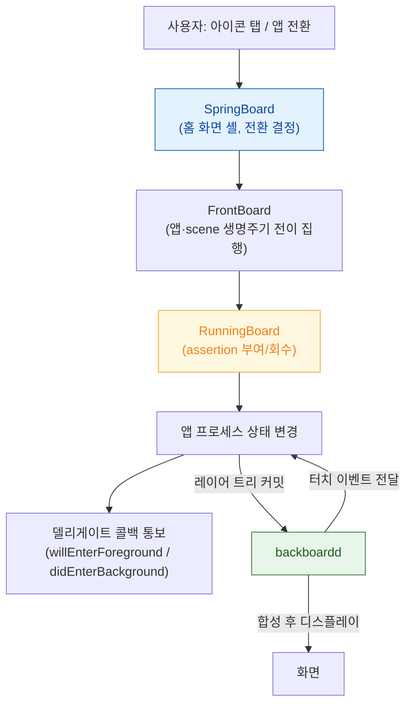

## SpringBoard 와 FrontBoard 가 앱의 전경·배경 전이를 소유한다

### 개념 (What)

iOS 에서 앱은 **자기 생명주기를 스스로 결정하지 않는다.** 홈 화면 셸인 **SpringBoard** 가 사용자 입력을 받아 앱 전환을 결정하고, **FrontBoard** 가 그 결정을 앱 프로세스의 상태 전이로 옮긴다. 앱이 받는 `sceneWillEnterForeground` 같은 콜백은 **결정이 아니라 통보**다.

한편 **backboardd** 는 이벤트 라우팅과 디스플레이를 담당하는 별도 데몬이다. 터치가 어느 앱으로 갈지를 정하고, 앱이 커밋한 레이어 트리를 실제로 합성한다.

### 왜 필요한가 (Why)

1. **콜백은 요청이 아니라 결과다**: "백그라운드로 가지 않겠다"는 선택지가 없다. `applicationDidEnterBackground` 에서 할 수 있는 것은 정리뿐이며, 여기서 오래 걸리면 [워치독](watchdog-termination-codes.md)에 걸린다.
2. **입력 경로와 렌더링 경로가 별개 프로세스**: 터치가 안 먹는 문제와 화면이 안 그려지는 문제는 서로 다른 데몬의 문제다.
3. **Scene 이 앱보다 작은 단위**: iPadOS 멀티윈도우 이후 생명주기 주체는 앱이 아니라 scene 이다. 앱 하나가 전경 scene 과 배경 scene 을 동시에 가질 수 있다.

### 내부 메커니즘 (How)



#### 상태 전이와 그 의미

| 상태 | 실행 | 메모리 | 화면 |
| :--- | :--- | :--- | :--- |
| **Foreground Active** | 실행, 이벤트 수신 | 유지 | 표시 |
| **Foreground Inactive** | 실행, 이벤트 미수신 | 유지 | 표시 (전환 중, 알림 오버레이 등) |
| **Background** | 제한 시간 동안만 실행 | 유지 | 비표시 |
| **Suspended** | **정지** | 유지 | 비표시 |
| **Not Running** | 없음 | 회수됨 | 비표시 |

배경 전환 직후 시스템은 **스냅샷**을 찍는다. 앱 전환기에 보이는 화면이 그것이다. 이 시점에 민감한 정보가 화면에 있으면 스냅샷에 남으므로, 배경 전환 시 가리는 처리가 필요하다.

> [!IMPORTANT] Suspended 는 콜백이 없다
> `Background` → `Suspended` 전이에는 별도 콜백이 없다. 마지막으로 실행되는 코드는 `didEnterBackground` 다. 여기서 파일 핸들이나 데이터베이스 잠금을 정리하지 않으면 [`0xdead10cc` 종료](watchdog-termination-codes.md)로 이어진다.

### 관찰 가능한 증거

```bash
# 앱 생명주기 전이 로그 (기기 연결 후)
log stream --device --predicate 'process == "SpringBoard" OR process == "runningboardd"' --info

# 특정 번들 ID 관련 전이만
log show --last 5m --predicate 'eventMessage CONTAINS "com.example.myapp"'
```

**정지가 아니라 종료를 재현하려면**: Xcode 로 실행한 상태에서는 디버거가 붙어 있어 정지/종료 동작이 실제와 다르다. 상태 복원 테스트는 Xcode 를 분리한 뒤 앱을 배경으로 보내고 다른 앱들로 메모리 압력을 만들어야 한다.

### 연관 문서

- [RunningBoard assertion 이 프로세스의 실행 지속 여부를 결정한다](runningboard-assertions.md)
- [워치독 종료는 예외 코드로 원인 구간을 구분할 수 있다](watchdog-termination-codes.md)
- [Render Server 는 앱 프로세스와 독립적으로 합성한다](../graphics-and-media/render-server-composition.md)
- [apple-app-lifecycle-and-ui](../../02_ui_frameworks/apple-app-lifecycle-and-ui.md) - Scene 기반 앱 구조

공식 문서: [Managing your app's life cycle](https://developer.apple.com/documentation/uikit/managing-your-app-s-life-cycle)
