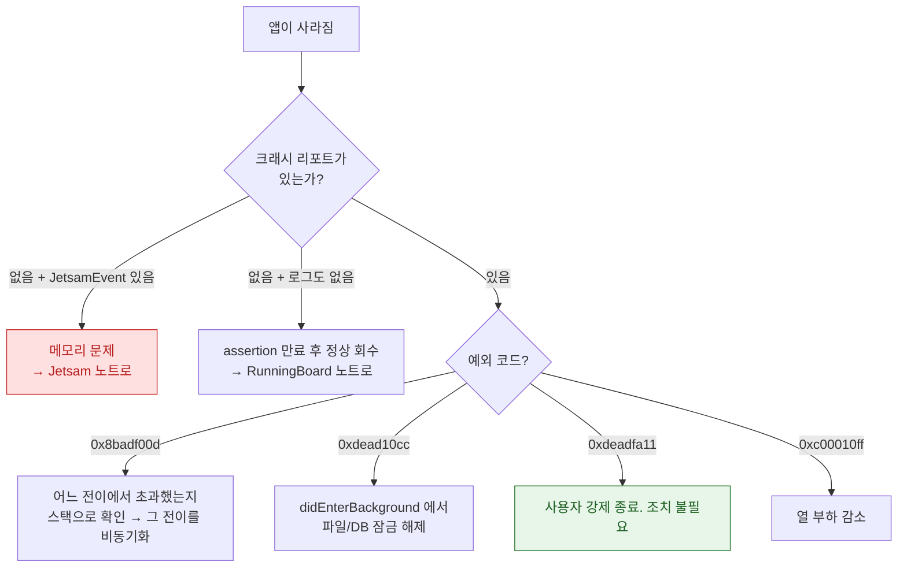

## 워치독 종료는 예외 코드로 원인 구간을 구분할 수 있다

### 개념 (What)

iOS 는 앱이 정해진 시간 안에 응답하지 않으면 강제 종료한다. 이것을 **워치독(watchdog) 종료**라 하며, 일반적인 크래시와 달리 **코드에 버그가 있어서가 아니라 너무 오래 걸려서** 죽는다.

핵심은 크래시 리포트의 **예외 코드가 원인 구간을 구분해 준다**는 점이다. 이 코드들은 16 진수로 영어 단어를 흉내 낸 것이라 외우기 쉽다.

### 왜 필요한가 (Why)

1. **스택 트레이스만으로는 부족하다**: 워치독 종료의 스택은 "그 순간 실행 중이던 코드"일 뿐 원인이 아닐 수 있다. 예외 코드가 **어느 생명주기 전이에서 시간을 초과했는지**를 알려준다.
2. **재현이 어렵다**: 디버거가 붙어 있으면 워치독이 비활성화되므로 Xcode 실행 중에는 재현되지 않는다. 로그의 코드로 역추적하는 것이 유일한 실마리인 경우가 많다.

### 예외 코드 표

| 코드 | 읽는 법 | 의미 | 대표 원인 |
| :--- | :--- | :--- | :--- |
| **`0x8badf00d`** | "ate bad food" | **워치독 타임아웃**. 시작·재개·정지·종료 전이가 제한 시간 초과 | `didFinishLaunching` 에서 동기 네트워크/디스크 I/O |
| **`0xdead10cc`** | "dead lock" | 정지되는 순간 **공유 컨테이너의 파일/DB 잠금을 쥐고 있었음** | 확장과 앱이 같은 SQLite 를 열어 둔 채 배경 전환 |
| **`0xbaadca11`** | "bad call" | CallKit 으로 수신 통화를 제때 보고하지 않음 | VoIP 푸시 후 `reportNewIncomingCall` 누락 |
| **`0xc00010ff`** | "cool off" | **열 관리**로 시스템이 종료 | 지속적인 고부하 연산 |
| **`0xdeadfa11`** | "dead fall" | **사용자가 강제 종료** | 앱 전환기에서 스와이프. 버그 아님 |
| **`0xbaaaaaad`** | — | 스택샷 기록. **크래시가 아님** | 진단용 스냅샷 |

### 진단 흐름

### `0x8badf00d` 를 만드는 전형적 패턴

`didFinishLaunching` 이나 `didEnterBackground` 는 **메인 스레드에서 동기적으로** 호출된다. 여기에 다음이 들어가면 워치독 위험이 생긴다.

- 동기 네트워크 요청 (특히 느린 네트워크에서)
- 대용량 파일 읽기·마이그레이션
- 무거운 Core Data 마이그레이션
- 메인 스레드에서의 `DispatchSemaphore.wait()` — **비동기 코드를 동기처럼 쓰려다 만든 데드락**이 가장 흔하다

> [!TIP] 재현 방법
> 워치독은 디버거가 붙어 있으면 동작하지 않는다. Xcode 를 분리한 상태에서 기기를 저속 네트워크(Network Link Conditioner)나 저전력 모드에 두고 실행해야 재현 확률이 올라간다.

### 관찰 가능한 증거

- **기기**: `설정 > 개인정보 보호 및 보안 > 분석 및 향상 > 분석 데이터` 에서 크래시 리포트 확인.
- **Xcode**: Organizer 의 Crashes 탭에서 실사용자 크래시를 예외 코드별로 집계.
- **MetricKit**: `MXAppExitMetric.cumulativeAppWatchdogExitCount` 로 워치독 종료 비율 추적. `MXHangDiagnostic` 은 종료까지 가지 않은 행(hang)도 수집한다.

### 연관 문서

- [RunningBoard assertion 이 프로세스의 실행 지속 여부를 결정한다](runningboard-assertions.md)
- [Jetsam 은 LRU 가 아니라 우선순위 밴드로 죽일 대상을 고른다](jetsam-memory-pressure-bands.md)
- [pre-main 시간은 대부분 dylib 로딩과 static initializer 가 쓴다](../boot-and-runtime/pre-main-launch-time-budget.md)
- [SpringBoard 와 FrontBoard 가 앱의 전경·배경 전이를 소유한다](springboard-frontboard-lifecycle.md)

공식 문서: [Addressing watchdog terminations](https://developer.apple.com/documentation/xcode/addressing-watchdog-terminations)
