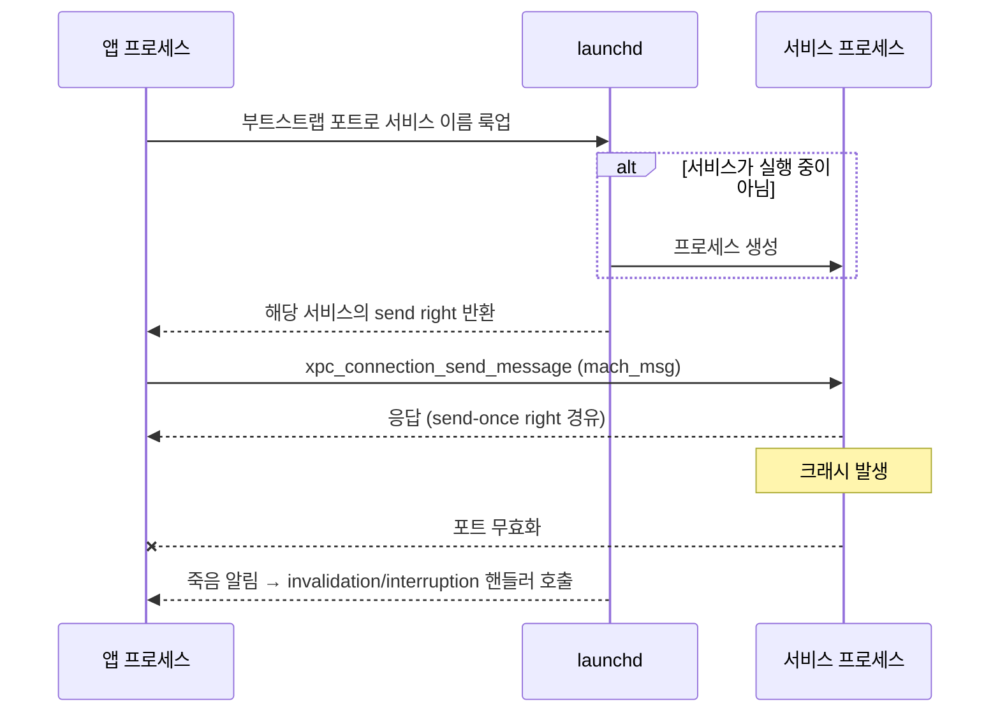

## XPC 연결은 launchd 가 중개하며 상대가 죽으면 함께 무효화된다

### 개념 (What)

**XPC** 는 Mach 메시지 위에 올린 프로세스 간 통신 추상이다. 개발자는 포트 권한을 직접 다루지 않고 **이름으로 서비스에 연결**하며, 메시지는 타입이 있는 딕셔너리(또는 `NSXPCConnection` 의 경우 프로토콜 메서드 호출)로 표현된다.

XPC 를 이해하는 데 가장 중요한 성질은 **연결이 상태를 가진다**는 점이다. 연결은 성립·무효화·중단 중 하나의 상태에 있고, **상대 프로세스의 죽음이 곧 연결의 상태 변화로 앱에 통보**된다.

### 왜 필요한가 (Why)

1. **원시 IPC 의 실수 제거**: 포트 권한 관리, 메시지 직렬화, 응답 포트 수명 — 손으로 하면 틀리기 쉬운 것들을 라이브러리가 처리한다.
2. **죽음의 명시적 처리**: 상대가 크래시했을 때 내 앱이 무한 대기하거나 조용히 실패하지 않는다. 핸들러가 호출된다.
3. **온디맨드와의 결합**: 연결 시점에 서비스가 실행 중이 아니면 launchd 가 띄운다. 클라이언트는 그 사실을 몰라도 된다.

### 내부 메커니즘 (How)



#### 두 가지 실패 상태의 구분

| 상태 | 의미 | 대응 |
| :--- | :--- | :--- |
| **Interrupted** | 상대가 죽었지만 **연결 객체는 아직 유효**. 다시 보내면 launchd 가 서비스를 재실행 | 진행 중이던 요청을 재시도 |
| **Invalidated** | 연결이 **영구히 끝남**. 다시 쓸 수 없음 | 새 연결 객체를 만들어야 함 |

이 구분을 놓치면 "가끔 요청이 사라진다"는 재현 어려운 버그가 된다. interrupted 시점에 in-flight 요청은 **응답 없이 사라지므로**, 재시도 책임은 클라이언트에 있다.

#### 신원 확인

서버는 연결해 온 상대가 누구인지 커널이 보증하는 정보로 확인할 수 있다. 클라이언트가 보낸 값을 믿는 것이 아니라, **커널이 기록한 PID/감사 토큰**을 읽는다. 이 점이 소켓 기반 IPC 와의 결정적 차이이며, 안드로이드 Binder 의 `getCallingUid` 와 같은 성질이다.

> [!IMPORTANT] iOS 에서의 제약
> macOS 앱은 번들 안에 자체 XPC 서비스를 포함할 수 있지만, **iOS 앱은 임의의 XPC 서비스 번들을 포함할 수 없다.** iOS 에서 프로세스를 분리하려면 [앱 확장](app-extension-process-model.md) 을 쓴다. `NSXPCConnection` 자체는 iOS 에서도 쓸 수 있으나 상대는 시스템이 허용한 프로세스여야 한다.

### 관찰 가능한 증거 (macOS)

```bash
# XPC 관련 로그 스트리밍
log stream --predicate 'subsystem == "com.apple.xpc"' --info

# 서비스가 실제로 떴는지, 마지막 종료 코드는 무엇인지
launchctl list | grep MyService
```

### 연관 문서

- [XPC 서비스는 별도 프로세스이자 별도 sandbox 이므로 크래시가 전파되지 않는다](xpc-service-isolation.md)
- [Mach port 는 이름이 아니라 커널이 소유한 능력(capability)이다](mach-port-is-a-capability.md)
- [launchd 는 PID 1 로서 모든 프로세스의 조상이며 선언에 따라 필요할 때만 데몬을 띄운다](../boot-and-runtime/launchd-is-pid-1.md)
- [apple-interprocess-and-xpc](../../04_system_services/apple-interprocess-and-xpc.md) - 앱 관점의 XPC 구현 패턴

공식 문서: [XPC](https://developer.apple.com/documentation/xpc)
