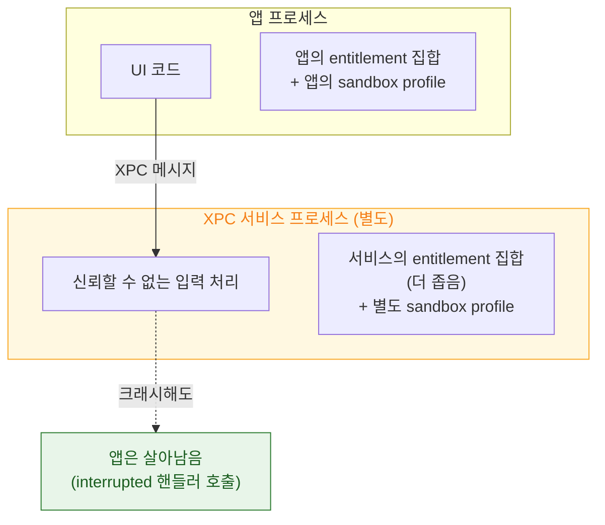

## XPC 서비스는 별도 프로세스이자 별도 sandbox 이므로 크래시가 전파되지 않는다

### 개념 (What)

XPC 서비스를 쓰는 이유는 "통신하려고"가 아니라 **"분리하려고"** 다. 서비스는 호출한 앱과 **다른 프로세스, 다른 sandbox profile, 다른 entitlement 집합**을 갖는다. 따라서 서비스가 크래시해도 앱은 살아 있고, 서비스가 뚫려도 얻는 권한은 서비스의 것뿐이다.

### 왜 필요한가 (Why)

1. **최소 권한 원칙의 실행 단위**: 위험한 데이터를 다루는 코드에만 필요한 권한을 주고, 앱 본체는 그 권한을 갖지 않는다. 예를 들어 파서에 네트워크 권한을 주지 않을 수 있다.
2. **크래시 격리**: 서드파티 라이브러리나 신뢰할 수 없는 입력을 다루는 코드가 죽어도 앱은 살아남는다.
3. **메모리 회수**: 서비스는 유휴 시 종료되고 다음 요청에 다시 뜬다. 무거운 일회성 작업의 메모리가 앱에 남지 않는다.

### 내부 메커니즘 (How)

1. **번들 배치**: macOS 앱은 `.app/Contents/XPCServices/` 아래에 서비스 번들을 포함한다. 각 서비스는 자기 `Info.plist` 와 자기 서명·entitlement 를 갖는다.
2. **독립 sandbox**: 서비스는 앱의 sandbox 를 상속하는 것이 아니라 자기 profile 을 적용받는다. 앱이 가진 권한을 서비스가 자동으로 갖지 않는다.
3. **유휴 종료**: 요청이 끊기면 서비스 프로세스는 종료된다. 상태를 프로세스 메모리에 유지한다고 가정하면 안 된다.

### 설계 시 주의점

| 함정 | 결과 | 대응 |
| :--- | :--- | :--- |
| 서비스가 상태를 메모리에 유지한다고 가정 | 유휴 종료 후 상태 소실 | 상태는 매 요청에 전달하거나 영속화 |
| 서비스에 앱과 같은 entitlement 를 그대로 부여 | 격리 효과가 사라짐 | 필요한 최소만 부여 |
| 서비스 크래시를 처리하지 않음 | 요청이 응답 없이 사라짐 | interrupted 핸들러에서 재시도 |
| 서비스 인터페이스에 임의 객체 역직렬화 허용 | 격리를 뚫는 공격 표면 | 허용 클래스를 명시적으로 제한 |

> [!TIP] `NSXPCConnection` 의 클래스 화이트리스트
> `NSXPCInterface` 에서 인자로 허용할 클래스를 명시하지 않으면 예상치 못한 타입이 역직렬화될 수 있다. `setClasses(_:for:argumentIndex:ofReply:)` 로 허용 목록을 좁히는 것이 격리의 일부다.

### iOS 에서의 대응물

iOS 앱은 자체 XPC 서비스를 포함할 수 없다. 같은 격리 효과는 **앱 확장**으로 얻는다 — 확장도 별도 프로세스, 별도 sandbox, 별도 메모리 한도를 갖는다. 다만 수명을 호스트가 아니라 **시스템이 통제**한다는 점이 다르다.

### 연관 문서

- [앱 확장은 호스트가 수명을 쥔 별도 프로세스다](app-extension-process-model.md)
- [XPC 연결은 launchd 가 중개하며 상대가 죽으면 함께 무효화된다](xpc-connection-lifetime.md)
- [TrustedBSD MAC 프레임워크가 sandbox 판정이 실제로 일어나는 지점이다](../kernel-and-driver/trustedbsd-mac-and-sandbox-enforcement.md)
- [apple-sandbox-and-security](../../05_security_privacy/apple-sandbox-and-security.md) - sandbox 와 진단

공식 문서: [Creating XPC services](https://developer.apple.com/documentation/xpc/creating-xpc-services)
