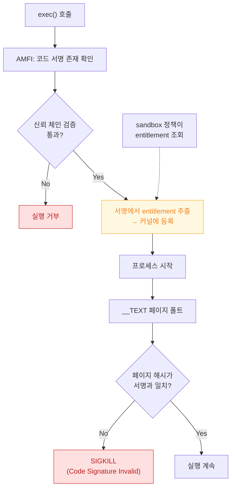

## AMFI 는 exec 시점에 코드 서명과 entitlement 를 커널에서 강제한다

### 개념 (What)

**AMFI(Apple Mobile File Integrity)** 는 "이 바이너리를 실행해도 되는가"를 판정하는 커널 정책 모듈이다. [TrustedBSD MAC](trustedbsd-mac-and-sandbox-enforcement.md) 훅에 등록되어, `exec` 시점과 이후 코드 페이지를 읽는 시점마다 개입한다.

AMFI 가 하는 일은 두 가지다.

1. **서명 검증**: 바이너리의 코드 서명이 신뢰된 체인에서 나왔는지, 그리고 각 페이지의 해시가 서명과 일치하는지 확인한다.
2. **entitlement 공급**: 서명 안에 봉인된 entitlement 를 읽어 커널의 다른 정책 모듈에 제공한다. sandbox 프로필이 "이 프로세스가 X entitlement 를 갖는가"를 물으면 AMFI 가 답한다.

### 왜 필요한가 (Why)

1. **entitlement 를 왜 런타임에 요청할 수 없는가**: entitlement 는 서명에 봉인되어 있고 AMFI 가 exec 시점에 읽는다. 실행 중에 추가하는 API 자체가 존재하지 않는다.
2. **"권한은 켰는데 왜 안 되는가"**: Xcode 의 Capabilities 탭에서 켜는 것은 **entitlement 파일과 프로비저닝 프로파일**을 맞추는 작업이다. 실제 바이너리 서명에 들어가지 않았다면 AMFI 는 그것을 모른다.
3. **JIT 가 특별 취급인 이유**: 실행 권한이 있는 메모리를 런타임에 만드는 것은 서명 검증을 우회하는 행위다. 그래서 별도 entitlement 없이는 금지된다.

### 내부 메커니즘 (How)



#### 실패 양상으로 구간 나누기

| 증상 | 어느 단계에서 걸린 것인가 |
| :--- | :--- |
| 앱이 아예 실행되지 않고 즉시 종료 | exec 시점의 서명 검증 실패 |
| 실행은 되는데 특정 기능만 실패 | entitlement 누락 (서명에는 문제 없음) |
| 한참 쓰다가 갑자기 `Code Signature Invalid` 로 종료 | 아직 안 읽었던 페이지의 해시 불일치 |
| 프로비저닝 프로파일 만료 후 실행 불가 | 서명은 유효하나 프로파일 신뢰 조건 실패 |

세 번째가 특히 헷갈린다 — **실행 도중에** 죽는데 원인은 시작 시점의 바이너리 무결성이다. 개발 중 빌드 산출물을 실행 중에 덮어썼을 때 흔히 나타난다.

> [!NOTE] macOS 와 iOS 의 차이
> macOS 에서는 사용자가 명시적으로 허용한 서명 없는 코드도 조건부로 실행할 수 있고, Gatekeeper·공증(notarization)·Hardened Runtime 이 층을 더 이룬다. iOS 에서는 예외 없이 유효한 서명이 필요하다.

### 관찰 가능한 증거

```bash
# 서명과 봉인된 entitlement 를 실제 바이너리에서 확인
codesign -dvvv MyApp.app
codesign -d --entitlements :- MyApp.app

# 서명 유효성 전체 검증
codesign --verify --deep --strict --verbose=2 MyApp.app

# AMFI 거부 로그 (macOS)
log show --last 5m --predicate 'senderImagePath CONTAINS "AppleMobileFileIntegrity"' --info
```

**핵심 진단 습관**: Xcode 설정이 아니라 **최종 산출물에 실제로 무엇이 서명되었는지**를 `codesign -d --entitlements :-` 로 확인한다. 설정과 산출물이 어긋나는 것이 가장 흔한 원인이다.

### 연관 문서

- [Mach-O 의 __TEXT 는 읽기 전용이며 페이지 인 될 때마다 서명 해시와 대조된다](../boot-and-runtime/mach-o-segments-and-code-signature.md)
- [TrustedBSD MAC 프레임워크가 sandbox 판정이 실제로 일어나는 지점이다](trustedbsd-mac-and-sandbox-enforcement.md)
- [apple-security-entitlements](../../05_security_privacy/apple-security-entitlements.md) - entitlement 의 의미
- [apple-build-and-distribution](../../08_packaging_deployment/apple-build-and-distribution.md) - 서명 체인과 프로비저닝

공식 문서: [Code Signing Guide](https://developer.apple.com/library/archive/documentation/Security/Conceptual/CodeSigningGuide/Introduction/Introduction.html)
