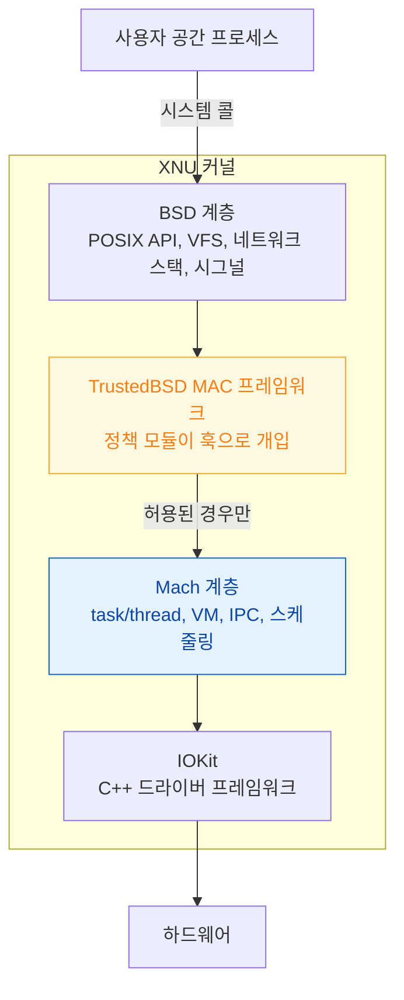

## XNU 는 자원 관리와 POSIX 인터페이스와 정책 강제를 서로 다른 계층이 나눠 맡는다

XNU 를 "하이브리드 커널"이라고만 알면 실무에서 쓸 데가 없다. 실제로 쓸모 있는 것은 **어떤 실패가 어느 계층에서 판정되는가** 다.

- 메모리 부족으로 죽었다 → Mach 의 VM 계층
- 파일 접근이 `EPERM` 으로 거부됐다 → TrustedBSD MAC 정책 모듈
- 앱이 실행조차 안 된다 → AMFI 의 서명 검증
- 주변 기기가 인식되지 않는다 → IOKit 매칭

이 클러스터는 그 판정 지점들을 다룬다.

### 계층 구조와 정책

- [XNU 는 Mach 가 자원을, BSD 가 인터페이스를 맡는 분업 구조다](xnu-mach-bsd-split.md)
- [TrustedBSD MAC 프레임워크가 sandbox 판정이 실제로 일어나는 지점이다](trustedbsd-mac-and-sandbox-enforcement.md)
- [AMFI 는 exec 시점에 코드 서명과 entitlement 를 커널에서 강제한다](amfi-code-signature-enforcement.md)

### 메모리

- [Mach VM 은 영역 단위로 매핑하고 물리 페이지 할당을 미룬다](mach-vm-and-memory-regions.md)
- [메모리 압축기는 iOS 에서 디스크 스왑을 대체한다](memory-compressor-and-swap.md)

### 드라이버

- [IOKit 은 IORegistry 트리 위에서 매칭으로 드라이버를 고른다](iokit-driver-families.md)
- [DriverKit 은 드라이버를 커널 밖으로 옮겨 크래시를 패닉이 아니게 만든다](driverkit-moves-drivers-out-of-kernel.md)

### 경계

- 드라이버 확장의 **배포·승인 워크플로**는 [apple-system-extensions-and-driverkit](../../07_platforms/macos/apple-system-extensions-and-driverkit.md) 에 둔다. 이 클러스터는 커널 경계에서 무엇이 달라지는지만 다룬다.
- 앱이 겪는 권한 실패의 **진단 절차**는 [apple-sandbox-and-security](../../05_security_privacy/apple-sandbox-and-security.md) 에 둔다.

### 연관 문서

- [apple-architecture-stack](../../00_foundations/apple-architecture-stack.md) - 커널부터 앱까지의 계층 개괄
- [Mach port 는 이름이 아니라 커널이 소유한 능력(capability)이다](../ipc-and-process/mach-port-is-a-capability.md)
- [Jetsam 은 LRU 가 아니라 우선순위 밴드로 죽일 대상을 고른다](../ipc-and-process/jetsam-memory-pressure-bands.md)
