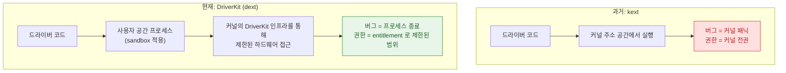

## DriverKit 은 드라이버를 커널 밖으로 옮겨 크래시를 패닉이 아니게 만든다

### 개념 (What)

전통적인 커널 확장(**kext**)은 커널 주소 공간 안에서 실행된다. 즉 드라이버의 버그 하나가 **커널 패닉**이 되고, 드라이버가 가진 권한은 곧 커널 권한이다.

**DriverKit** 은 드라이버를 **사용자 공간 프로세스(dext)** 로 옮긴다. 커널은 여전히 하드웨어 접근을 중개하지만, 드라이버 코드 자체는 sandbox 된 별도 프로세스에서 돈다.

### 왜 필요한가 (Why)

1. **크래시 격리**: dext 가 죽으면 그 장치만 동작을 멈춘다. 시스템은 계속 돈다. 그리고 시스템이 dext 를 다시 띄울 수 있다.
2. **공격 표면 축소**: 서드파티 코드가 커널 권한을 갖지 않는다. 커널 무결성 보호(Apple Silicon 의 하드웨어 지원 포함)와 양립한다.
3. **배포 모델 변화**: dext 는 앱 번들 안에 담겨 App Store 로도 배포될 수 있고, 사용자 승인으로 설치된다. kext 처럼 시스템 디렉터리에 설치하고 재부팅할 필요가 없다.

### 내부 메커니즘 (How)



1. **제한된 API**: DriverKit 은 커널 API 전체를 노출하지 않는다. 대상 장치 종류별로 필요한 것만 있는 별도 프레임워크다. 그래서 kext 코드를 그대로 옮길 수 없고 다시 작성해야 한다.
2. **entitlement 로 통제**: dext 는 어떤 장치 계열을 다룰 수 있는지를 entitlement 로 선언하고, Apple 의 승인을 받아야 한다.
3. **매칭은 그대로**: IORegistry 위에서 매칭으로 드라이버를 고르는 [IOKit 의 모델](iokit-driver-families.md)은 유지된다. 달라지는 것은 선택된 드라이버가 어디서 실행되는가다.

### System Extensions 와의 관계

DriverKit 확장은 **System Extensions** 라는 더 큰 범주의 하나다. 같은 배포·승인 메커니즘을 공유한다.

| 확장 종류 | 대체하는 것 | 용도 |
| :--- | :--- | :--- |
| **DriverKit 확장** | 드라이버 kext | 주변 기기 제어 |
| **Network 확장** | 네트워크 필터 kext | VPN, 콘텐츠 필터, 방화벽 |
| **Endpoint Security 확장** | 보안 감시 kext | 프로세스/파일 이벤트 감시 |

공통점은 **전부 사용자 공간에서 돌고, 사용자 승인이 필요하고, 앱 번들로 배포된다**는 것이다.

### 관찰 가능한 증거 (macOS)

```bash
# 설치된 시스템 확장 목록과 상태
systemextensionsctl list

# 아직 로드된 커널 확장 확인
kmutil showloaded

# 확장 관련 로그
log stream --predicate 'subsystem == "com.apple.sysextd"' --info
```

`systemextensionsctl list` 의 상태 필드가 `activated enabled` 가 아니면 사용자 승인 단계에서 멈춘 것이다.

### 연관 문서

- [IOKit 은 IORegistry 트리 위에서 매칭으로 드라이버를 고른다](iokit-driver-families.md)
- [XPC 서비스는 별도 프로세스이자 별도 sandbox 이므로 크래시가 전파되지 않는다](../ipc-and-process/xpc-service-isolation.md)
- [apple-system-extensions-and-driverkit](../../07_platforms/macos/apple-system-extensions-and-driverkit.md) - 개발·배포 실무 가이드
- [apple-macos-system](../../07_platforms/apple-macos-system.md) - macOS 보안 모델

공식 문서: [DriverKit](https://developer.apple.com/documentation/driverkit)
