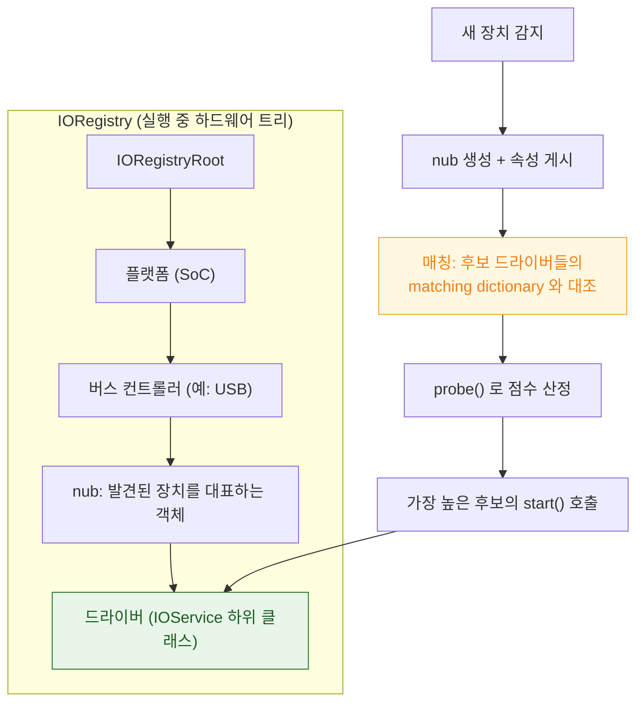

## IOKit 은 IORegistry 트리 위에서 매칭으로 드라이버를 고른다

### 개념 (What)

**IOKit** 은 XNU 의 드라이버 프레임워크다. 특이한 점은 C 가 아니라 **C++ 의 제한된 부분집합**으로 작성된 객체 지향 모델이라는 것이다. 드라이버는 클래스이고, 상속으로 공통 동작을 재사용하며, 실행 중인 하드웨어 구성은 **IORegistry** 라는 트리로 표현된다.

드라이버가 하드웨어에 붙는 방식은 등록이 아니라 **매칭**이다. 새 장치가 나타나면 커널이 그 장치의 속성과 맞는 드라이버 후보들을 찾고, 점수가 가장 높은 것을 선택한다.

### 왜 필요한가 (Why)

1. **"기기를 꽂았는데 인식이 안 된다"의 구조적 이해**: 문제는 대개 드라이버 코드가 아니라 **매칭 사전(matching dictionary)이 그 장치와 맞지 않는 것**이다.
2. **전원 관리의 위치**: 절전, 슬립/웨이크 처리가 개별 드라이버가 아니라 IOKit 의 전원 관리 트리로 조율된다. 트리의 부모가 잠들면 자식도 잠든다.
3. **앱 개발자에게도 보이는 지점**: `IOKit` 의 사용자 공간 API 로 기기 정보, 배터리 상태, 열 상태를 조회할 수 있다. 그 데이터의 출처가 IORegistry 다.

### 내부 메커니즘 (How)



#### 드라이버 생명주기

| 단계 | 하는 일 |
| :--- | :--- |
| **매칭** | 장치 속성과 드라이버의 matching dictionary 대조 |
| **`probe()`** | "내가 이 장치를 다룰 수 있는가"를 확인하고 점수 반환 |
| **`start()`** | 실제 초기화. 실패하면 다음 후보로 넘어감 |
| **`stop()` / `free()`** | 장치 제거나 드라이버 언로드 시 정리 |

**점수 기반 선택**이 핵심이다. 일반적인 드라이버와 특정 벤더 전용 드라이버가 같은 장치에 맞을 때, 더 구체적인 쪽이 높은 점수를 반환해 선택된다.

#### 드라이버 패밀리

IOKit 은 장치 종류별로 **패밀리**를 제공한다. 개별 드라이버는 패밀리의 공통 로직을 상속하고 자기 하드웨어 부분만 구현한다.

- 저장 장치, USB, 네트워크, 그래픽, HID(키보드/마우스) 등
- 패밀리가 전원 관리, 큐잉, 사용자 공간 인터페이스의 공통 부분을 제공한다

### 관찰 가능한 증거 (macOS)

```bash
# IORegistry 트리 전체 (매우 김)
ioreg -l

# 특정 클래스만, 트리 형태로
ioreg -c IOUSBHostDevice -w 0

# 배터리 정보 (IORegistry 에서 읽어옴)
ioreg -rn AppleSmartBattery

# 어떤 드라이버가 붙었는지 계보 확인
ioreg -b -w 0 | grep -i <장치이름>
```

`ioreg` 출력에서 **nub 아래에 드라이버 객체가 붙어 있는지**를 보면 매칭이 성공했는지 즉시 알 수 있다. 붙어 있지 않으면 매칭 사전 문제다.

### 연관 문서

- [DriverKit 은 드라이버를 커널 밖으로 옮겨 크래시를 패닉이 아니게 만든다](driverkit-moves-drivers-out-of-kernel.md)
- [XNU 는 Mach 가 자원을, BSD 가 인터페이스를 맡는 분업 구조다](xnu-mach-bsd-split.md)
- [apple-system-extensions-and-driverkit](../../07_platforms/macos/apple-system-extensions-and-driverkit.md) - 시스템 확장 배포 워크플로

공식 문서: [IOKit Fundamentals](https://developer.apple.com/library/archive/documentation/DeviceDrivers/Conceptual/IOKitFundamentals/Introduction/Introduction.html)
