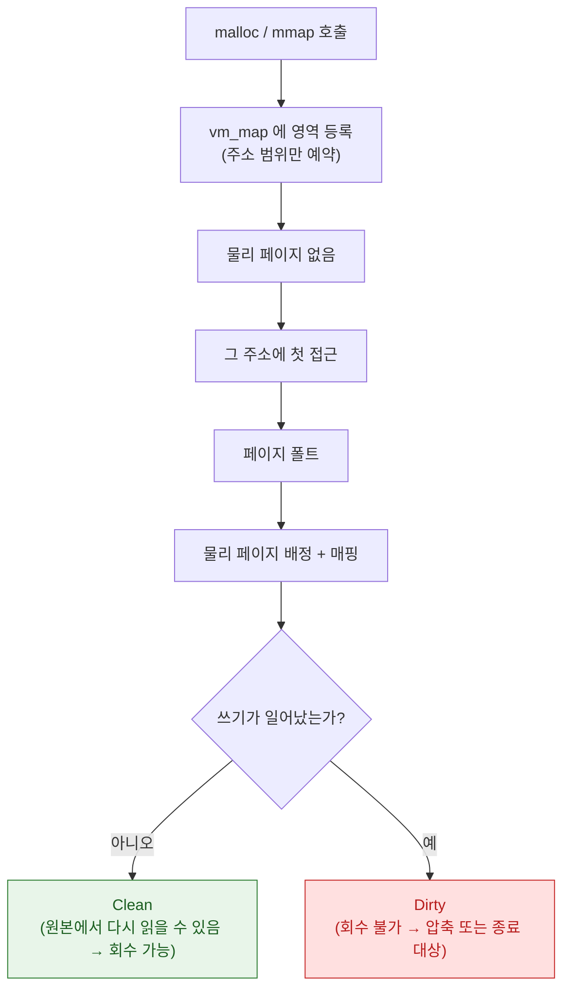

## Mach VM 은 영역 단위로 매핑하고 물리 페이지 할당을 미룬다

### 개념 (What)

프로세스가 메모리를 "할당"해도 그 순간에는 **물리 메모리가 배정되지 않는다.** Mach VM 은 주소 공간을 **영역(region)** 단위로 관리하고, 실제 물리 페이지는 그 주소에 처음 접근할 때(페이지 폴트) 배정한다.

이 때문에 "이 앱이 메모리를 얼마나 쓰는가"라는 질문에는 여러 답이 있고, **어느 수치를 봐야 하는지가 진단의 핵심**이 된다.

### 왜 필요한가 (Why)

1. **잘못된 수치를 보면 잘못된 결론이 난다**: 가상 메모리 크기는 수 GB 여도 정상이다. [Jetsam](../ipc-and-process/jetsam-memory-pressure-bands.md) 이 보는 것은 그것이 아니라 **더티 메모리**다.
2. **회수 가능성이 다르다**: 파일에서 매핑된 깨끗한(clean) 페이지는 필요하면 버리고 다시 읽으면 된다. 앱이 써서 더러워진(dirty) 페이지는 버릴 수 없다.
3. **공유 여부가 다르다**: [dyld shared cache](../boot-and-runtime/dyld-shared-cache.md) 페이지는 모든 프로세스가 공유하므로 내 앱 몫으로 세면 안 된다.

### 내부 메커니즘 (How)



#### 메모리 수치의 종류

| 수치 | 의미 | Jetsam 관련성 |
| :--- | :--- | :--- |
| **Virtual Size** | 예약된 주소 공간 총량 | 거의 무관. 크게 나와도 정상 |
| **Resident Size (RSS)** | 현재 물리 메모리에 있는 총량 (공유 포함) | 간접적 |
| **Dirty Size** | 앱이 수정해 회수할 수 없는 페이지 | **직접 관련** |
| **Footprint / Phys Footprint** | 이 프로세스에 귀속되는 실제 부담 | **가장 관련 높음** |

Xcode 의 메모리 게이지와 Jetsam 판정은 대체로 **footprint** 계열 수치를 본다. `malloc` 총량이나 힙 크기만 보면 실제 위험도를 놓친다.

#### Copy-on-Write

`fork()`, out-of-line Mach 메시지, 파일 매핑이 모두 copy-on-write 로 동작한다. 같은 물리 페이지를 여러 주소 공간이 공유하다가, 누군가 쓰는 순간 그 페이지만 복제된다.

- **장점**: 큰 데이터 전달이 즉시 복사되지 않는다.
- **함정**: "복사했으니 메모리가 두 배"라고 생각하면 과대 추정이고, "공유하니 공짜"라고 생각하면 쓰기 시점에 갑자기 늘어난다.

### 관찰 가능한 증거 (macOS)

```bash
# 영역별 상세: 각 영역의 virtual / resident / dirty / swapped 크기
vmmap --summary <pid>
vmmap <pid> | grep -i dirty

# 물리 메모리 부담 요약 (Jetsam 관점에 가장 가까움)
footprint <pid>

# 힙 객체 분포
heap <pid>
```

iOS 기기에서는 Instruments 의 **Allocations**(힙 증가)와 **VM Tracker**(영역별 더티/상주)를 함께 본다. 둘 중 하나만 보면 "힙은 안 느는데 메모리가 는다"(이미지 디코딩 버퍼, IOSurface 등)를 놓친다.

### 연관 문서

- [메모리 압축기는 iOS 에서 디스크 스왑을 대체한다](memory-compressor-and-swap.md)
- [Jetsam 은 LRU 가 아니라 우선순위 밴드로 죽일 대상을 고른다](../ipc-and-process/jetsam-memory-pressure-bands.md)
- [IOSurface 는 프로세스와 GPU 가 함께 보는 메모리다](../graphics-and-media/iosurface-shared-gpu-memory.md)
- [apple-memory-management](../../01_language_concurrency/apple-memory-management.md) - ARC 와 참조 카운트

공식 문서: [Analyzing the memory usage of your app](https://developer.apple.com/documentation/xcode/analyzing-the-memory-usage-of-your-app)
