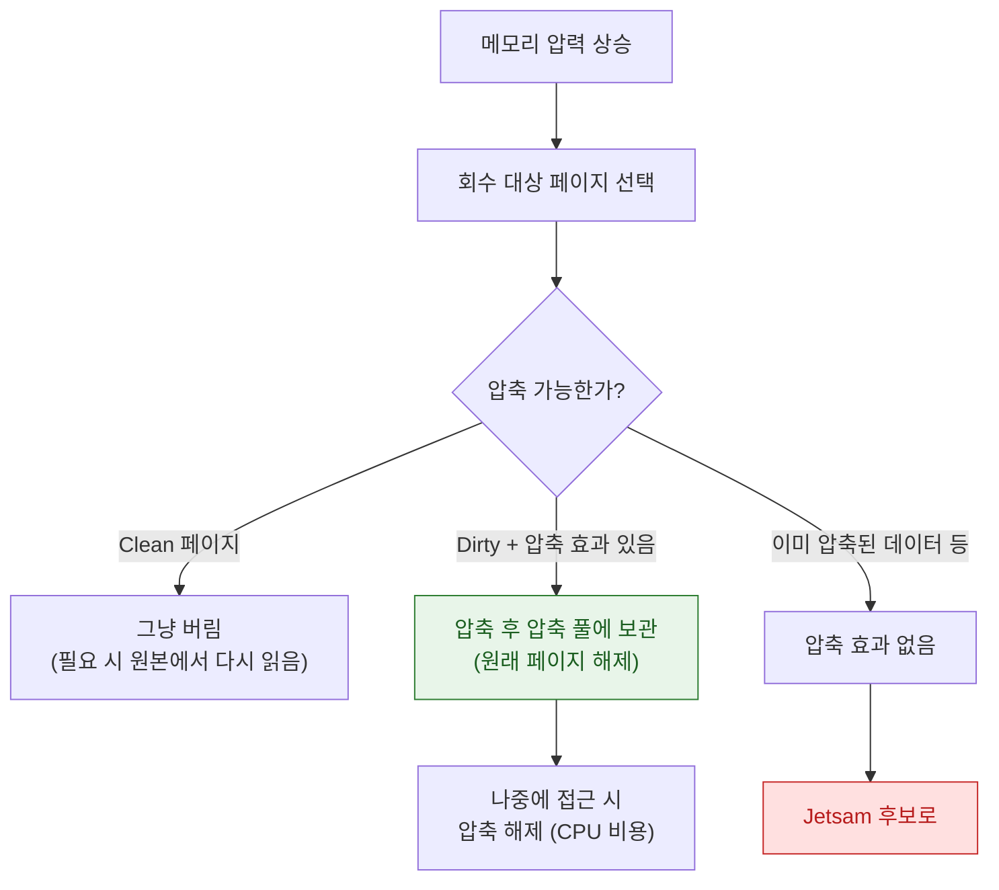

## 메모리 압축기는 iOS 에서 디스크 스왑을 대체한다

### 개념 (What)

메모리가 부족할 때 전통적인 운영체제는 잘 안 쓰는 페이지를 **디스크로 내보낸다(swap)**. iOS 는 오랫동안 이것을 하지 않았다. 대신 **압축기(compressor)** 가 그 페이지를 **RAM 안에서 압축해 보관**한다.

즉 회수 경로가 이렇게 된다: `압축 시도 → 그래도 부족하면 종료(Jetsam)`. 디스크로 내보내는 중간 단계가 없다.

### 왜 필요한가 (Why)

1. **플래시 수명과 속도**: 모바일 플래시에 반복 쓰기를 하면 수명이 줄고, 스왑 인/아웃 지연이 사용자 체감을 크게 해친다. 압축/해제는 CPU 만 쓰므로 훨씬 빠르다.
2. **왜 갑자기 CPU 가 튀는가**: 메모리 압력이 높으면 압축/해제가 계속 일어나 CPU 사용률이 올라간다. "메모리 문제인데 CPU 그래프가 튀는" 현상의 원인이다.
3. **압축되지 않는 메모리가 있다**: 이미 압축된 데이터(이미지, 비디오 버퍼)는 더 줄지 않는다. 이런 메모리를 많이 쥔 앱은 압축의 혜택 없이 바로 Jetsam 후보가 된다.

### 내부 메커니즘 (How)



1. **대상 선정**: 최근 접근하지 않은 더티 페이지가 우선 대상이다. 클린 페이지는 압축할 것 없이 그냥 버린다.
2. **압축과 보관**: 압축된 데이터는 **여전히 RAM 안**에 있다. 물리 메모리가 줄어드는 것이 아니라, 같은 데이터가 더 적은 공간을 차지하게 되는 것이다.
3. **해제**: 압축된 페이지에 다시 접근하면 해제 비용이 든다. 압축과 해제를 반복하는 상태(thrashing)에 빠지면 CPU 를 크게 소모한다.

> [!NOTE] 플랫폼별 차이
> macOS 는 압축기와 **디스크 스왑을 함께** 쓴다. iOS 계열은 전통적으로 스왑 없이 압축기만 썼으나, 최근 일부 고사양 iPad 에서는 스왑 관련 기능이 도입되었다. **버전과 기기에 따라 다르므로 "iOS 에는 스왑이 절대 없다"를 상수로 삼지 말고 대상 기기에서 확인한다.** 앱 설계 관점의 전제는 여전히 같다 — 스왑이 있다고 가정하고 메모리를 쓰면 안 된다.

### 실무적 귀결

| 메모리 종류 | 압축 효과 | 대응 |
| :--- | :--- | :--- |
| 일반 객체 그래프, 문자열 | 좋음 | 상대적으로 안전 |
| 디코딩된 비트맵 | 나쁨 (이미 조밀) | 다운샘플링, 필요할 때만 디코딩 |
| 비디오/오디오 버퍼 | 나쁨 | 스트리밍 처리, 버퍼 재사용 |
| 파일 매핑(clean) | 압축 불필요 (그냥 버림) | **큰 읽기 전용 데이터는 `mmap` 이 유리** |

마지막 줄이 실무적으로 가장 유용하다. 큰 읽기 전용 리소스를 `Data(contentsOf:)` 로 전부 읽으면 더티 메모리가 되지만, `Data(contentsOf:options: .mappedIfSafe)` 로 매핑하면 클린 페이지라 압력 시 그냥 회수된다.

### 관찰 가능한 증거 (macOS)

```bash
# 압축된 페이지 수와 압축기 통계
vm_stat 1

# 프로세스별 압축 상태 포함 요약
footprint <pid>
```

`vm_stat` 출력의 `Pages occupied by compressor` 가 늘고 `Swapins/Swapouts` 가 증가하면 압력이 높은 상태다.

### 연관 문서

- [Mach VM 은 영역 단위로 매핑하고 물리 페이지 할당을 미룬다](mach-vm-and-memory-regions.md)
- [Jetsam 은 LRU 가 아니라 우선순위 밴드로 죽일 대상을 고른다](../ipc-and-process/jetsam-memory-pressure-bands.md)
- [apple-ios-system](../../07_platforms/apple-ios-system.md) - iOS 의 자원 제약 개괄

공식 문서: [Analyzing the memory usage of your app](https://developer.apple.com/documentation/xcode/analyzing-the-memory-usage-of-your-app)
