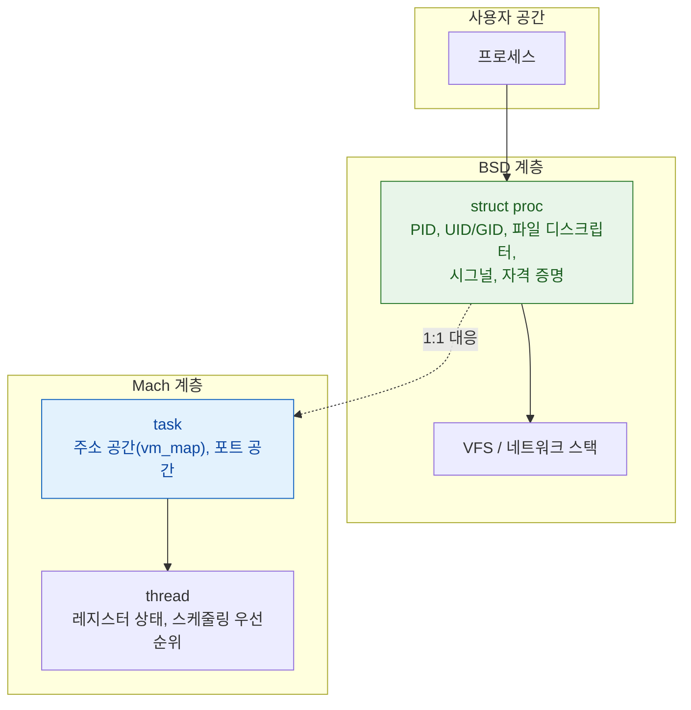

## XNU 는 Mach 가 자원을, BSD 가 인터페이스를 맡는 분업 구조다

### 개념 (What)

XNU 는 두 계층이 **같은 주소 공간에 함께 링크된** 커널이다. 마이크로커널처럼 계층이 분리되어 있지만, 메시지 전달이 아니라 함수 호출로 서로를 부른다. 그래서 "하이브리드"다.

분업의 핵심은 이렇다.

| 계층 | 소유하는 것 |
| :--- | :--- |
| **Mach** | task, thread, 가상 메모리, IPC(포트/메시지), 스케줄링 |
| **BSD** | process, 사용자/그룹, 시그널, 파일 시스템(VFS), 네트워크 스택, POSIX API |
| **IOKit** | 드라이버 객체 모델과 하드웨어 접근 |

### 왜 필요한가 (Why)

이 분업을 알아야 이해되는 것들이 있다.

1. **PID 와 task port 는 다른 것**: `pid` 는 BSD 개념이고, 프로세스의 메모리와 스레드를 실제로 조작하는 권한은 Mach 의 **task port** 다. 디버거가 다른 프로세스를 제어하려면 PID 가 아니라 task port 를 얻어야 하고, 그것이 엄격히 제한되어 있어 iOS 에서 임의 프로세스 디버깅이 불가능하다.
2. **스레드가 두 개의 정체성을 갖는다**: `pthread` 는 BSD/POSIX 추상이지만 그 아래에는 Mach thread 가 있다. 스케줄링 우선순위(QoS)는 Mach 계층에서 결정된다.
3. **`fork()` 의 비용**: BSD 의 `fork` 는 Mach VM 의 copy-on-write 위에 구현된다. 그래서 주소 공간 복사가 즉시 일어나지 않는다.

### 내부 메커니즘 (How)



- **하나의 프로세스 = 하나의 BSD `proc` + 하나의 Mach `task`**. 둘은 서로를 가리키는 포인터로 묶여 있다.
- 시스템 콜은 두 종류다. **BSD 시스템 콜**(`open`, `read`, `socket`…)은 양수 번호를, **Mach trap**(`mach_msg`, `task_self`…)은 음수 번호를 쓴다.
- 스케줄링은 Mach 가 한다. BSD 의 `nice` 값은 Mach 우선순위로 변환되어 반영된다.

### QoS 와 스케줄링

Swift Concurrency 와 GCD 의 QoS 는 결국 Mach thread 의 스케줄링 파라미터로 내려간다.

| QoS | 의도 |
| :--- | :--- |
| `userInteractive` | 프레임 마감에 묶인 작업 |
| `userInitiated` | 사용자가 결과를 기다림 |
| `utility` | 진행 표시가 있는 장시간 작업 |
| `background` | 사용자가 인지하지 않는 작업 |

> [!IMPORTANT] 우선순위 역전
> 낮은 QoS 스레드가 잠금을 쥐고 있고 높은 QoS 스레드가 그것을 기다리면 전체가 느려진다. Mach 는 이때 **우선순위 상속(priority donation)** 으로 잠금을 쥔 스레드를 일시적으로 승격한다. 단, 이것이 동작하려면 시스템이 아는 동기화 원시(`os_unfair_lock`, GCD 큐)를 써야 한다. 직접 만든 스핀락은 이 혜택을 받지 못한다.

### 관찰 가능한 증거 (macOS)

```bash
# 프로세스의 Mach/BSD 상태를 함께 덤프
sample <pid> 5

# 스레드별 QoS 와 스택
spindump <pid> 5 -file /tmp/spin.txt
```

Instruments 의 **System Trace** 템플릿은 시스템 콜, 스레드 상태 전이, VM 이벤트를 함께 보여준다.

### 연관 문서

- [Mach VM 은 영역 단위로 매핑하고 물리 페이지 할당을 미룬다](mach-vm-and-memory-regions.md)
- [Mach port 는 이름이 아니라 커널이 소유한 능력(capability)이다](../ipc-and-process/mach-port-is-a-capability.md)
- [TrustedBSD MAC 프레임워크가 sandbox 판정이 실제로 일어나는 지점이다](trustedbsd-mac-and-sandbox-enforcement.md)
- [apple-architecture-stack](../../00_foundations/apple-architecture-stack.md) - 시스템 계층 개괄

공식 문서: [Kernel Architecture Overview](https://developer.apple.com/library/archive/documentation/Darwin/Conceptual/KernelProgramming/Architecture/Architecture.html)
