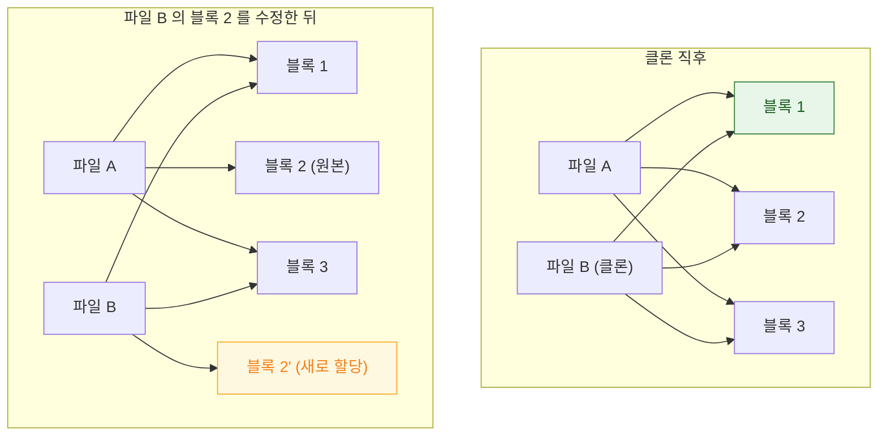

## APFS 클론은 블록을 공유하다 쓰는 순간에만 복제한다

### 개념 (What)

APFS 에서 같은 볼륨 안의 파일을 복사하면, 데이터 블록이 실제로 복제되지 않는다. **두 파일이 같은 블록을 가리키고, 둘 중 하나가 수정될 때 그 블록만 복제**된다. 이것이 **클론(clone)** 이며 copy-on-write 의 파일 시스템 판이다.

Finder 에서 큰 파일을 같은 디스크 안에서 복사하면 순식간에 끝나는 이유, 그리고 그 직후 디스크 여유 공간이 줄지 않는 이유가 이것이다.

### 왜 필요한가 (Why)

1. **용량 계산이 직관과 어긋난다**: 10GB 파일을 클론해도 사용량은 거의 늘지 않는다. 반대로 그 파일을 조금씩 수정하기 시작하면 **아무것도 새로 만들지 않았는데 용량이 늘어난다**.
2. **속도 차이의 원인**: 같은 볼륨 안 이동은 즉시, 다른 볼륨으로 복사는 실제 전송이다. 앱에서 파일 이동 성능이 경로에 따라 극적으로 달라지는 이유다.
3. **스냅샷의 기반**: [APFS 스냅샷](apfs-snapshots-and-updates.md)도 같은 원리 위에 서 있다.

### 내부 메커니즘 (How)



1. **클론 생성**: 메타데이터만 복제하고 데이터 블록은 참조를 공유한다. 크기와 무관하게 거의 즉시 끝난다.
2. **분기**: 어느 쪽이든 수정하면 **수정된 블록만** 새로 할당된다. 나머지는 계속 공유된다.
3. **공간 공유**: APFS 는 컨테이너 안의 여러 볼륨이 여유 공간을 공유한다. 그래서 볼륨별 "남은 용량"이 서로 겹쳐 보인다.

### 실무적 귀결

| 상황 | 결과 |
| :--- | :--- |
| 같은 볼륨 안 파일 복사 | 즉시. 용량 거의 안 늘어남 |
| 다른 볼륨으로 복사 | 실제 전송. 용량 그만큼 증가 |
| 클론한 큰 파일을 조금씩 수정 | **아무것도 새로 만들지 않았는데 용량 증가** |
| 디스크 여유 공간 보고 | 컨테이너 단위로 공유되어 볼륨별 합이 총량과 다름 |

> [!TIP] 앱에서 활용
> 같은 볼륨 안이라면 `FileManager.copyItem(at:to:)` 가 자동으로 클론을 사용한다. 큰 파일의 "수정 전 백업본"을 만들 때 용량 걱정 없이 복사할 수 있다는 뜻이다. 단, 이후 수정량만큼은 실제로 늘어난다.

### 관찰 가능한 증거 (macOS)

```bash
# APFS 컨테이너와 볼륨 구조, 공간 공유 확인
diskutil apfs list

# 클론 여부와 실제 점유 블록 확인
du -h file.dat        # 논리 크기
du -h --apparent-size file.dat

# 클론 생성 (Finder 복사와 동일 동작)
cp -c source.dat clone.dat
```

### 연관 문서

- [APFS 스냅샷은 시스템 업데이트를 되돌릴 수 있게 만든다](apfs-snapshots-and-updates.md)
- [앱 컨테이너의 디렉터리는 백업과 정리 정책이 서로 다르다](app-container-directory-policies.md)
- [Mach VM 은 영역 단위로 매핑하고 물리 페이지 할당을 미룬다](../kernel-and-driver/mach-vm-and-memory-regions.md) - 메모리에서의 같은 원리

공식 문서: [Apple File System Guide](https://developer.apple.com/documentation/foundation/file_system)
