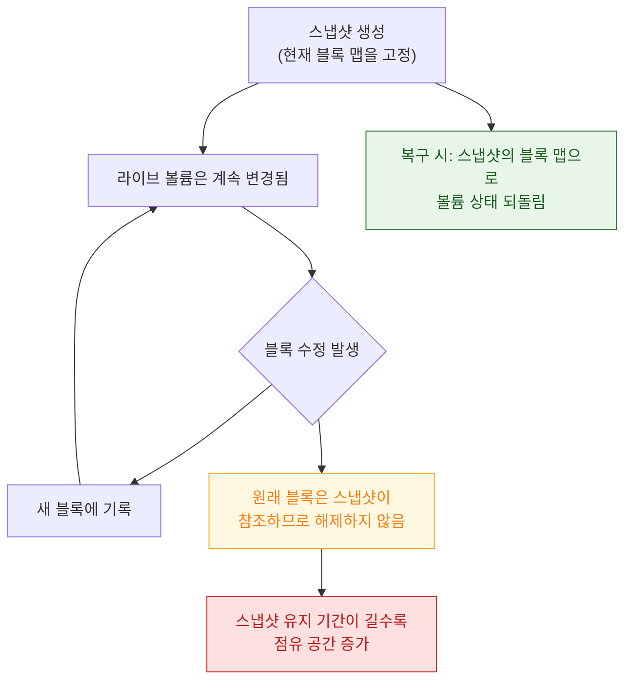

## APFS 스냅샷은 시스템 업데이트를 되돌릴 수 있게 만든다

### 개념 (What)

**스냅샷**은 특정 시점의 볼륨 상태를 읽기 전용으로 고정한 것이다. [클론과 같은 copy-on-write 원리](apfs-copy-on-write-clones.md)를 볼륨 전체에 적용한 것으로, 생성 비용이 거의 없고 이후 변경분만큼만 공간을 쓴다.

OS 업데이트, Time Machine 로컬 백업, 그리고 복구가 전부 이 위에 서 있다.

### 왜 필요한가 (Why)

1. **업데이트의 원자성**: 새 시스템을 준비해 두고 부팅 대상만 바꾸면 된다. 실패하면 이전 스냅샷으로 되돌린다. "반쯤 업데이트된 상태"가 존재하지 않는다.
2. **"디스크가 갑자기 꽉 찼다"의 원인**: 로컬 스냅샷이 삭제된 파일의 블록을 계속 붙잡고 있으면, 파일을 지워도 공간이 회수되지 않는다.
3. **백업이 일관된 시점을 보게 한다**: 백업 도중 파일이 바뀌어도 스냅샷을 기준으로 읽으면 시점이 섞이지 않는다.

### 내부 메커니즘 (How)



핵심은 **스냅샷이 살아 있는 동안 그 시점의 블록은 해제되지 않는다**는 점이다. 사용자가 파일을 지워도, 스냅샷이 그 블록을 참조하고 있으면 공간은 돌아오지 않는다.

### OS 업데이트에서의 역할

1. 업데이트 전 시스템 볼륨의 스냅샷을 만든다.
2. 새 시스템 콘텐츠를 준비하고 [SSV seal](../boot-and-runtime/signed-system-volume-seal.md)을 갱신한다.
3. 재부팅 시 새 시스템으로 부팅한다.
4. 문제가 있으면 이전 스냅샷으로 되돌린다.

macOS 는 부팅 시 **읽기 전용 시스템 스냅샷**에서 부팅한다. 시스템 볼륨을 직접 쓰는 것이 아니라 그 스냅샷을 마운트하는 구조다.

### 관찰 가능한 증거 (macOS)

```bash
# 볼륨의 스냅샷 목록
tmutil listlocalsnapshots /

# 스냅샷이 잡고 있는 공간을 포함한 실제 여유량
diskutil apfs list
df -h /System/Volumes/Data

# 로컬 스냅샷 정리 (공간 회수)
tmutil thinlocalsnapshots / 10000000000 4
```

> [!NOTE] "여유 공간이 두 개로 보이는" 이유
> Finder 가 보여주는 여유 공간과 `df` 의 값이 다른 경우가 있다. Finder 는 **삭제 가능한 스냅샷을 회수하면 확보될 공간**까지 포함해 보여주기 때문이다. 실제로 지금 당장 쓸 수 있는 양은 `df` 쪽에 가깝다.

### 연관 문서

- [APFS 클론은 블록을 공유하다 쓰는 순간에만 복제한다](apfs-copy-on-write-clones.md)
- [SSV 는 시스템 볼륨 전체를 해시 트리로 봉인해 읽는 순간마다 검증한다](../boot-and-runtime/signed-system-volume-seal.md)
- [앱 컨테이너의 디렉터리는 백업과 정리 정책이 서로 다르다](app-container-directory-policies.md)

공식 문서: [Apple File System Guide](https://developer.apple.com/documentation/foundation/file_system)
