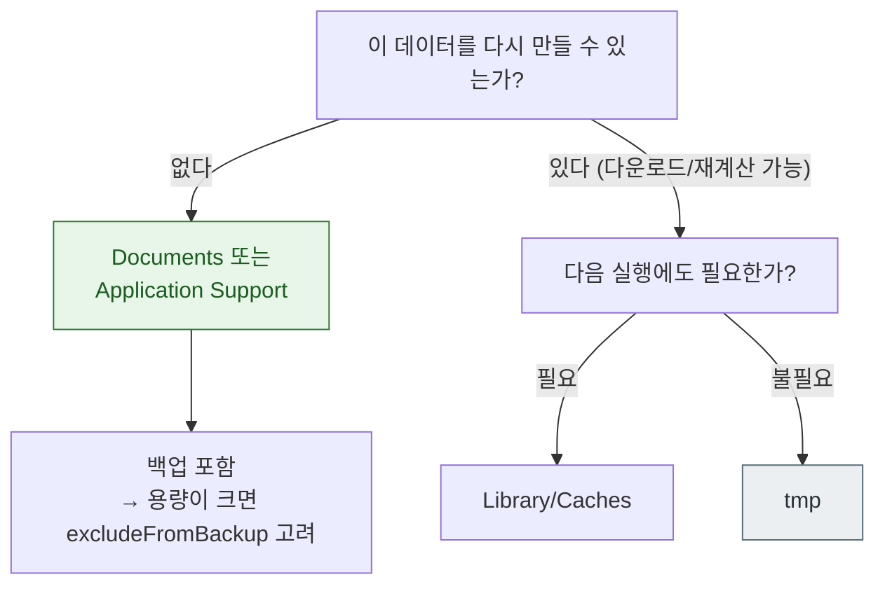

## 앱 컨테이너의 디렉터리는 백업과 정리 정책이 서로 다르다

### 개념 (What)

앱은 자기 **컨테이너** 안에서만 자유롭게 파일을 다룰 수 있다. 그런데 컨테이너 안의 디렉터리들은 이름만 다른 것이 아니라 **시스템이 다르게 취급한다.**

- 백업에 포함되는가
- 공간이 부족할 때 시스템이 지울 수 있는가
- 사용자에게 노출되는가

이 세 축이 디렉터리마다 다르다. 아무 데나 쓰면 데이터가 사라지거나, 반대로 백업 용량을 불필요하게 차지해 심사에서 지적받는다.

### 디렉터리별 정책

| 경로 | 백업 | 시스템 자동 삭제 | 용도 |
| :--- | :---: | :---: | :--- |
| `Documents/` | O | X | **사용자가 만든 데이터.** 재생성 불가한 것 |
| `Library/Application Support/` | O | X | 앱이 만든 데이터베이스, 설정 |
| `Library/Preferences/` | O | X | `UserDefaults` |
| `Library/Caches/` | **X** | **O (공간 부족 시)** | 재다운로드 가능한 캐시 |
| `tmp/` | **X** | **O (언제든)** | 한 세션 안에서만 필요한 임시 파일 |



### 흔한 두 가지 실수

**1. 큰 다운로드 파일을 `Documents` 에 둔다**

백업 용량이 급증하고, 심사에서 "재다운로드 가능한 데이터를 백업하지 말 것" 지적을 받는다. 대안:

```swift
// Documents 에 두어야 하지만 백업은 원하지 않을 때
var url = fileURL
var values = URLResourceValues()
values.isExcludedFromBackup = true
try url.setResourceValues(values)
```

**2. 지워지면 안 되는 데이터를 `Caches` 에 둔다**

`Caches` 는 공간이 부족하면 **앱이 실행 중이 아닐 때 시스템이 지울 수 있다.** 개발 중에는 공간이 넉넉해 재현되지 않다가 사용자 기기에서만 데이터가 사라진다.

### App Group 공유 컨테이너

앱과 [앱 확장](../ipc-and-process/app-extension-process-model.md)은 서로 다른 프로세스이자 서로 다른 컨테이너를 갖는다. 데이터를 공유하려면 **App Group** 컨테이너를 써야 한다.

```swift
let shared = FileManager.default.containerURL(
    forSecurityApplicationGroupIdentifier: "group.com.example.app"
)!
// UserDefaults 도 별도 suite 가 필요하다
let defaults = UserDefaults(suiteName: "group.com.example.app")
```

> [!WARNING] 공유 컨테이너의 SQLite
> 공유 컨테이너에 둔 SQLite/Core Data 를 앱과 확장이 동시에 열면 잠금 충돌이 난다. 더 나쁜 것은 **잠금을 쥔 채 정지되면 [`0xdead10cc`](../ipc-and-process/watchdog-termination-codes.md) 로 강제 종료**된다는 점이다. [NSFileCoordinator](file-coordination-across-processes.md) 로 접근을 조정하고, 배경 전환 시 반드시 잠금을 푼다.

### 관찰 가능한 증거

```bash
# 시뮬레이터에서 앱 컨테이너 경로 확인
xcrun simctl get_app_container booted com.example.app data

# 그룹 컨테이너
xcrun simctl get_app_container booted com.example.app groups
```

실기기에서는 Xcode 의 **Devices and Simulators > 앱 선택 > Download Container** 로 컨테이너 전체를 내려받아 구조를 확인할 수 있다.

### 연관 문서

- [Data Protection 클래스는 파일 키를 기기 잠금 상태에 묶는다](data-protection-classes.md)
- [NSFileCoordinator 는 프로세스 간 파일 접근을 조정한다](file-coordination-across-processes.md)
- [앱 확장은 호스트가 수명을 쥔 별도 프로세스다](../ipc-and-process/app-extension-process-model.md)
- [apple-storage-and-filesystems](../../03_data_networking/apple-storage-and-filesystems.md) - 앱 관점 파일 API

공식 문서: [File System Basics](https://developer.apple.com/library/archive/documentation/FileManagement/Conceptual/FileSystemProgrammingGuide/FileSystemOverview/FileSystemOverview.html)
