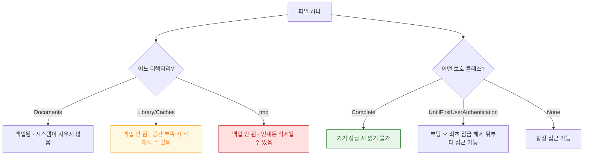

## 파일의 운명은 어느 디렉터리에 있고 어떤 보호 클래스를 갖느냐로 결정된다

같은 코드로 쓴 파일이라도 **어디에 썼느냐**에 따라 백업 여부와 시스템 자동 삭제 여부가 갈리고, **어떤 보호 클래스를 지정했느냐**에 따라 기기가 잠긴 동안 읽을 수 있는지가 갈린다. 두 축은 독립적이며, 둘 다 명시하지 않으면 기본값이 적용된다.

### 파일 시스템

- [APFS 클론은 블록을 공유하다 쓰는 순간에만 복제한다](apfs-copy-on-write-clones.md)
- [APFS 스냅샷은 시스템 업데이트를 되돌릴 수 있게 만든다](apfs-snapshots-and-updates.md)

### 보호와 정책

- [Data Protection 클래스는 파일 키를 기기 잠금 상태에 묶는다](data-protection-classes.md)
- [앱 컨테이너의 디렉터리는 백업과 정리 정책이 서로 다르다](app-container-directory-policies.md)

### 프로세스 간 접근

- [NSFileCoordinator 는 프로세스 간 파일 접근을 조정한다](file-coordination-across-processes.md)

### 문제 분류

- **사용자 데이터가 사라졌다** → `Caches` 나 `tmp` 에 두지 않았는지 확인 → [컨테이너 정책](app-container-directory-policies.md)
- **백그라운드에서 파일을 못 읽는다** → 보호 클래스가 `Complete` 인지 확인 → [Data Protection](data-protection-classes.md)
- **앱이 정지되는 순간 `0xdead10cc` 로 죽는다** → 공유 컨테이너 잠금을 쥐고 있음 → [파일 조정](file-coordination-across-processes.md)
- **앱 용량이 계속 늘어 심사에서 지적받았다** → 캐시 정리 정책 부재 → [컨테이너 정책](app-container-directory-policies.md)

### 경계

앱 관점의 파일 API 사용법과 iCloud 동기화는 [apple-storage-and-filesystems](../../03_data_networking/apple-storage-and-filesystems.md) 와 [apple-cloud-sync-patterns](../../03_data_networking/apple-cloud-sync-patterns.md) 에 둔다.

### 연관 문서

- [SSV 는 시스템 볼륨 전체를 해시 트리로 봉인해 읽는 순간마다 검증한다](../boot-and-runtime/signed-system-volume-seal.md)
- [apple-keychain-biometrics](../../05_security_privacy/apple-keychain-biometrics.md) - Keychain 접근성 속성
