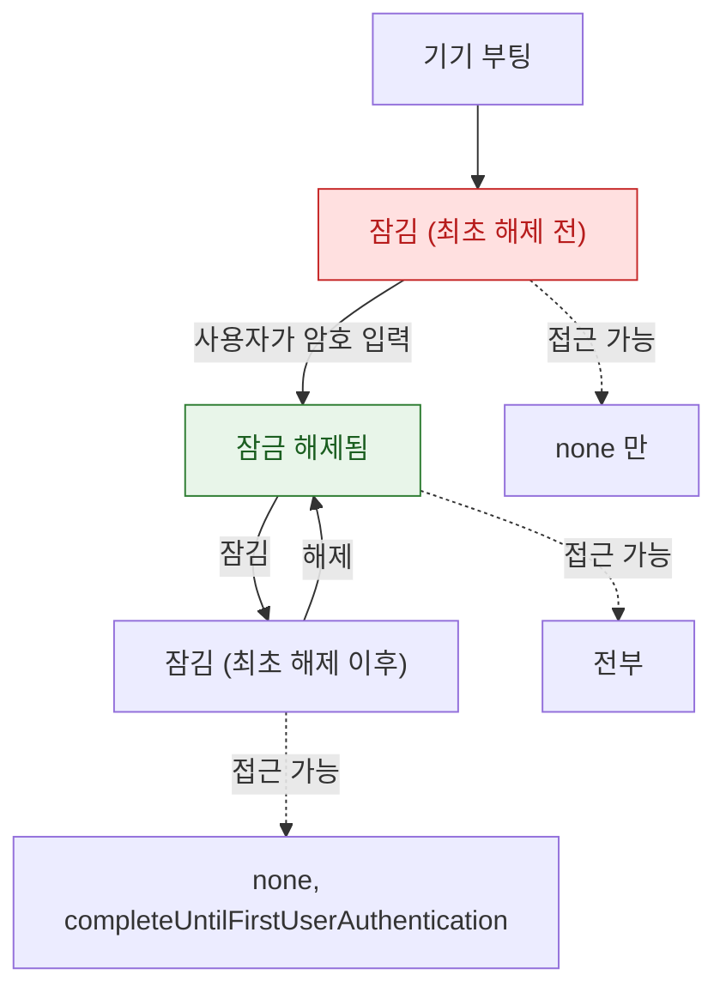

## Data Protection 클래스는 파일 키를 기기 잠금 상태에 묶는다

### 개념 (What)

iOS 의 모든 파일은 각자의 키로 암호화되고, 그 파일 키는 다시 **클래스 키**로 감싸여 있다. 클래스 키가 언제 메모리에 존재하는지가 곧 **그 파일을 언제 읽을 수 있는지**를 결정한다.

기기가 잠기면 특정 클래스 키가 메모리에서 제거된다. 그 순간부터 해당 클래스의 파일은 **복호화 자체가 불가능**해진다. 권한 문제가 아니라 키가 없는 것이다.

### 왜 필요한가 (Why)

1. **백그라운드 실패의 흔한 원인**: 잠긴 기기에서 백그라운드 작업이 파일을 읽으려다 실패한다. 코드 문제가 아니라 보호 클래스 선택 문제다.
2. **보안과 가용성의 트레이드오프**: 가장 강한 보호는 잠금 중 접근 불가를 의미한다. 백그라운드 동작이 필요한 데이터에는 쓸 수 없다.
3. **기본값이 최선이 아닐 수 있다**: 명시하지 않으면 기본 클래스가 적용된다. 민감한 데이터라면 더 강한 클래스를 명시해야 한다.

### 클래스 비교

| 클래스 | 언제 접근 가능 | 쓰기 좋은 데이터 |
| :--- | :--- | :--- |
| **`complete`** | **잠금 해제 상태에서만** | 건강·금융 기록 등 최고 민감도 |
| **`completeUnlessOpen`** | 잠금 전에 열어 두었으면 잠금 후에도 계속 쓰기 가능 | 백그라운드 다운로드 결과물 |
| **`completeUntilFirstUserAuthentication`** | **부팅 후 최초 잠금 해제 이후**로는 계속 접근 가능 | 대부분의 앱 데이터 (기본값 성격) |
| **`none`** | 항상 | 민감하지 않은 캐시 |



**세 상태를 구분하는 것이 핵심이다.** "잠김"이 두 가지라는 점 — 부팅 후 한 번도 안 푼 상태와, 풀었다가 다시 잠근 상태는 접근 가능 범위가 다르다.

### 지정 방법

```swift
// 파일 쓰기 시 지정
try data.write(to: url, options: [.completeFileProtection])

// 기존 파일의 클래스 변경
try FileManager.default.setAttributes(
    [.protectionKey: FileProtectionType.completeUntilFirstUserAuthentication],
    ofItemAtPath: url.path
)

// 잠금 상태 변화 감지 (접근 가능 시점에 작업 재개)
UIApplication.shared.isProtectedDataAvailable   // 현재 접근 가능 여부
// .protectedDataDidBecomeAvailableNotification 관찰
```

### Keychain 의 대응 속성

Keychain 항목도 같은 개념의 접근성 속성을 갖는다. 이름이 다를 뿐 구조는 같다.

| Keychain 접근성 | 파일 클래스 대응 |
| :--- | :--- |
| `WhenUnlocked` | `complete` |
| `AfterFirstUnlock` | `completeUntilFirstUserAuthentication` |
| `WhenPasscodeSetThisDeviceOnly` | 암호 설정 필수 + 백업/이전 불가 |

> [!IMPORTANT] 백그라운드 작업이 있다면
> 푸시 수신 후 데이터를 저장하거나, 백그라운드 전송 완료를 처리해야 한다면 그 데이터는 `complete` 이면 안 된다. `completeUntilFirstUserAuthentication` 이나 `completeUnlessOpen` 을 쓰고, `isProtectedDataAvailable` 로 방어한다.

### 연관 문서

- [앱 컨테이너의 디렉터리는 백업과 정리 정책이 서로 다르다](app-container-directory-policies.md)
- [백그라운드 전송은 앱이 아니라 시스템 데몬이 이어서 수행한다](../connectivity/background-transfer-daemon.md)
- [apple-keychain-biometrics](../../05_security_privacy/apple-keychain-biometrics.md) - Keychain 과 Secure Enclave
- [mobile-apple-secure-storage](../../05_security_privacy/mobile-apple-secure-storage.md) - 보안 저장소 구현

공식 문서: [Encrypting your app's files](https://developer.apple.com/documentation/uikit/protecting-the-user-s-privacy/encrypting-your-app-s-files)
