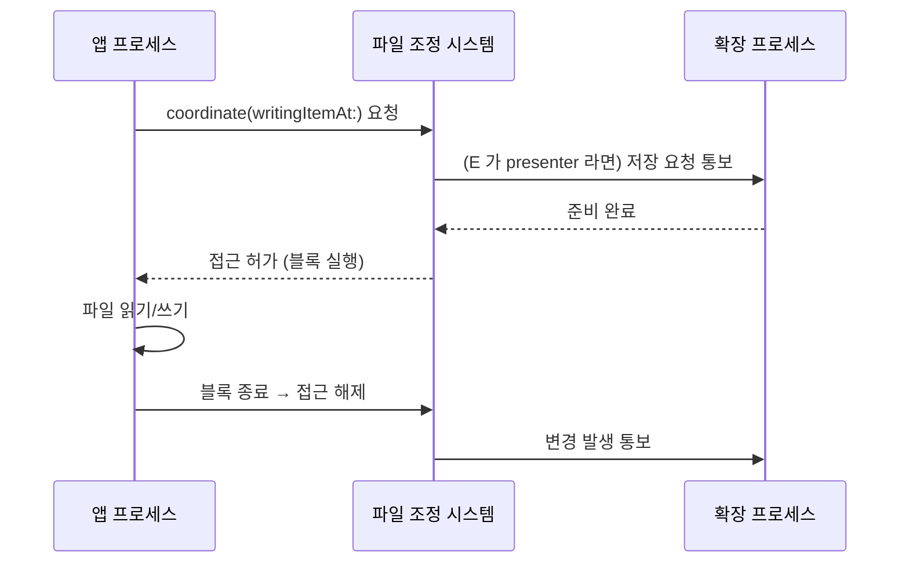

## NSFileCoordinator 는 프로세스 간 파일 접근을 조정한다

### 개념 (What)

같은 파일을 **여러 프로세스가 동시에 만질 수 있는 상황**이 iOS 에 여럿 있다.

- 앱과 [앱 확장](../ipc-and-process/app-extension-process-model.md)이 App Group 컨테이너를 공유할 때
- iCloud Drive 동기화 데몬이 로컬 파일을 갱신할 때
- 다른 앱이 Document Provider 를 통해 내 파일에 접근할 때

이때 일반 파일 API 로 읽고 쓰면 **찢어진 상태**를 읽거나 쓰기가 서로를 덮어쓴다. **`NSFileCoordinator`** 는 이 접근을 직렬화하고, **`NSFilePresenter`** 는 다른 프로세스가 내 파일을 건드리기 직전에 알림을 받게 한다.

### 왜 필요한가 (Why)

1. **파일 잠금만으로는 부족하다**: POSIX 잠금은 협조적이고, 프로세스가 정지될 때의 처리를 해 주지 않는다. 조정자는 시스템이 상황을 알게 한다.
2. **`0xdead10cc` 방지**: 정지되는 순간 공유 컨테이너의 잠금을 쥐고 있으면 [워치독이 강제 종료](../ipc-and-process/watchdog-termination-codes.md)한다. 조정된 블록은 범위가 명확해 이 상황을 만들기 어렵다.
3. **iCloud 와의 필수 규약**: iCloud 로 동기화되는 파일은 조정 없이 접근하면 안 된다. 동기화 데몬이 언제든 파일을 교체할 수 있다.

### 내부 메커니즘 (How)



```swift
let coordinator = NSFileCoordinator()
var coordinationError: NSError?

coordinator.coordinate(writingItemAt: url, options: [], error: &coordinationError) { url in
    // 이 블록 안에서만 파일을 만진다.
    // 블록이 끝나면 접근이 해제되므로 잠금을 오래 쥐지 않는다.
    try? data.write(to: url)
}
```

### 설계 규칙

| 규칙 | 이유 |
| :--- | :--- |
| 조정 블록을 **짧게** 유지한다 | 블록 안에서 정지되면 다른 프로세스가 막힌다 |
| 블록 안에서 네트워크 요청을 하지 않는다 | 예측 불가능한 시간 동안 잠금을 쥐게 된다 |
| `didEnterBackground` 에서 **열린 DB 연결을 닫는다** | `0xdead10cc` 의 직접 원인 제거 |
| 확장에서는 특히 짧게 | 확장은 시스템이 언제든 정지시킨다 |

> [!TIP] 공유 상태에는 파일보다 나은 선택지가 있다
> 단순한 키-값 상태라면 App Group `UserDefaults` 가 파일 조정보다 안전하다. 큰 구조적 데이터라면 SQLite 를 **WAL 모드**로 열고 접근 시간을 짧게 유지하는 편이 낫다. 파일 조정은 문서 단위 데이터에 적합하다.

### 관찰 가능한 증거

```bash
# 파일 조정 관련 로그
log stream --device --predicate 'subsystem == "com.apple.FileCoordination"' --info

# 0xdead10cc 종료가 났는지 크래시 리포트에서 확인
# (설정 > 개인정보 보호 및 보안 > 분석 및 향상 > 분석 데이터)
```

### 연관 문서

- [앱 컨테이너의 디렉터리는 백업과 정리 정책이 서로 다르다](app-container-directory-policies.md)
- [앱 확장은 호스트가 수명을 쥔 별도 프로세스다](../ipc-and-process/app-extension-process-model.md)
- [워치독 종료는 예외 코드로 원인 구간을 구분할 수 있다](../ipc-and-process/watchdog-termination-codes.md)
- [apple-cloud-sync-patterns](../../03_data_networking/apple-cloud-sync-patterns.md) - iCloud 동기화 패턴

공식 문서: [NSFileCoordinator](https://developer.apple.com/documentation/foundation/nsfilecoordinator)
