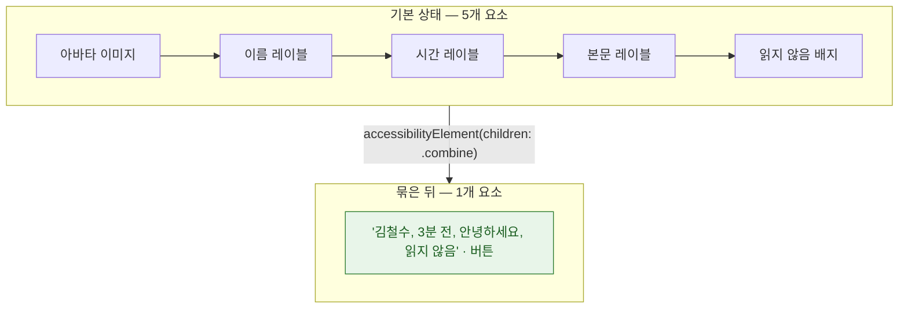

## 접근성 트리는 뷰 계층과 다르며 VoiceOver 는 그 트리를 순회한다

### 개념 (What)

VoiceOver 가 읽는 것은 뷰 계층이 아니라 **접근성 트리(accessibility tree)** 다. 시스템이 뷰 계층에서 파생시키지만 **1:1 대응이 아니다.**

- 장식용 이미지는 트리에서 빠진다
- 컨테이너 뷰는 대개 트리에 없다
- 하나의 뷰가 여러 요소로 쪼개질 수도, 여러 뷰가 하나로 묶일 수도 있다

**시각적으로 카드 하나로 보이는 것이 트리에서는 요소 5개**일 수 있고, 그러면 사용자는 카드 하나를 지나가는 데 다섯 번 스와이프해야 한다.

### 왜 필요한가 (Why)

접근성 문제의 대부분은 "레이블이 없다"가 아니라 **"구조가 잘못됐다"** 이다.

| 증상 | 원인 |
| :--- | :--- |
| 한 항목에 스와이프를 여러 번 해야 함 | 묶여야 할 요소가 쪼개져 있음 |
| 순서가 시각적 배치와 다름 | 트리 순서가 뷰 추가 순서를 따름 |
| 의미 없는 것까지 읽음 | 장식 요소가 트리에 남아 있음 |
| 버튼인데 버튼이라고 안 함 | trait 미지정 |

### 묶기와 빼기



**UIKit**

```swift
// 카드 전체를 하나의 요소로 묶는다
cardView.isAccessibilityElement = true
cardView.accessibilityLabel = "\(name), \(relativeTime), \(preview)"
cardView.accessibilityTraits = .button
cardView.accessibilityHint = "두 번 탭하면 대화를 엽니다"

// 장식용 이미지는 트리에서 뺀다
decorativeImageView.isAccessibilityElement = false
```

**SwiftUI**

```swift
HStack { Avatar(); VStack { Text(name); Text(preview) }; Badge() }
    .accessibilityElement(children: .combine)          // 하나로 묶기
    .accessibilityLabel("\(name), \(preview)")
    .accessibilityAddTraits(.isButton)

Image("decoration")
    .accessibilityHidden(true)                          // 트리에서 제외
```

| `children:` | 동작 |
| :--- | :--- |
| `.combine` | 자식들의 레이블을 합쳐 **하나의 요소**로 |
| `.ignore` | 자식을 무시하고 **직접 지정한 레이블만** |
| `.contain` | 자식을 유지하되 **그룹 경계**를 만듦 (로터 이동 단위) |

### 순서 고치기

트리 순서는 기본적으로 뷰 추가 순서를 따르므로, 시각적 배치와 어긋날 수 있다.

```swift
// UIKit: 명시적 순서 지정
containerView.accessibilityElements = [titleLabel, subtitleLabel, actionButton]

// SwiftUI: 정렬 우선순위 (큰 값이 먼저)
Text("제목").accessibilitySortPriority(2)
Text("부제").accessibilitySortPriority(1)
```

### 커스텀 액션 — 스와이프 수를 줄인다

셀 안에 버튼이 여러 개면 요소가 늘어난다. **로터 액션**으로 옮기면 셀 하나만 순회하면서도 모든 기능에 접근할 수 있다.

```swift
.accessibilityAction(named: "보관") { archive() }
.accessibilityAction(named: "삭제") { delete() }
```

### 관찰 가능한 증거

**Accessibility Inspector** (Xcode > Open Developer Tool > Accessibility Inspector)

| 기능 | 확인하는 것 |
| :--- | :--- |
| Inspection | 요소별 label · value · trait · frame |
| **Audit** | 누락된 레이블, 낮은 대비, 작은 터치 타깃을 자동 검사 |
| Navigation | 요소 순서를 순차적으로 따라가 보기 |

**자동화 테스트로 회귀 방지**

```swift
func testAccessibility() throws {
    let app = XCUIApplication(); app.launch()
    try app.performAccessibilityAudit()      // 실패 시 문제 목록을 리포트
}
```

**실기기 VoiceOver 테스트가 최종 검증이다.** 설정 > 손쉬운 사용 > 단축키에 VoiceOver 를 등록해 두면 측면 버튼 세 번으로 켜고 끌 수 있다.

### 연관 문서

- [Dynamic Type 은 글꼴 크기가 아니라 레이아웃 요구사항이다](dynamic-type-requires-layout-that-grows.md)
- [trait 과 label 은 생김새가 아니라 목적을 서술한다](traits-and-labels-describe-purpose-not-appearance.md)
- [시스템 접근성 설정은 제안이 아니라 계약이다](system-settings-are-contracts-not-suggestions.md)

공식 문서: [Accessibility](https://developer.apple.com/documentation/accessibility) · [Accessibility Inspector](https://developer.apple.com/documentation/accessibility/accessibility-inspector)
