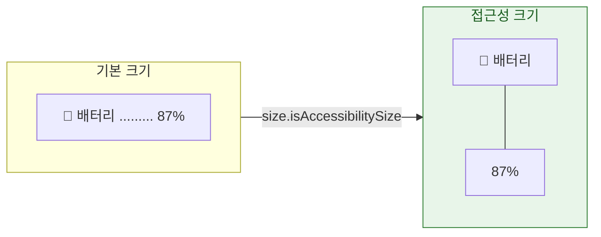

## Dynamic Type 은 글꼴 크기 설정이 아니라 레이아웃이 커질 수 있어야 한다는 요구사항이다

### 개념 (What)

Dynamic Type 을 "시스템 글꼴 크기를 따르는 기능"으로 이해하면 절반만 맞다. 사용자가 접근성 크기까지 올리면 텍스트가 **몇 배로 커진다.** 그때 레이아웃이 견디지 못하면 글자가 잘리거나 겹치거나 버튼이 화면 밖으로 나간다.

즉 Dynamic Type 지원은 **폰트 API 를 바꾸는 일이 아니라 레이아웃을 다시 설계하는 일**이다.

### 왜 필요한가 (Why)

1. **실사용자 비율이 높다**: 글꼴 크기를 키워 쓰는 사용자는 시각 장애인만이 아니다. 노안 사용자를 포함하면 상당한 비율이다.
2. **고정 높이가 전부 깨진다**: `height: 44` 로 고정한 버튼은 큰 글꼴에서 텍스트를 담지 못한다.
3. **가로 배치가 무너진다**: 아이콘 + 레이블 + 값을 가로로 놓으면 큰 글꼴에서 공간이 없다.

### 구현

```swift
// SwiftUI: 시맨틱 스타일을 쓰면 자동 대응
Text("제목").font(.headline)          // ✅
Text("제목").font(.system(size: 17))  // ❌ 고정 크기

// 커스텀 폰트도 스케일링에 태울 수 있다
Text("제목").font(.custom("MyFont", size: 17, relativeTo: .headline))

// UIKit
label.font = UIFont.preferredFont(forTextStyle: .body)
label.adjustsFontForContentSizeCategory = true      // ★ 이걸 빼면 갱신되지 않는다
label.numberOfLines = 0                             // ★ 줄바꿈 허용
```

### 큰 크기에서 가로를 세로로 바꾼다

가장 효과가 큰 대응이다.

```swift
struct InfoRow: View {
    @Environment(\.dynamicTypeSize) private var size

    var body: some View {
        // 접근성 크기에서는 세로로 쌓는다
        let layout = size.isAccessibilitySize
            ? AnyLayout(VStackLayout(alignment: .leading))
            : AnyLayout(HStackLayout())

        layout {
            Label("배터리", systemImage: "battery.100")
            Spacer()
            Text("87%")
        }
    }
}
```



### 체크리스트

| 항목 | 확인 |
| :--- | :--- |
| 고정 높이 제약 | `heightAnchor.constraint(equalToConstant:)` 를 제거하거나 `greaterThanOrEqualTo` 로 |
| `numberOfLines = 1` | 0 으로 바꾸거나 잘림을 허용할지 판단 |
| 가로 배치 | 접근성 크기에서 세로 전환 |
| 커스텀 폰트 | `relativeTo:` 또는 `UIFontMetrics` 로 스케일링 |
| 상한 필요 시 | `.dynamicTypeSize(...DynamicTypeSize.accessibility3)` 로 제한 (**남용 금지**) |
| 이미지 크기 | `Label` 의 SF Symbol 은 자동, 커스텀 이미지는 `@ScaledMetric` |

```swift
// 이미지·간격도 함께 커지게
@ScaledMetric(relativeTo: .body) private var iconSize: CGFloat = 24
Image(systemName: "star").frame(width: iconSize, height: iconSize)
```

### 관찰 가능한 증거

```bash
# 시뮬레이터 글꼴 크기 조작 — 가장 빠른 검증
xcrun simctl ui booted content_size accessibility-extra-extra-extra-large
xcrun simctl ui booted content_size small
```

**Xcode Preview 로 여러 크기를 동시에 본다**

```swift
#Preview("기본") { InfoRow() }
#Preview("접근성 XXXL") {
    InfoRow().environment(\.dynamicTypeSize, .accessibility5)
}
```

**Accessibility Inspector 의 Audit** 이 잘린 텍스트를 자동 검출한다. 실기기에서는 **설정 > 손쉬운 사용 > 디스플레이 및 텍스트 크기 > 더 큰 텍스트**에서 최대로 올려 전체 화면을 순회한다.

### 연관 문서

- [접근성 트리는 뷰 계층과 다르며 VoiceOver 는 그 트리를 순회한다](accessibility-tree-is-not-the-view-hierarchy.md)
- [시스템 접근성 설정은 제안이 아니라 계약이다](system-settings-are-contracts-not-suggestions.md)
- [SwiftUI 레이아웃은 부모 제안·자식 선택·부모 배치의 3단계 협상이다](../swiftui/layout-is-a-three-step-negotiation.md)
- [Auto Layout 은 우선순위가 붙은 제약 시스템을 풀어 프레임을 정한다](../uikit/autolayout-solves-a-constraint-system.md)

공식 문서: [Scaling fonts automatically](https://developer.apple.com/documentation/uikit/scaling-fonts-automatically)
