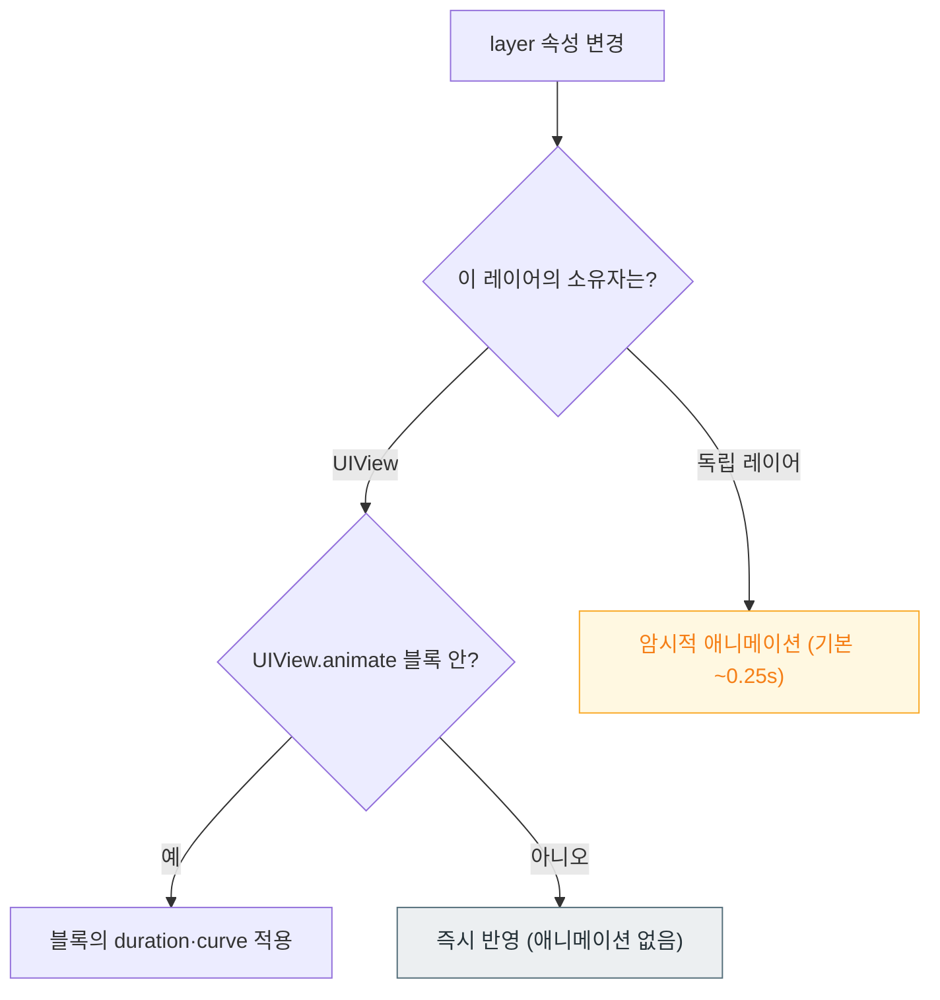

## 암시적 애니메이션은 레이어가 스스로 결정하고 명시적 애니메이션은 개발자가 지정한다

### 개념 (What)

`CALayer` 의 애니메이션 가능한 속성을 바꾸면 **아무것도 요청하지 않아도 애니메이션이 일어난다.** 레이어가 "이 속성이 바뀌었으니 어떻게 전환할까"를 스스로 찾아보고(action lookup) 기본 전환을 적용하기 때문이다. 이것이 **암시적(implicit) 애니메이션**이다.

```swift
layer.opacity = 0.5      // 요청하지 않았는데 약 0.25초 페이드가 일어난다
```

**명시적(explicit) 애니메이션**은 개발자가 애니메이션 객체를 만들어 직접 붙이는 것이다.

```swift
let anim = CABasicAnimation(keyPath: "opacity")
anim.fromValue = 1.0; anim.toValue = 0.5; anim.duration = 1.0
layer.add(anim, forKey: "fade")
```

### 왜 필요한가 (Why)

혼란의 원인이 여기 있다 — **어떤 변경은 애니메이션되고 어떤 것은 안 된다.**

| 대상 | 암시적 애니메이션 |
| :--- | :--- |
| **독립 `CALayer`** (직접 만든 레이어) | **일어난다** |
| **뷰가 소유한 레이어** (`view.layer`) | **일어나지 않는다** |

`UIView` 는 자기 레이어의 action lookup 을 가로채 **`UIView.animate` 블록 밖에서는 애니메이션을 끈다.** 그래서 같은 코드가 커스텀 레이어에서는 애니메이션되고 뷰 레이어에서는 즉시 반영된다.



### 암시적 애니메이션 끄기

커스텀 레이어에서 원치 않는 전환이 보일 때 쓴다.

```swift
CATransaction.begin()
CATransaction.setDisableActions(true)      // 이 블록 안의 변경은 애니메이션하지 않는다
shapeLayer.path = newPath
CATransaction.commit()
```

대량의 레이어를 한 번에 갱신할 때 이걸 빼면 **불필요한 애니메이션 비용이 그대로 프레임 예산을 먹는다.**

### SwiftUI 에서의 대응

SwiftUI 는 [값이 바뀌면 body 를 다시 평가](../swiftui/view-is-a-value-not-an-object.md)하고, 그 변경을 애니메이션할지는 **트랜잭션**이 정한다.

```swift
// 명시적 — 이 상태 변경을 애니메이션한다
withAnimation(.spring) { isExpanded.toggle() }

// 특정 값의 변화만 애니메이션 (권장)
.animation(.spring, value: isExpanded)

// ⚠️ 값 없는 .animation(_:) 은 deprecated — 의도치 않은 것까지 애니메이션된다
```

`.animation(_:value:)` 형태를 쓰는 이유는 **무엇의 변화를 애니메이션할지 명시**하기 위해서다. 값 없는 형태는 그 뷰의 모든 변경에 붙어 예상치 못한 전환을 만든다.

### 애니메이션 가능한 속성

모든 속성이 애니메이션되지는 않는다. `CALayer` 기준으로 대표적인 것들:

| 애니메이션됨 | 안 됨 |
| :--- | :--- |
| `opacity`, `position`, `bounds`, `transform` | `contentsGravity` |
| `backgroundColor`, `borderWidth`, `cornerRadius` | `masksToBounds` (즉시 적용) |
| `shadowOpacity`, `shadowRadius`, `shadowPath` | 대부분의 불리언 플래그 |
| `path` (`CAShapeLayer`) | — |

**`shadowPath` 가 애니메이션된다**는 점이 유용하다. [그림자 성능](../../01_system_internals/graphics-and-media/offscreen-rendering-cost.md)을 위해 `shadowPath` 를 지정하면서도 모양 전환을 부드럽게 할 수 있다.

### 관찰 가능한 증거

```swift
// 레이어에 현재 붙어 있는 애니메이션 확인
print(layer.animationKeys() ?? [])
print(layer.animation(forKey: "fade") as Any)

// 뷰의 레이어가 action lookup 을 어떻게 처리하는지
print(view.layer.action(forKey: "opacity") as Any)   // UIView 소유면 NSNull
```

**Instruments의 Animation Hitches** 로 애니메이션이 프레임 마감을 지키는지 확인한다. 애니메이션 자체는 [Render Server 에서 독립적으로 진행](../../01_system_internals/graphics-and-media/render-server-composition.md)되므로, 메인 스레드가 막혀도 계속 돈다는 점을 기억한다.

### 연관 문서

- [인터럽트 가능한 애니메이션은 별도 애니메이터가 필요하다](interruptible-animation-needs-a-property-animator.md)
- [스프링은 지속 시간이 아니라 물리 파라미터로 정의된다](spring-animations-model-physics-not-duration.md)
- [Render Server 는 앱 프로세스와 독립적으로 합성한다](../../01_system_internals/graphics-and-media/render-server-composition.md)
- [레이어 트리는 IPC 로 Render Server 에 커밋된다](../../01_system_internals/graphics-and-media/layer-tree-commit-to-render-server.md)

공식 문서: [Core Animation](https://developer.apple.com/documentation/quartzcore) · [Animating views and transitions](https://developer.apple.com/documentation/swiftui/animating-views-and-transitions)
