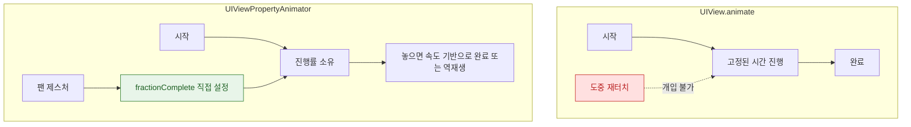

## 인터럽트 가능한 애니메이션은 진행률을 소유하는 애니메이터가 필요하다

### 개념 (What)

`UIView.animate(withDuration:)` 로 시작한 애니메이션은 **끝날 때까지 되돌릴 수 없다.** 사용자가 도중에 다시 손을 대면 어색하게 튄다.

**`UIViewPropertyAnimator`** 는 애니메이션을 **진행률(0~1)을 가진 객체**로 만든다. 그래서 중간에 멈추고, 역재생하고, 손가락 위치에 맞춰 진행률을 직접 조절할 수 있다.

```swift
let animator = UIViewPropertyAnimator(duration: 0.4, dampingRatio: 0.8) {
    self.card.transform = CGAffineTransform(translationX: 0, y: -200)
}
animator.startAnimation()

// 도중에 개입
animator.pauseAnimation()
animator.fractionComplete = 0.6          // 손가락 위치에 맞춰 직접 설정
animator.isReversed = true               // 역재생
animator.continueAnimation(withTimingParameters: nil, durationFactor: 0.3)
```

### 왜 필요한가 (Why)

Apple 의 UI 는 **사용자가 언제든 개입할 수 있다**는 전제로 설계되어 있다. 시트를 내리다 다시 올리거나, 전환 중에 취소하는 동작이 자연스러워야 한다. `UIView.animate` 로는 이 요구를 구현할 수 없다.



### 제스처와 결합하는 표준 형태

```swift
@objc func handlePan(_ gesture: UIPanGestureRecognizer) {
    let translation = gesture.translation(in: view).y

    switch gesture.state {
    case .began:
        animator = UIViewPropertyAnimator(duration: 0.4, dampingRatio: 0.8) { ... }
        animator.pauseAnimation()                       // 즉시 멈춰 진행률만 조작

    case .changed:
        animator.fractionComplete = -translation / 200   // 손가락에 직접 매핑

    case .ended, .cancelled:
        // 속도를 반영해 완료할지 되돌릴지 결정한다
        let velocity = gesture.velocity(in: view).y
        animator.isReversed = velocity > 0
        let remaining = animator.isReversed ? animator.fractionComplete : 1 - animator.fractionComplete
        animator.continueAnimation(
            withTimingParameters: UISpringTimingParameters(dampingRatio: 0.8,
                                                            initialVelocity: .init(dx: 0, dy: velocity / 200)),
            durationFactor: remaining)
    default: break
    }
}
```

**핵심은 `.ended` 처리다.** 손가락을 뗀 시점의 **속도**를 반영해야 자연스럽다. 진행률만 보고 판단하면 빠르게 튕겼는데도 되돌아가는 어색한 동작이 된다.

### SwiftUI 에서

SwiftUI 는 상태 기반이라 진행률을 직접 잡는 대신 **제스처 상태를 뷰 상태에 반영**한다.

```swift
@GestureState private var dragOffset: CGFloat = 0
@State private var isExpanded = false

card
    .offset(y: isExpanded ? -200 + dragOffset : dragOffset)
    .gesture(
        DragGesture()
            .updating($dragOffset) { value, state, _ in
                state = value.translation.height        // 실시간 추적
            }
            .onEnded { value in
                // 속도를 반영해 최종 상태 결정
                let shouldExpand = value.predictedEndTranslation.height < -100
                withAnimation(.spring) { isExpanded = shouldExpand }
            }
    )
```

`predictedEndTranslation` 이 속도를 반영한 예상 위치를 준다. 이것으로 판단하면 UIKit 의 velocity 처리와 같은 효과를 얻는다.

`@GestureState` 는 제스처가 끝나면 **자동으로 초기값으로 돌아간다.** 수동으로 리셋할 필요가 없다.

### 흔한 실수

| 실수 | 결과 |
| :--- | :--- |
| `.ended` 에서 속도 무시 | 빠르게 튕겼는데 되돌아감 |
| 애니메이터를 지역 변수로 | 제스처 도중 해제되어 애니메이션이 사라짐 |
| `fractionComplete` 를 0~1 밖으로 | 예측 불가 동작 (클램프 필요) |
| 애니메이터 재사용 | `.stopAnimation` 후 상태가 꼬임. **매번 새로 만든다** |

### 관찰 가능한 증거

```swift
print(animator.state, animator.isRunning, animator.fractionComplete)
// state: .inactive / .active / .stopped
```

**Instruments의 Animation Hitches** 로 제스처 추적 중 프레임이 밀리는지 확인한다. `fractionComplete` 설정은 [즉시 커밋을 유발](../../01_system_internals/graphics-and-media/layer-tree-commit-to-render-server.md)하므로, 제스처 콜백에서 무거운 계산을 하면 그대로 히치가 된다.

### 연관 문서

- [암시적 애니메이션은 레이어가 스스로 결정한다](implicit-and-explicit-animation-differ-in-who-decides.md)
- [스프링은 지속 시간이 아니라 물리 파라미터로 정의된다](spring-animations-model-physics-not-duration.md)
- [시스템 접근성 설정은 제안이 아니라 계약이다](../accessibility/system-settings-are-contracts-not-suggestions.md) - 동작 줄이기 대응
- [히치는 평균 FPS 가 아니라 사용자가 실제로 본 지연을 잰다](../../01_system_internals/graphics-and-media/hitches-measure-user-visible-jank.md)

공식 문서: [UIViewPropertyAnimator](https://developer.apple.com/documentation/uikit/uiviewpropertyanimator)
