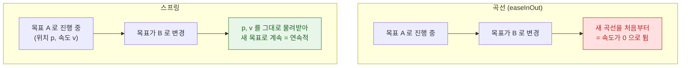

## 스프링 애니메이션은 지속 시간이 아니라 물리 파라미터로 정의된다

### 개념 (What)

`easeInOut` 같은 곡선 기반 애니메이션은 **"몇 초 동안 이 곡선을 따라간다"** 를 정의한다. 스프링은 다르다. **질량·강성·감쇠라는 물리 파라미터**를 주면 시스템이 실제 스프링 방정식을 풀어 움직임을 만든다.

그래서 스프링에는 "정확한 지속 시간"이라는 개념이 원래 없다. 값이 목표에 충분히 가까워지면 멈출 뿐이다.

### 왜 필요한가 (Why)

**중간에 목표가 바뀌어도 자연스럽다.** 곡선 애니메이션은 진행 중에 목표를 바꾸면 처음부터 다시 시작하거나 튄다. 스프링은 **현재 위치와 현재 속도를 시작 조건으로 물려받아** 이어서 계산하므로 끊김이 없다.



이것이 Apple UI 의 움직임이 부드러운 이유다. 사용자가 언제 개입해도 값이 튀지 않는다.

### 파라미터 이해하기

SwiftUI 는 물리 파라미터 대신 **직관적인 두 값**을 노출한다.

```swift
.spring(response: 0.5, dampingFraction: 0.7)
```

| 파라미터 | 의미 | 키우면 |
| :--- | :--- | :--- |
| **`response`** | 목표에 반응하는 속도 (대략적인 주기) | 느리고 여유 있게 |
| **`dampingFraction`** | 감쇠 비율 | 튕김이 줄어듦 |

`dampingFraction` 의 세 구간:

| 값 | 동작 |
| :--- | :--- |
| `< 1` | **과소감쇠** — 목표를 지나쳐 튕긴다 (탄력적) |
| `= 1` | **임계감쇠** — 튕김 없이 가장 빠르게 도달 |
| `> 1` | **과감쇠** — 느리게 스며들 듯 도달 |

```swift
.spring(response: 0.4, dampingFraction: 0.6)   // 탄력적 (튕김 있음)
.spring(response: 0.4, dampingFraction: 1.0)   // 깔끔 (튕김 없음)
.smooth                                        // iOS 17+ 프리셋: 튕김 없음
.snappy                                        // 약간의 튕김
.bouncy                                        // 뚜렷한 튕김
```

**iOS 17+ 의 프리셋(`.smooth`/`.snappy`/`.bouncy`)** 을 쓰면 파라미터를 고민하지 않아도 시스템 감각과 일치한다. 대부분의 경우 이것으로 충분하다.

### UIKit 에서

```swift
// dampingRatio 기반 (SwiftUI 의 dampingFraction 과 같은 개념)
UIViewPropertyAnimator(duration: 0.4, dampingRatio: 0.7) { ... }

// 물리 파라미터를 직접 주기
let spring = UISpringTimingParameters(mass: 1, stiffness: 180, damping: 20,
                                      initialVelocity: .init(dx: 0, dy: 2))
UIViewPropertyAnimator(duration: 0, timingParameters: spring)
```

**`initialVelocity` 가 제스처 연결의 핵심이다.** 손가락을 뗀 속도를 여기에 넘겨야 움직임이 이어진다. → [인터럽트 가능한 애니메이션](interruptible-animation-needs-a-property-animator.md)

### 언제 스프링을 쓰지 않는가

| 상황 | 선택 |
| :--- | :--- |
| 사용자 조작에 반응하는 UI 이동 | **스프링** |
| 시트·카드 전환 | **스프링** |
| 진행률 표시 (선형이어야 함) | `.linear` |
| 정확한 타이밍이 필요한 시퀀스 | 곡선 + duration |
| 반복 애니메이션 (로딩 스피너) | `.linear` + repeat |

진행률 바에 스프링을 쓰면 값이 목표를 지나쳤다가 돌아와 **실제와 다른 진행률을 표시**한다.

### 접근성

동작 줄이기를 켠 사용자에게는 튕김이 불편할 수 있다.

```swift
@Environment(\.accessibilityReduceMotion) private var reduceMotion

.animation(reduceMotion ? .easeInOut(duration: 0.2) : .bouncy, value: isExpanded)
```

→ [시스템 접근성 설정은 계약이다](../accessibility/system-settings-are-contracts-not-suggestions.md)

### 관찰 가능한 증거

```swift
// 여러 파라미터를 나란히 비교
#Preview {
    VStack(spacing: 40) {
        ForEach([0.4, 0.7, 1.0], id: \.self) { d in
            AnimatedBox(animation: .spring(response: 0.5, dampingFraction: d))
        }
    }
}
```

**Instruments의 Animation Hitches** 로 스프링이 안정될 때까지 프레임 마감을 지키는지 확인한다. 스프링은 곡선보다 오래 이어질 수 있어 [가변 주사율](../../01_system_internals/graphics-and-media/promotion-variable-refresh-deadline.md)에서 프레임 수가 더 많다.

### 연관 문서

- [인터럽트 가능한 애니메이션은 진행률을 소유하는 애니메이터가 필요하다](interruptible-animation-needs-a-property-animator.md)
- [암시적 애니메이션은 레이어가 스스로 결정한다](implicit-and-explicit-animation-differ-in-who-decides.md)
- [시스템 접근성 설정은 제안이 아니라 계약이다](../accessibility/system-settings-are-contracts-not-suggestions.md)

공식 문서: [Animation](https://developer.apple.com/documentation/swiftui/animation) · [WWDC 2023: Animate with springs](https://developer.apple.com/videos/play/wwdc2023/10158/)
