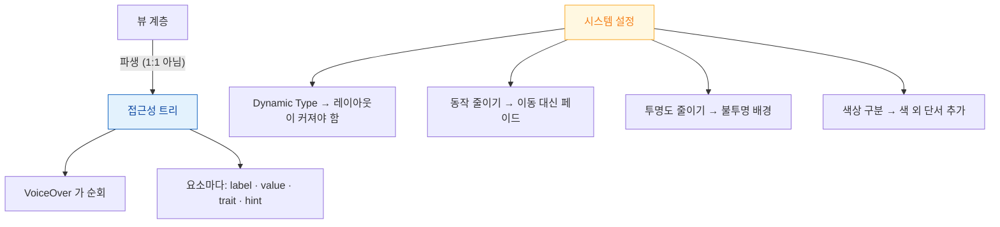

## 접근성은 레이블을 붙이는 일이 아니라 구조·크기·시스템 설정을 지키는 일이다

"접근성 = `accessibilityLabel` 채우기"로 이해하면 감사(audit)는 통과해도 실사용은 여전히 불편하다. 실제 문제는 세 축에서 나온다.

1. **구조** — 접근성 트리가 뷰 계층과 달라서, 카드 하나가 요소 5개로 쪼개져 있다.
2. **크기** — 사용자가 글꼴을 키우면 레이아웃이 견디지 못한다.
3. **설정** — 동작 줄이기·투명도 줄이기를 무시하면 실제로 불편이나 어지럼을 유발한다.



### 정본 노트

- [접근성 트리는 뷰 계층과 다르며 VoiceOver 는 그 트리를 순회한다](accessibility/accessibility-tree-is-not-the-view-hierarchy.md) — **묶기(`.combine`)와 빼기(`accessibilityHidden`)**, 순서 고치기, 커스텀 액션.
- [label 과 trait 은 생김새가 아니라 목적과 상태를 서술한다](accessibility/traits-and-labels-describe-purpose-not-appearance.md) — 네 축(label·value·trait·hint)의 분리, `.header` 의 효과.
- [Dynamic Type 은 글꼴 크기 설정이 아니라 레이아웃이 커질 수 있어야 한다는 요구사항이다](accessibility/dynamic-type-requires-layout-that-grows.md) — 접근성 크기에서 가로를 세로로.
- [시스템 접근성 설정은 제안이 아니라 앱이 지켜야 할 계약이다](accessibility/system-settings-are-contracts-not-suggestions.md) — 여섯 가지 설정과 각각의 대응.

### 증상에서 시작하기

| 증상 | 어느 노트로 |
| :--- | :--- |
| 항목 하나에 스와이프를 여러 번 해야 한다 | [접근성 트리](accessibility/accessibility-tree-is-not-the-view-hierarchy.md) |
| 읽는 순서가 화면 배치와 다르다 | [접근성 트리](accessibility/accessibility-tree-is-not-the-view-hierarchy.md) |
| 아이콘 버튼을 "버튼" 이라고만 읽는다 | [label 과 trait](accessibility/traits-and-labels-describe-purpose-not-appearance.md) |
| 상태가 바뀌어도 알려주지 않는다 | [label 과 trait](accessibility/traits-and-labels-describe-purpose-not-appearance.md) (value / 알림) |
| 글꼴을 키우면 텍스트가 잘린다 | [Dynamic Type](accessibility/dynamic-type-requires-layout-that-grows.md) |
| 동작 줄이기를 켜도 애니메이션이 그대로다 | [시스템 설정](accessibility/system-settings-are-contracts-not-suggestions.md) |

### 검증 도구

| 도구 | 무엇을 잡는가 |
| :--- | :--- |
| **Accessibility Inspector > Audit** | 레이블 누락, 낮은 대비, 작은 터치 타깃, 잘린 텍스트 |
| **XCTest `performAccessibilityAudit()`** | 위 항목을 CI 에서 회귀 방지 |
| **의사 언어 (Double-Length)** | Dynamic Type·번역 길이로 인한 잘림 |
| **실기기 VoiceOver** | 구조와 순서 — **자동 도구가 못 잡는 유일한 것** |

```bash
xcrun simctl ui booted content_size accessibility-extra-extra-extra-large
```

```swift
func testAccessibility() throws {
    let app = XCUIApplication(); app.launch()
    try app.performAccessibilityAudit()
}
```

> [!IMPORTANT] 자동 감사만으로는 부족하다
> Audit 은 "레이블이 있는가"는 잡지만 "레이블이 유용한가", "순서가 합리적인가"는 못 잡는다. **VoiceOver 를 켜고 눈을 감은 채 주요 흐름을 완주**하는 것이 최종 검증이다.

### Android 비교

| | iOS | Android |
| :--- | :--- | :--- |
| 트리 구성 | 접근성 트리 (뷰에서 파생) | Semantics 트리 (Compose) / AccessibilityNodeInfo |
| 묶기 | `.accessibilityElement(children: .combine)` | `Modifier.semantics(mergeDescendants = true)` |
| 레이블 | `accessibilityLabel` | `contentDescription` |
| 제외 | `accessibilityHidden(true)` | `contentDescription = null` |
| 검사 도구 | Accessibility Inspector | Accessibility Scanner |

### 연관 문서

- [apple-internationalization](apple-internationalization.md) - 함께 검증하면 효율이 좋다 (둘 다 레이아웃이 커지는 문제)
- [apple-animation-and-motion](apple-animation-and-motion.md) - 동작 줄이기 대응
- [apple-swiftui-deep-dive](apple-swiftui-deep-dive.md)
- [apple-testing-and-quality](../06_testing_performance/apple-testing-and-quality.md) - 감사 자동화

공식 문서: [Accessibility](https://developer.apple.com/documentation/accessibility) · [Human Interface Guidelines: Accessibility](https://developer.apple.com/design/human-interface-guidelines/accessibility)
