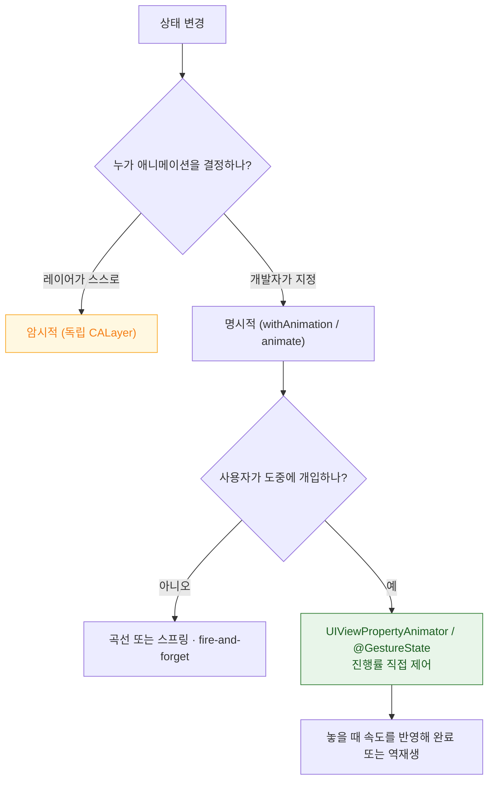

## 애니메이션은 예쁨이 아니라 상태 변화를 설명하고 사용자 개입을 허용하는 장치다

Apple 플랫폼의 애니메이션 설계는 두 가지 원칙 위에 있다.

1. **연속성** — 값이 갑자기 점프하지 않는다. 그래서 곡선보다 [스프링](animation/spring-animations-model-physics-not-duration.md)이 기본이다.
2. **개입 가능성** — 사용자가 애니메이션 도중에 다시 조작할 수 있어야 한다. 그래서 [진행률을 소유하는 애니메이터](animation/interruptible-animation-needs-a-property-animator.md)가 필요하다.

### 정본 노트

- [암시적 애니메이션은 레이어가 스스로 결정하고 명시적 애니메이션은 개발자가 지정한다](animation/implicit-and-explicit-animation-differ-in-who-decides.md) — **뷰 레이어에서는 왜 암시적 애니메이션이 안 일어나는가**, 애니메이션 가능한 속성 목록.
- [인터럽트 가능한 애니메이션은 진행률을 소유하는 애니메이터가 필요하다](animation/interruptible-animation-needs-a-property-animator.md) — 제스처 결합 표준 형태, `.ended` 에서 속도 반영.
- [스프링 애니메이션은 지속 시간이 아니라 물리 파라미터로 정의된다](animation/spring-animations-model-physics-not-duration.md) — 목표가 바뀌어도 연속적인 이유, `response`/`dampingFraction` 해석.

### 계층 구조

| 계층 | 무엇을 쓰나 | 언제 |
| :--- | :--- | :--- |
| **SwiftUI** | `withAnimation`, `.animation(_:value:)` | 대부분의 상황 |
| **UIKit** | `UIViewPropertyAnimator` | 인터랙티브·인터럽트 가능 |
| **Core Animation** | `CABasicAnimation`, `CAKeyframeAnimation` | 레이어 직접 제어, 복잡한 경로 |
| **Core Motion** | 가속도계·자이로 | 기기 물리 움직임에 반응 |

### 증상에서 시작하기

| 증상 | 어느 노트로 |
| :--- | :--- |
| 원치 않는 애니메이션이 일어난다 | [암시적 애니메이션](animation/implicit-and-explicit-animation-differ-in-who-decides.md) (`setDisableActions`) |
| 커스텀 레이어는 되는데 뷰는 안 된다 | [암시적 애니메이션](animation/implicit-and-explicit-animation-differ-in-who-decides.md) |
| 제약을 바꿨는데 애니메이션이 안 된다 | [레이아웃 사이클](uikit/layout-cycle-is-deferred-and-coalesced.md) (`layoutIfNeeded` 위치) |
| 도중에 다시 만지면 튄다 | [인터럽트 가능](animation/interruptible-animation-needs-a-property-animator.md) |
| 빠르게 튕겼는데 되돌아간다 | [인터럽트 가능](animation/interruptible-animation-needs-a-property-animator.md) (속도 미반영) |
| 진행률 바가 목표를 지나친다 | [스프링](animation/spring-animations-model-physics-not-duration.md) (선형을 써야 함) |
| 애니메이션 중 프레임이 떨어진다 | [07 런북](../00_foundations/diagnostic-runbooks/07-scroll-hitches.md) |

### 접근성은 선택이 아니다

동작 줄이기를 켠 사용자에게 큰 이동·확대·회전은 실제로 불편이나 어지럼을 유발한다. **전환을 없애는 것이 아니라 크로스페이드로 대체**한다. → [시스템 접근성 설정은 계약이다](accessibility/system-settings-are-contracts-not-suggestions.md)

### 성능

애니메이션은 [Render Server 에서 독립적으로 진행](../01_system_internals/graphics-and-media/render-server-composition.md)되므로 메인 스레드가 막혀도 계속 돈다. 반대로 **애니메이션이 도는데 터치가 안 먹으면** 앱이 멈춘 것이다. → [02 런북](../00_foundations/diagnostic-runbooks/02-watchdog-and-hang.md)

### 연관 문서

- [apple-swiftui-deep-dive](apple-swiftui-deep-dive.md)
- [apple-uikit-lifecycle](apple-uikit-lifecycle.md)
- [apple-graphics-and-media](../01_system_internals/graphics-and-media/apple-graphics-and-media.md)
- [히치는 평균 FPS 가 아니라 사용자가 실제로 본 지연을 잰다](../01_system_internals/graphics-and-media/hitches-measure-user-visible-jank.md)

공식 문서: [Animating views and transitions](https://developer.apple.com/documentation/swiftui/animating-views-and-transitions) · [Core Animation](https://developer.apple.com/documentation/quartzcore)
