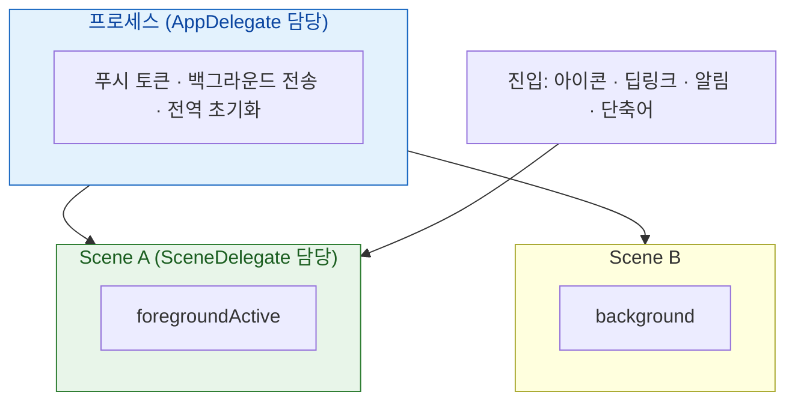

## 앱 생명주기의 단위는 scene 이며 진입 경로마다 다른 콜백을 탄다

iOS 13 의 멀티윈도우 이후 "앱 생명주기"라는 말이 정확하지 않게 되었다. 실제로는 **두 개의 축**이 있다.

1. **무엇이 단위인가** — 앱(프로세스)이 아니라 **scene(창)** 이 생명주기 단위다. 한 앱이 서로 다른 상태의 창을 동시에 가질 수 있다.
2. **어떻게 들어왔는가** — 아이콘 탭, 딥링크, 알림, 단축어, 백그라운드 전송이 **각각 다른 콜백**을 탄다.



### 정본 노트

- [생명주기 단위는 앱이 아니라 scene 이며 한 앱이 여러 상태를 동시에 가질 수 있다](scene/scene-is-the-lifecycle-unit-not-the-app.md) — 네 가지 상태와 `foregroundInactive` 의 의미, 스냅샷 대비.
- [AppDelegate 는 프로세스를, SceneDelegate 는 창을 소유한다](scene/app-delegate-and-scene-delegate-own-different-things.md) — **푸시 토큰과 백그라운드 전송을 SceneDelegate 에 두면 안 되는 이유.**
- [앱은 여러 진입점으로 시작되며 각 경로가 서로 다른 콜백을 탄다](scene/launch-paths-differ-by-entry-point.md) — 콜드 스타트에서 8개 경로를 모두 받는 형태.
- [상태 복원은 스냅샷이 아니라 NSUserActivity 로 창마다 따로 한다](scene/state-restoration-uses-user-activity.md) — **앱 전환기 스와이프로 테스트하면 안 되는 이유.**

### 증상에서 시작하기

| 증상 | 어느 노트로 |
| :--- | :--- |
| 다른 창이 전경인데 타이머가 멈춘다 | [scene 단위](scene/scene-is-the-lifecycle-unit-not-the-app.md) |
| 창을 여러 개 열면 상태가 섞인다 | [scene 단위](scene/scene-is-the-lifecycle-unit-not-the-app.md) |
| 창 없이 깨어났을 때 푸시 토큰이 등록 안 됨 | [델리게이트 책임](scene/app-delegate-and-scene-delegate-own-different-things.md) |
| 앱 종료 상태에서 링크를 탭하면 아무 일도 없다 | [진입 경로](scene/launch-paths-differ-by-entry-point.md) |
| 시스템이 앱을 종료한 뒤 상태가 복원되지 않는다 | [상태 복원](scene/state-restoration-uses-user-activity.md) |
| 앱 전환기에 민감 정보가 남는다 | [scene 단위](scene/scene-is-the-lifecycle-unit-not-the-app.md) (`inactive` 처리) |
| 배경 전환 시 `0xdead10cc` 로 죽는다 | [02 런북](../00_foundations/diagnostic-runbooks/02-watchdog-and-hang.md) |

### 경계

- **OS 가 왜 그 전이를 결정했는가**는 [SpringBoard/FrontBoard](../01_system_internals/ipc-and-process/springboard-frontboard-lifecycle.md) 와 [RunningBoard assertion](../01_system_internals/ipc-and-process/runningboard-assertions.md) 에 둔다. 이 클러스터는 앱이 받는 콜백과 해야 할 일을 다룬다.
- 딥링크 검증(AASA, entitlement)은 [apple-deep-links](../04_system_services/apple-deep-links.md) 에 둔다.
- 백그라운드 작업 예약은 [apple-background-tasks](../04_system_services/apple-background-tasks.md) 에 둔다.

### 관찰 가능한 증거

```swift
for scene in UIApplication.shared.connectedScenes {
    print(scene.session.persistentIdentifier, scene.activationState.rawValue)
}
```

```bash
log stream --device --predicate 'process == "SpringBoard" OR process == "runningboardd"' --info
```

**iPad Split View 로 같은 앱을 두 창 띄우는 것**이 scene 단위 동작을 검증하는 가장 빠른 방법이다.

### 연관 문서

- [apple-swiftui-deep-dive](apple-swiftui-deep-dive.md) - `@Environment(\.scenePhase)` 와 `WindowGroup`
- [apple-uikit-lifecycle](apple-uikit-lifecycle.md) - ViewController 단위 생명주기
- [apple-ipados-multitasking](../04_system_services/apple-ipados-multitasking.md)
- [01-icon-tap-to-first-frame](../00_foundations/worked-examples/01-icon-tap-to-first-frame.md)

공식 문서: [Scenes](https://developer.apple.com/documentation/uikit/scenes) · [Managing your app's life cycle](https://developer.apple.com/documentation/uikit/managing-your-app-s-life-cycle)
