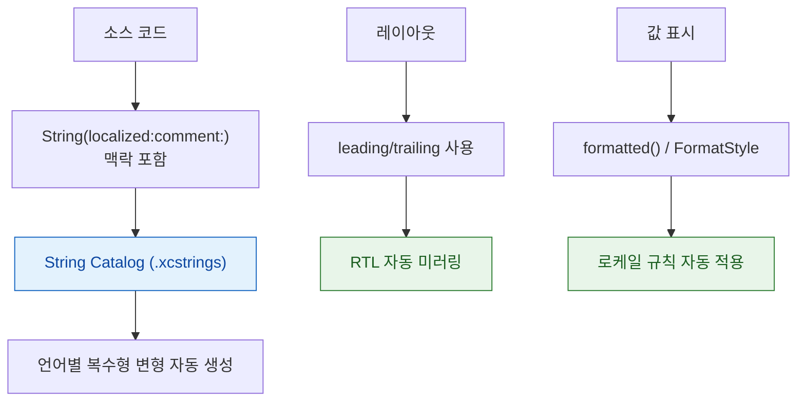

## 지역화는 문자열 교체가 아니라 맥락·복수형·방향·서식 규칙을 시스템에 맡기는 일이다

지역화를 "문자열을 뽑아 번역하는 일"로 보면 네 가지가 전부 빠진다.

1. **맥락** — 번역자는 코드를 못 본다. 같은 단어가 동사인지 명사인지 알 수 없다.
2. **복수형** — 언어마다 복수 범주 수가 다르다 (한국어 1개, 영어 2개, 아랍어 6개).
3. **방향** — RTL 은 텍스트 정렬이 아니라 레이아웃 전체가 뒤집히는 것이다.
4. **서식** — 날짜·숫자·통화는 표기 형식만이 아니라 규칙 자체가 다르다.



### 정본 노트

- [번역에는 문자열만이 아니라 맥락과 복수형 규칙이 함께 필요하다](i18n/localized-strings-need-context-and-plural-rules.md) — String Catalog, `comment:` 의 역할, 문장을 조각내지 않는 이유.
- [RTL 은 텍스트 정렬이 아니라 레이아웃 방향 전체가 뒤집히는 것이다](i18n/layout-direction-is-not-text-alignment.md) — 방향 중립 API 표, 미러링할 것과 하지 말 것.
- [Formatter 는 표시 문자열이 아니라 로케일 규칙을 담는다](i18n/formatters-encode-locale-rules-not-display-strings.md) — `formatted()`, 저장과 표시의 분리, Formatter 재사용.

### 증상에서 시작하기

| 증상 | 어느 노트로 |
| :--- | :--- |
| 번역이 문법에 안 맞는다 | [맥락과 복수형](i18n/localized-strings-need-context-and-plural-rules.md) (`comment:` 누락) |
| "1개 항목" 처리가 언어마다 깨진다 | [맥락과 복수형](i18n/localized-strings-need-context-and-plural-rules.md) |
| 독일어에서 텍스트가 잘린다 | [맥락과 복수형](i18n/localized-strings-need-context-and-plural-rules.md) + [Dynamic Type](accessibility/dynamic-type-requires-layout-that-grows.md) |
| 아랍어에서 레이아웃이 안 뒤집힌다 | [레이아웃 방향](i18n/layout-direction-is-not-text-alignment.md) (좌/우 고정 API) |
| 재생 버튼이 반대로 뒤집혔다 | [레이아웃 방향](i18n/layout-direction-is-not-text-alignment.md) (미러링 금지 대상) |
| 독일에서 소수점이 이상하다 | [Formatter](i18n/formatters-encode-locale-rules-not-display-strings.md) |
| 언어를 바꾸니 날짜 파싱이 깨진다 | [Formatter](i18n/formatters-encode-locale-rules-not-display-strings.md) (저장에 지역 형식 사용) |

### 검증 — 의사 언어가 핵심이다

번역이 하나도 없어도 문제를 전수 검출할 수 있다.

```
Xcode > Product > Scheme > Edit Scheme > Run > Options > App Language
```

| 의사 언어 | 잡는 문제 |
| :--- | :--- |
| **Accented** | **하드코딩된 문자열** (평범한 영어로 남아 있는 것) |
| **Double-Length** | 길이 초과, 잘림, 레이아웃 붕괴 |
| **Right-to-Left** | 미러링되지 않는 요소 |

```swift
#Preview("RTL") { RowView().environment(\.layoutDirection, .rightToLeft) }
#Preview("독일") { RowView().environment(\.locale, Locale(identifier: "de_DE")) }
```

**독일(긴 단어 + 소수점 구분자)과 아랍어(RTL + 복수 6범주)** 두 지역만 확인해도 대부분의 문제가 드러난다.

```bash
plutil -p Localizable.xcstrings | grep -c '"state" => "new"'   # 미번역 항목 수
```

### 접근성과 함께 처리하면 효율이 좋다

"텍스트가 예상보다 길어져도 레이아웃이 견뎌야 한다"는 요구사항이 [Dynamic Type](accessibility/dynamic-type-requires-layout-that-grows.md) 과 동일하다. **고정 높이 제거·줄바꿈 허용·가로를 세로로 전환**이 두 문제를 한 번에 해결한다.

### 연관 문서

- [apple-accessibility](apple-accessibility.md) - 레이아웃이 커지는 같은 문제
- [apple-swiftui-deep-dive](apple-swiftui-deep-dive.md) - `Text` 와 `FormatStyle`
- [apple-distribution-and-policies](../08_packaging_deployment/apple-distribution-and-policies.md) - 지역별 정책과 규제

공식 문서: [Localization](https://developer.apple.com/documentation/xcode/localization) · [String Catalogs](https://developer.apple.com/documentation/xcode/localizing-and-varying-text-with-a-string-catalog)
