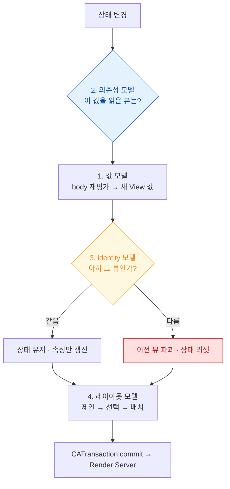

## SwiftUI 는 화면을 값으로 서술하고 의존성 그래프로 갱신 범위를 정한다

SwiftUI 를 API 목록으로 배우면 "왜 이게 이렇게 동작하지"에서 계속 막힌다. 실무 문제의 대부분은 **네 개의 모델** 중 하나에서 나온다.

1. **값 모델** — View 는 객체가 아니라 값이다. `body` 는 여러 번 호출된다.
2. **의존성 모델** — 갱신 범위는 diff 가 아니라 **읽은 값**이 정한다.
3. **identity 모델** — 뷰가 "같은 뷰인지"가 `@State` 의 생사를 결정한다.
4. **레이아웃 모델** — 부모는 제안만 하고 크기는 자식이 정한다.



### 정본 노트

**핵심 모델**

- [SwiftUI 의 View 는 화면 객체가 아니라 화면을 서술한 값이고 body 는 여러 번 호출된다](swiftui/view-is-a-value-not-an-object.md) — `body` 에 넣으면 안 되는 것들.
- [AttributeGraph 는 diff 가 아니라 의존성 그래프로 무효화 범위를 정한다](swiftui/attributegraph-tracks-dependency-not-diff.md) — `@Observable` 이 `ObservableObject` 보다 나은 이유.
- [View 의 identity 가 상태의 생사를 결정한다](swiftui/view-identity-determines-state-lifetime.md) — **"입력하던 내용이 사라진다"의 원인.**
- [소유 관계에 따라 property wrapper 를 고른다](swiftui/state-ownership-property-wrappers.md) — 선택 흐름도.

**레이아웃**

- [SwiftUI 레이아웃은 부모 제안·자식 선택·부모 배치의 3단계 협상이다](swiftui/layout-is-a-three-step-negotiation.md) — 결정권은 자식에게 있다.
- [modifier 는 뷰를 감싸므로 순서가 의미를 바꾼다](swiftui/modifier-order-changes-semantics.md) — 탭 영역·그림자·배경의 순서 규칙.

**데이터 흐름**

- [PreferenceKey 는 자식에서 부모로, Environment 는 부모에서 자식으로 흐른다](swiftui/preference-flows-up-environment-flows-down.md)
- [NavigationStack 은 화면 스택이 아니라 경로 상태를 그린다](swiftui/navigation-path-is-state.md) — 딥링크와 상태 복원이 같은 메커니즘.
- [.task 는 비동기 작업의 수명을 뷰 수명에 묶고 사라질 때 자동 취소한다](swiftui/task-modifier-ties-async-to-view-lifetime.md)

### 증상에서 시작하기

| 증상 | 어느 노트로 |
| :--- | :--- |
| 입력하던 내용이 갑자기 사라진다 | [identity](swiftui/view-identity-determines-state-lifetime.md) |
| 다른 항목을 골랐는데 이전 상태가 남는다 | [identity](swiftui/view-identity-determines-state-lifetime.md) |
| 관계없는 뷰까지 자꾸 다시 그려진다 | [의존성 그래프](swiftui/attributegraph-tracks-dependency-not-diff.md) |
| 모델이 매번 초기화된다 | [소유권](swiftui/state-ownership-property-wrappers.md) |
| 뷰가 원하는 크기가 안 된다 | [레이아웃 협상](swiftui/layout-is-a-three-step-negotiation.md) |
| 여백에 배경색이 안 칠해진다 / 탭이 안 먹는다 | [modifier 순서](swiftui/modifier-order-changes-semantics.md) |
| 화면을 닫아도 요청이 계속 돈다 | [.task](swiftui/task-modifier-ties-async-to-view-lifetime.md) |
| 스크롤이 끊긴다 | [07 런북](../00_foundations/diagnostic-runbooks/07-scroll-hitches.md) |

### 진단 도구

```swift
var body: some View {
    let _ = Self._printChanges()   // 무엇이 재평가를 유발했는가
    ...
}
```

| 출력 | 의미 |
| :--- | :--- |
| `@self` | 부모가 다른 값을 넘김 — 소유권을 확인한다 |
| `@identity` | identity 가 바뀜 — **상태가 리셋된다** |
| `_propertyName` | 그 상태가 바뀌어 무효화됨 |

**Instruments의 SwiftUI 템플릿**은 뷰별 body 평가 횟수와 소요 시간을, **Animation Hitches** 는 그 결과가 프레임 마감을 넘겼는지를 보여준다.

### iOS 26: Liquid Glass

머티리얼과 반투명, 알약형 컴포넌트, 공간감 있는 계층 표현이 시스템 디자인 언어로 통합되었다. 반투명이 겹치면 [오버드로](../01_system_internals/graphics-and-media/render-server-composition.md)가 늘어나므로, 시각 효과를 쓰는 만큼 [히치 측정](../01_system_internals/graphics-and-media/hitches-measure-user-visible-jank.md)을 함께 본다.

### 연관 문서

- [apple-uikit-lifecycle](apple-uikit-lifecycle.md) - UIKit 과의 상호 운용과 비용 모델 차이
- [apple-observation-framework](../01_language_concurrency/apple-observation-framework.md) - `@Observable` 매크로 내부
- [apple-animation-and-motion](apple-animation-and-motion.md) - 애니메이션과 전환
- [apple-graphics-and-media](../01_system_internals/graphics-and-media/apple-graphics-and-media.md) - commit 이후의 합성
- [07-swiftui-state-change-to-pixel](../00_foundations/worked-examples/07-swiftui-state-change-to-pixel.md) - 상태 변경에서 픽셀까지 전체 경로

공식 문서: [SwiftUI](https://developer.apple.com/documentation/swiftui) · [WWDC 2021: Demystify SwiftUI](https://developer.apple.com/videos/play/wwdc2021/10022/)
