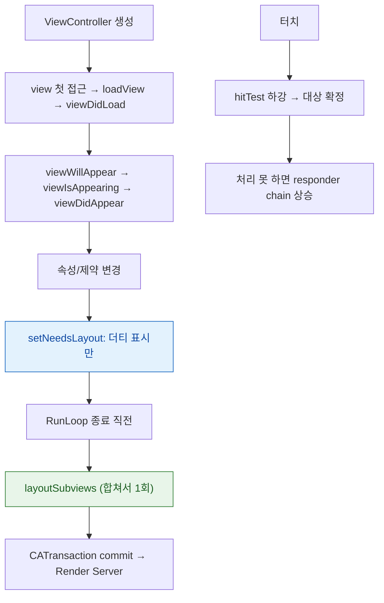

## UIKit 은 오래 사는 객체를 명령형으로 조작하고 갱신을 다음 주기까지 미룬다

UIKit 의 비용 모델은 [SwiftUI 와 정확히 반대](apple-swiftui-deep-dive.md)다. 뷰는 **오래 사는 객체**라 생성이 비싸고 속성 변경은 싸다. 대신 그 변경이 **즉시 반영되지 않고 다음 갱신 주기까지 미뤄진다.**

이 두 가지 — **객체 수명**과 **지연된 갱신** — 이 UIKit 실무 문제의 대부분을 설명한다.



### 정본 노트

**생명주기**

- [ViewController 생명주기는 view 프로퍼티의 지연 로딩이 시작점이다](uikit/viewcontroller-lifecycle-is-driven-by-view-loading.md) — 단계별 계약과 `viewIsAppearing`(iOS 17+)이 해결한 문제.

**레이아웃**

- [레이아웃은 지연되고 합쳐진다](uikit/layout-cycle-is-deferred-and-coalesced.md) — **제약 애니메이션이 안 되는 이유**와 `layoutIfNeeded` 의 정확한 위치.
- [Auto Layout 은 우선순위가 붙은 제약 시스템을 풀어 프레임을 정한다](uikit/autolayout-solves-a-constraint-system.md) — unsatisfiable 과 ambiguous 의 구분, Hugging vs Compression Resistance.

**이벤트**

- [터치는 hit-test 로 내려가 대상을 찾고 이벤트는 responder chain 을 타고 올라간다](uikit/responder-chain-routes-events-upward.md) — **"터치가 안 먹는" 네 가지 원인.**

**컬렉션**

- [셀 재사용은 이전 상태를 그대로 물려주므로 모든 상태를 명시적으로 되돌려야 한다](uikit/cell-reuse-requires-full-state-reset.md) — 비동기 이미지 경쟁 조건과 두 가지 해법.

**상호 운용**

- [UIKit 과 SwiftUI 상호 운용은 서로 다른 두 수명 모델을 잇는 일이다](uikit/uikit-swiftui-interop-bridges-two-lifetimes.md) — Coordinator 가 필요한 이유, `updateUIView` 무한 루프 방지.

### 증상에서 시작하기

| 증상 | 어느 노트로 |
| :--- | :--- |
| 제약을 바꿨는데 애니메이션이 안 된다 | [레이아웃 사이클](uikit/layout-cycle-is-deferred-and-coalesced.md) |
| 제약을 바꾼 직후 frame 이 이전 값이다 | [레이아웃 사이클](uikit/layout-cycle-is-deferred-and-coalesced.md) |
| 콘솔에 제약 충돌 로그가 쏟아진다 | [Auto Layout](uikit/autolayout-solves-a-constraint-system.md) |
| 경고는 없는데 위치가 이상하다 | [Auto Layout](uikit/autolayout-solves-a-constraint-system.md) (ambiguous) |
| 버튼이 눌리지 않는다 | [responder chain](uikit/responder-chain-routes-events-upward.md) |
| 스크롤하면 엉뚱한 이미지가 뜬다 | [셀 재사용](uikit/cell-reuse-requires-full-state-reset.md) |
| 자식 화면이 데이터를 갱신하지 않는다 | [생명주기](uikit/viewcontroller-lifecycle-is-driven-by-view-loading.md) (컨테이너 3단계 누락) |
| `updateUIView` 가 무한히 호출된다 | [상호 운용](uikit/uikit-swiftui-interop-bridges-two-lifetimes.md) |
| 스크롤이 끊긴다 | [07 런북](../00_foundations/diagnostic-runbooks/07-scroll-hitches.md) |

### 진단 도구

```
Debug > View Debugging > Capture View Hierarchy
  → 실제 프레임, User Interaction Enabled, 적용된 제약

Breakpoint Navigator > Symbolic Breakpoint
  → UIViewAlertForUnsatisfiableConstraints  (제약 충돌 지점에서 정지)

디버거 콘솔
  po view.hasAmbiguousLayout
  po view.value(forKey: "_autolayoutTrace")
  po UIApplication.shared.keyWindow?.recursiveDescription()
```

### UIKit 을 계속 쓰는 이유

새 코드는 SwiftUI 로 가더라도, 다음은 여전히 UIKit 이 강하다.

- **복잡한 컬렉션 레이아웃**: `UICollectionViewCompositionalLayout`
- **정밀한 스크롤 제어**: 관성, 페이징, 중첩 스크롤
- **텍스트 편집 심화**: `TextKit 2`
- **기존 코드베이스**: 점진적 전환에는 [상호 운용](uikit/uikit-swiftui-interop-bridges-two-lifetimes.md)이 필수

### 연관 문서

- [apple-swiftui-deep-dive](apple-swiftui-deep-dive.md) - 반대편 비용 모델
- [apple-app-lifecycle-and-ui](apple-app-lifecycle-and-ui.md) - Scene 기반 앱 구조
- [apple-graphics-and-media](../01_system_internals/graphics-and-media/apple-graphics-and-media.md) - commit 이후의 합성
- [메인 스레드의 이벤트 처리와 화면 갱신은 RunLoop 한 바퀴 안에서 정해진 순서로 일어난다](../01_system_internals/boot-and-runtime/runloop-drives-main-thread.md)

공식 문서: [UIKit](https://developer.apple.com/documentation/uikit) · [UIViewController](https://developer.apple.com/documentation/uikit/uiviewcontroller)
