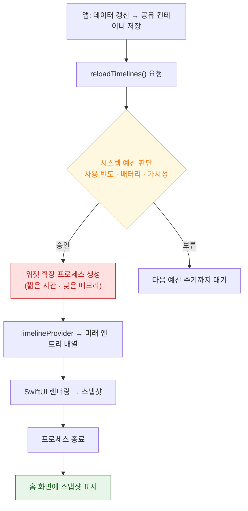

## 위젯은 시스템이 예산 안에서 렌더링하는 스냅샷이고 앱 코드는 그 순간에만 실행된다

위젯 개발의 모든 제약이 하나의 사실에서 나온다 — **사용자가 위젯을 보고 있는 동안 내 코드는 실행되고 있지 않다.** 시스템이 잠깐 확장 프로세스를 띄워 렌더링하고 종료시킨 뒤, 그 결과 이미지를 보여줄 뿐이다.



### 정본 노트

- [위젯은 살아 있는 뷰가 아니라 미리 렌더링된 스냅샷이다](widgets/widget-is-a-snapshot-not-a-live-view.md) — 할 수 없는 것들의 목록과 그 이유, 시간 표시만 예외인 까닭.
- [TimelineProvider 는 현재가 아니라 미래 시점들의 상태를 미리 선언한다](widgets/timeline-provider-declares-future-states.md) — 세 메서드의 역할과 갱신 정책 선택.
- [갱신 예산은 시스템이 정하며 reloadTimelines 는 요청이지 보장이 아니다](widgets/widget-refresh-budget-is-system-controlled.md) — **"위젯이 갱신되지 않는다"의 진짜 원인.**
- [상호작용 위젯은 클로저가 아니라 AppIntent 를 실행한다](widgets/interactive-widgets-run-app-intents.md) — 프로세스가 없는데 버튼이 동작하는 원리.
- [Live Activity 는 로컬과 푸시 두 경로로 갱신되며 각각 제약이 다르다](widgets/live-activity-updates-via-push-or-local.md) — `push-type.liveactivity` 토픽과 토큰 관찰.

### 증상에서 시작하기

| 증상 | 어느 노트로 |
| :--- | :--- |
| 위젯이 갱신되지 않는다 | [갱신 예산](widgets/widget-refresh-budget-is-system-controlled.md) |
| 위젯이 비어 있거나 이전 내용이 남는다 | [스냅샷 모델](widgets/widget-is-a-snapshot-not-a-live-view.md) (확장이 메모리 한도로 죽음) |
| 애니메이션·스크롤이 안 된다 | [스냅샷 모델](widgets/widget-is-a-snapshot-not-a-live-view.md) (구조적 제약) |
| 버튼을 눌러도 반응이 없다 | [상호작용 위젯](widgets/interactive-widgets-run-app-intents.md) (클로저 대신 AppIntent) |
| Live Activity 푸시가 도착하지 않는다 | [Live Activity](widgets/live-activity-updates-via-push-or-local.md) (토픽 접미사·토큰) |
| 확장에서만 크래시한다 | [앱 확장 프로세스 모델](../01_system_internals/ipc-and-process/app-extension-process-model.md) |

### 설계 원칙

1. **데이터는 미리 준비해 둔다.** 렌더링 시점에 네트워크를 기다릴 수 없다. 앱이 [App Group 공유 컨테이너](../01_system_internals/storage/app-container-directory-policies.md)에 써 두고 위젯은 읽기만 한다.
2. **이미지는 미리 다운샘플링한다.** 위젯 확장의 메모리 한도는 매우 낮다.
3. **엔트리를 미리 여러 개 선언한다.** 예산을 가장 크게 아끼는 방법이다.
4. **시간 표시는 시스템에 맡긴다.** `Text(date, style: .timer)` 는 프로세스 없이 갱신된다.

### 관찰 가능한 증거

```bash
log stream --device --predicate 'subsystem == "com.apple.chronod"' --info
log stream --device --predicate 'process == "runningboardd"' --info | grep -i widget
log stream --device --predicate 'subsystem == "com.apple.ActivityKit"' --info
```

**Xcode 에서 위젯 스킴을 선택해 실행**해야 디버거가 붙는다. 단, 디버깅 중에는 예산이 실제와 다르게 동작하므로 **예산 문제는 Xcode 를 분리하고 실기기에서** 확인한다.

### Android 비교

| | WidgetKit | Jetpack Glance |
| :--- | :--- | :--- |
| 렌더링 | 확장 프로세스가 SwiftUI 렌더 → 스냅샷 | Composable → `RemoteViews` 변환 |
| 갱신 | TimelineProvider + 시스템 예산 | `GlanceAppWidget.update()` / WorkManager |
| 상호작용 | `AppIntent` | `actionRunCallback` |
| 제약 | 메모리·시간 한도, 예산 | `RemoteViews` 표현 제약 |

→ [android app-widget](../../android/02_app_framework/app-widgets/app-widget.md)

### 연관 문서

- [apple-app-intents](../04_system_services/apple-app-intents.md) - 상호작용 위젯의 실행 단위
- [apple-push-notifications-apns](../04_system_services/apple-push-notifications-apns.md) - Live Activity 푸시
- [앱 확장은 호스트가 수명을 쥔 별도 프로세스다](../01_system_internals/ipc-and-process/app-extension-process-model.md)

공식 문서: [WidgetKit](https://developer.apple.com/documentation/widgetkit) · [ActivityKit](https://developer.apple.com/documentation/activitykit)
