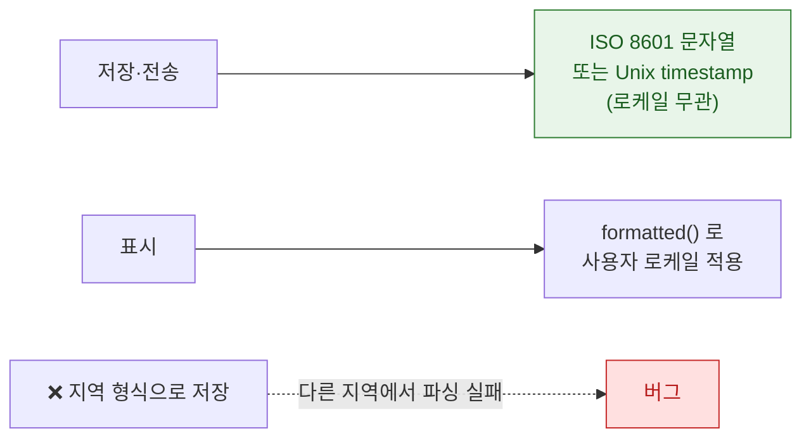

## Formatter 는 표시 문자열이 아니라 로케일 규칙을 담는다

### 개념 (What)

날짜·숫자·통화·이름·주소를 문자열로 직접 조립하면 **거의 모든 지역에서 틀린다.** 지역마다 다른 것이 표기 형식만이 아니기 때문이다.

| 항목 | 지역마다 다른 것 |
| :--- | :--- |
| 날짜 | 순서(년월일/월일년/일월년), 구분자, 달력(그레고리·불교력·일본력) |
| 숫자 | 소수점(`.` vs `,`), 천 단위 구분(`,` vs `.` vs 공백), 자릿수 그룹 |
| 통화 | 기호 위치, 소수 자릿수(엔화는 0), 기호 vs 코드 |
| 시간 | 12/24시간제, 자정 표기 |
| 이름 | 성-이름 순서 |
| 상대 시간 | "3일 전" 의 문법 |

### 왜 필요한가 (Why)

```swift
// ❌ 하드코딩 — 미국식만 맞다
let s = "\(month)/\(day)/\(year)"
let price = "$\(amount)"
let n = String(format: "%.2f", value)     // 소수점 구분자가 지역마다 다르다
```

독일에서 `1.234,56` 이 맞고 미국에서 `1,234.56` 이 맞다. 문자열 포맷으로는 이 차이를 표현할 수 없다.

### 현대 API — `formatted()`

iOS 15+ 의 `formatted()` 계열이 가장 간결하다.

```swift
// 날짜
Date().formatted(date: .abbreviated, time: .shortened)
Date().formatted(.dateTime.year().month().day())

// 상대 시간 — "3일 전" 을 언어별 문법으로
Date().formatted(.relative(presentation: .named))

// 숫자와 통화
(1234.56).formatted(.number.precision(.fractionLength(2)))
(1234.56).formatted(.currency(code: "KRW"))
(0.87).formatted(.percent)

// 목록 — "A, B 및 C" 의 접속사도 언어마다 다르다
["사과", "배", "감"].formatted(.list(type: .and))

// 용량·거리 등 측정값
Measurement(value: 5, unit: UnitLength.kilometers)
    .formatted(.measurement(width: .abbreviated))
```

**SwiftUI 에서는 직접 넘길 수 있다.**

```swift
Text(date, format: .dateTime.year().month().day())
Text(price, format: .currency(code: "KRW"))
Text(date, style: .relative)     // 자동 갱신되는 상대 시간
```

### 재사용 — Formatter 생성은 비싸다

레거시 `DateFormatter`/`NumberFormatter` 를 쓴다면 **매번 만들지 않는다.** 생성 비용이 커서 리스트 셀에서 만들면 [스크롤 히치](../../01_system_internals/graphics-and-media/hitches-measure-user-visible-jank.md)의 원인이 된다.

```swift
// ❌ 셀마다 생성
func configure(date: Date) {
    let f = DateFormatter()          // 매우 비싸다
    f.dateStyle = .medium
    label.text = f.string(from: date)
}

// ✅ 한 번 만들어 재사용
private static let dateFormatter: DateFormatter = {
    let f = DateFormatter()
    f.dateStyle = .medium
    return f
}()
```

`formatted()` 는 내부적으로 캐시를 활용하므로 이 문제에서 자유롭다.

### 저장과 표시를 분리한다



```swift
// 저장/전송: 로케일 독립
let iso = date.ISO8601Format()
let parsed = try Date(iso, strategy: .iso8601)

// 표시: 사용자 로케일
Text(date, format: .dateTime)
```

**서버와 주고받는 값에 지역 형식을 쓰면** 사용자가 기기 언어를 바꾸는 순간 파싱이 깨진다.

### 타임존도 별개 축이다

```swift
var fmt = Date.FormatStyle(date: .abbreviated, time: .shortened)
fmt.timeZone = TimeZone(identifier: "Asia/Seoul")!
```

"오늘"의 경계가 타임존마다 다르므로, 날짜 그룹핑을 서버에서 할지 클라이언트에서 할지 명확히 정해야 한다.

### 관찰 가능한 증거

```swift
// 여러 로케일에서 결과를 한 번에 확인
for id in ["ko_KR", "en_US", "de_DE", "ja_JP", "ar_SA"] {
    var style = Date.FormatStyle(date: .abbreviated, time: .shortened)
    style.locale = Locale(identifier: id)
    print(id, Date().formatted(style), (1234.56).formatted(.number.locale(Locale(identifier: id))))
}
```

```
# 스킴에서 지역 바꿔 실행
Product > Scheme > Edit Scheme > Run > Options
  · App Language / App Region
```

**독일(소수점 구분자)과 일본(엔화 소수 자릿수 0)** 두 지역만 확인해도 대부분의 서식 버그가 드러난다.

### 연관 문서

- [번역에는 문자열만이 아니라 맥락과 복수형 규칙이 함께 필요하다](localized-strings-need-context-and-plural-rules.md)
- [레이아웃 방향은 텍스트 정렬과 다른 개념이다](layout-direction-is-not-text-alignment.md)
- [셀 재사용은 이전 상태를 그대로 물려주므로 모든 상태를 명시적으로 되돌려야 한다](../uikit/cell-reuse-requires-full-state-reset.md)

공식 문서: [Formatting data](https://developer.apple.com/documentation/foundation/formatstyle) · [Locale](https://developer.apple.com/documentation/foundation/locale)
