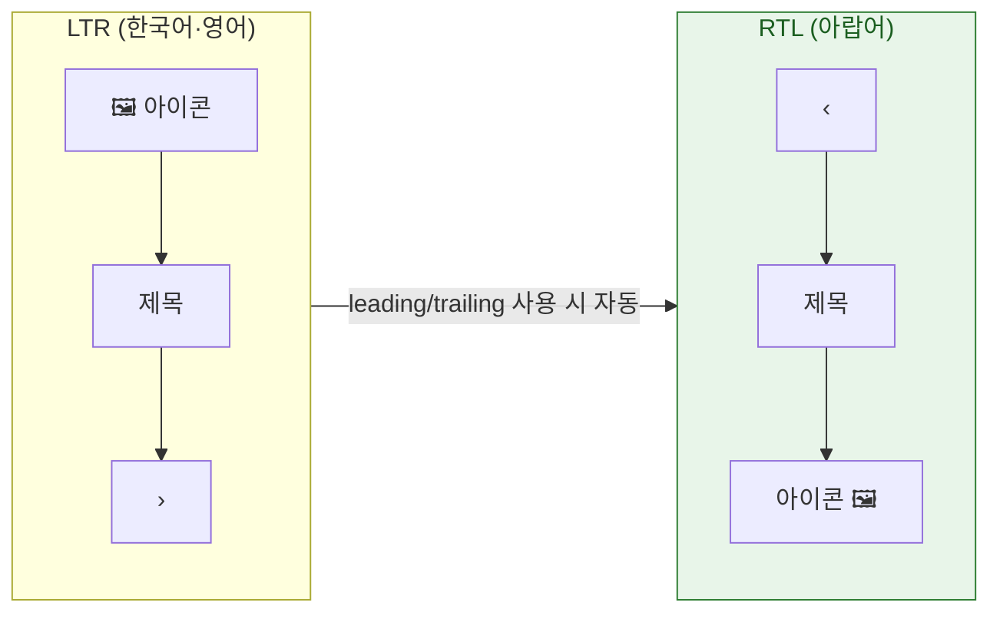

## RTL 은 텍스트 정렬이 아니라 레이아웃 방향 전체가 뒤집히는 것이다

### 개념 (What)

아랍어·히브리어 지역화에서 바뀌는 것은 텍스트 정렬만이 아니다. **읽기 흐름 자체가 오른쪽에서 왼쪽으로 뒤집히므로** 다음이 전부 미러링되어야 한다.

- 요소 배치 순서 (첫 번째 항목이 오른쪽에)
- 여백과 들여쓰기 방향
- 내비게이션 전환 방향 (push 가 왼쪽에서 들어옴)
- 뒤로가기 화살표 등 방향성 아이콘
- 진행률 표시 방향

**미러링하면 안 되는 것도 있다**: 재생 버튼(▶), 시계 방향, 실제 로고.

### 왜 필요한가 (Why)

미러링을 자동으로 받으려면 **방향 중립 API** 를 써야 한다. 좌/우를 직접 쓴 코드는 뒤집히지 않고 그대로 남아 레이아웃이 깨진다.

| 쓰지 않는다 (고정) | 쓴다 (방향 인식) |
| :--- | :--- |
| `.left` / `.right` | `.leading` / `.trailing` |
| `leftAnchor` / `rightAnchor` | `leadingAnchor` / `trailingAnchor` |
| `UIEdgeInsets(left:right:)` | `NSDirectionalEdgeInsets(leading:trailing:)` |
| `textAlignment = .left` | `textAlignment = .natural` |
| `frame.origin.x` 직접 계산 | Auto Layout / SwiftUI 레이아웃 |

```swift
// ❌ RTL 에서 뒤집히지 않는다
NSLayoutConstraint.activate([
    icon.leftAnchor.constraint(equalTo: view.leftAnchor, constant: 16)
])

// ✅ 자동 미러링
NSLayoutConstraint.activate([
    icon.leadingAnchor.constraint(equalTo: view.leadingAnchor, constant: 16)
])
```

SwiftUI 의 `HStack`, `.padding(.leading)`, `.frame(alignment: .leading)` 은 기본적으로 방향을 인식한다.



### 아이콘 미러링 제어

SF Symbols 는 방향성 있는 기호를 자동으로 미러링한다. 커스텀 이미지는 명시해야 한다.

```swift
// 미러링 필요 (뒤로가기 화살표 등)
let image = UIImage(named: "arrow-back")?
    .imageFlippedForRightToLeftLayoutDirection()

// 미러링 금지 (재생 버튼, 로고, 시계)
imageView.semanticContentAttribute = .forceLeftToRight
```

| 미러링한다 | 미러링하지 않는다 |
| :--- | :--- |
| 뒤로/앞으로 화살표 | 재생 ▶ (미디어 시간축은 보편) |
| 들여쓰기·목록 방향 | 시계 방향 회전 |
| 진행률 방향 | 브랜드 로고 |
| 말풍선 꼬리 | 숫자·수식 |

### 혼합 방향 텍스트

RTL 언어 안에 영어 단어나 숫자가 섞이면 **양방향 알고리즘(bidi)** 이 처리한다. 대부분 자동이지만, 사용자 입력을 문자열 결합으로 조립하면 순서가 이상해질 수 있다.

```swift
// ❌ 직접 결합하면 bidi 경계가 깨질 수 있다
let s = username + " • " + statusText

// ✅ 지역화 문자열의 위치 인자를 쓴다 (bidi 마커가 함께 처리됨)
let s = String(localized: "\(username) • \(statusText)")
```

### 관찰 가능한 증거

**RTL 의사 언어로 실행** — 아랍어 번역이 없어도 레이아웃 미러링을 검증할 수 있다.

```
Xcode > Product > Scheme > Edit Scheme > Run > Options
  · App Language: Right-to-Left Pseudolanguage
```

```swift
// Preview 로 동시 비교
#Preview("LTR") { RowView() }
#Preview("RTL") { RowView().environment(\.layoutDirection, .rightToLeft) }
```

```bash
# 시뮬레이터를 아랍어로 실행
xcrun simctl spawn booted defaults write -g AppleLanguages -array ar
```

**점검 항목**: 화면을 RTL 로 띄우고 좌우가 뒤집히지 않은 요소를 찾는다. 그것이 좌/우 고정 API 를 쓴 지점이다.

### 연관 문서

- [번역에는 문자열만이 아니라 맥락과 복수형 규칙이 함께 필요하다](localized-strings-need-context-and-plural-rules.md)
- [Formatter 는 표시 문자열이 아니라 로케일 규칙을 담는다](formatters-encode-locale-rules-not-display-strings.md)
- [Auto Layout 은 우선순위가 붙은 제약 시스템을 풀어 프레임을 정한다](../uikit/autolayout-solves-a-constraint-system.md)

공식 문서: [Supporting right-to-left languages](https://developer.apple.com/documentation/uikit/supporting-right-to-left-languages)
