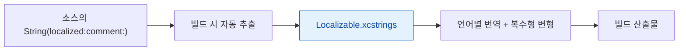

## 번역에는 문자열만이 아니라 맥락과 복수형 규칙이 함께 필요하다

### 개념 (What)

지역화는 "문자열을 뽑아 번역기에 넘기는 일"이 아니다. 같은 영어 단어가 맥락에 따라 다른 언어로 번역되고, 언어마다 **복수형 규칙 자체가 다르다.**

- `"Open"` 은 동사(열다)일 수도 형용사(열려 있는)일 수도 있다. 번역자는 맥락 없이 알 수 없다.
- 영어는 단수/복수 두 형태지만, 아랍어는 **여섯 개**, 러시아어는 **네 개**의 복수 범주를 갖는다.

### 왜 필요한가 (Why)

맥락 없이 번역하면 문법이 틀린 문자열이 나오고, 복수형을 문자열 결합으로 처리하면 **다수 언어에서 반드시 틀린다.**

```swift
// ❌ 영어 규칙을 하드코딩 — 다른 언어에서 전부 깨진다
let text = "\(count) item" + (count == 1 ? "" : "s")

// ❌ 조건 분기 — 복수 범주가 2개인 언어에만 맞다
let text = count == 1 ? "1개 항목" : "\(count)개 항목"
```

### String Catalog (`.xcstrings`)

Xcode 15+ 의 String Catalog 는 추출·번역·복수형을 한 파일에서 관리한다.

```swift
// 코드에서 맥락(comment)을 함께 남긴다 — 번역자가 보는 유일한 단서다
Text("Open", comment: "Button title to open the selected document")

// UIKit / 일반 코드
let title = String(localized: "Open",
                   comment: "Button title to open the selected document")
```



### 복수형은 시스템에 맡긴다

String Catalog 에서 문자열을 **Vary by Plural** 로 설정하면 언어마다 필요한 복수 범주가 자동으로 생성된다.

```swift
// 코드는 이렇게만 쓰고, 복수형 처리는 카탈로그가 담당한다
Text("\(count) items selected")
```

| 언어 | 필요한 복수 범주 |
| :--- | :--- |
| 한국어 | one (사실상 하나) |
| 영어 | one, other |
| 러시아어 | one, few, many, other |
| 아랍어 | zero, one, two, few, many, other |

**직접 분기하면 이 표를 전부 구현해야 한다.** 시스템에 맡기면 카탈로그가 언어별로 필요한 칸을 만들어 준다.

### 문장을 조각내 결합하지 않는다

```swift
// ❌ 어순이 다른 언어에서 깨진다
let msg = String(localized: "Deleted") + " " + name + " " + String(localized: "from list")

// ✅ 하나의 문장으로 두고 위치 인자를 쓴다
let msg = String(localized: "Deleted \(name) from list",
                 comment: "Confirmation after removing an item")
```

번역자가 어순을 바꿀 수 있어야 한다. 조각을 결합하면 그럴 수 없다.

### 문자열 길이는 언어마다 크게 다르다

독일어는 영어보다 30~50% 길어지는 경우가 흔하다. **고정 폭 레이블은 거의 항상 문제가 된다.**

- 레이블에 `numberOfLines = 0` 또는 축소 허용
- 버튼은 내용에 따라 늘어나게
- [Dynamic Type](../accessibility/dynamic-type-requires-layout-that-grows.md) 대응과 같은 문제이므로 함께 해결된다

### 관찰 가능한 증거

**의사 언어(pseudolanguage)로 실행** — 번역 없이 문제를 미리 찾는 가장 빠른 방법이다.

```
Xcode > Product > Scheme > Edit Scheme > Run > Options > App Language
  · Double-Length Pseudolanguage   → 길이 초과·잘림 탐지
  · Accented Pseudolanguage        → 지역화되지 않은 하드코딩 문자열 탐지
  · Right-to-Left Pseudolanguage   → RTL 레이아웃 검증
```

**Accented** 로 실행했을 때 **평범한 영어로 남아 있는 문자열이 하드코딩된 것**이다. 이 방법으로 누락을 전수 검출할 수 있다.

```bash
# 카탈로그에서 미번역 항목 확인
plutil -p Localizable.xcstrings | grep -c '"state" => "new"'
```

### 연관 문서

- [레이아웃 방향은 텍스트 정렬과 다른 개념이다](layout-direction-is-not-text-alignment.md)
- [Formatter 는 표시 문자열이 아니라 로케일 규칙을 담는다](formatters-encode-locale-rules-not-display-strings.md)
- [Dynamic Type 은 글꼴 크기가 아니라 레이아웃 요구사항이다](../accessibility/dynamic-type-requires-layout-that-grows.md)

공식 문서: [Localization](https://developer.apple.com/documentation/xcode/localization) · [String Catalogs](https://developer.apple.com/documentation/xcode/localizing-and-varying-text-with-a-string-catalog)
