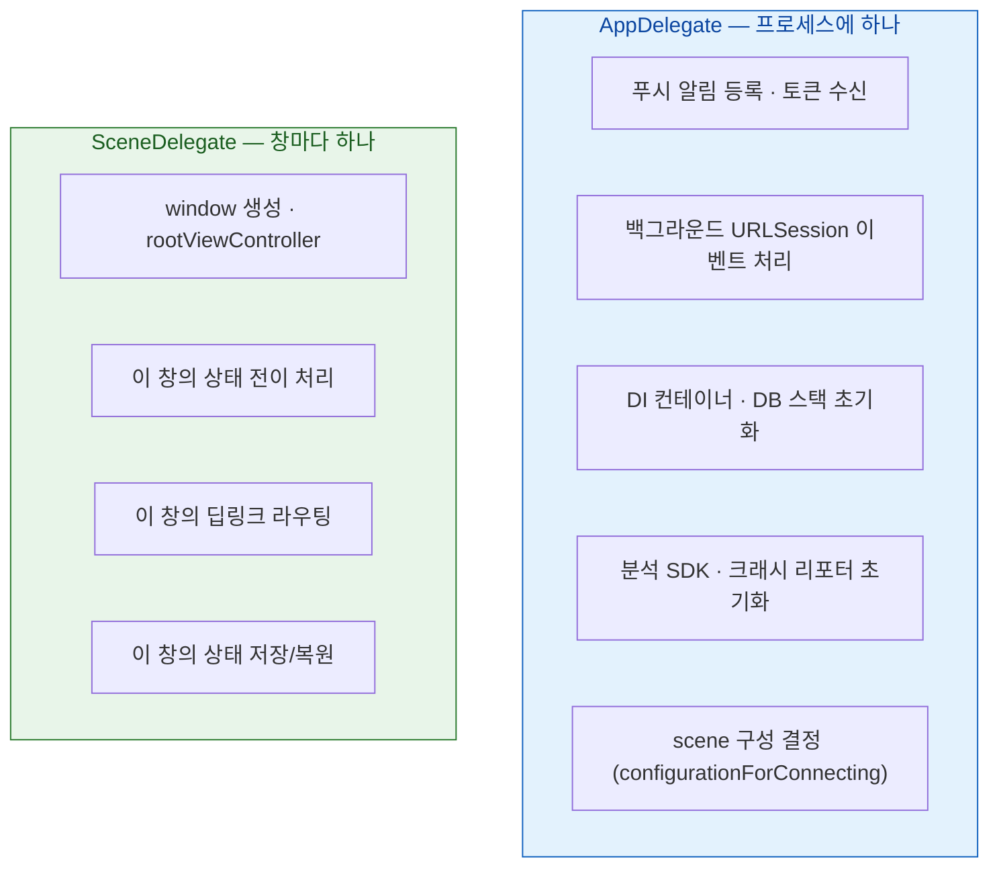

## AppDelegate 는 프로세스를, SceneDelegate 는 창을 소유한다

### 개념 (What)

멀티윈도우 도입으로 델리게이트가 둘로 나뉘었다. 경계는 명확하다.

| | AppDelegate | SceneDelegate |
| :--- | :--- | :--- |
| 대응 단위 | **프로세스 (앱 전체)** | **창 (scene) 하나** |
| 개수 | 항상 1 | scene 수만큼 |
| 소유하는 것 | 프로세스 수명, 전역 자원, 시스템 등록 | UI 계층, 화면 상태, 창별 데이터 |

**"앱 전체에 하나만 있어야 하는가?"** 로 판단하면 거의 틀리지 않는다.

### 왜 필요한가 (Why)

잘못 두면 두 방향으로 문제가 난다.

1. **AppDelegate 에 UI 상태를 두면**: 창을 여러 개 열었을 때 서로 덮어쓴다.
2. **SceneDelegate 에 전역 등록을 두면**: 창 개수만큼 중복 등록되거나, 창이 없을 때 실행되지 않는다.

### 무엇을 어디에 두는가



**AppDelegate 에 두어야 하는 것 — 프로세스에 하나뿐이어야 하는 것들**

```swift
func application(_ app: UIApplication,
                 didFinishLaunchingWithOptions opts: [UIApplication.LaunchOptionsKey: Any]?) -> Bool {
    // 앱 전체에 하나뿐이어야 하는 것만
    DatabaseStack.shared.setup()
    Analytics.configure()
    UNUserNotificationCenter.current().delegate = self
    return true
}

// 푸시 토큰은 프로세스 단위 — scene 마다 받지 않는다
func application(_ app: UIApplication,
                 didRegisterForRemoteNotificationsWithDeviceToken token: Data) { ... }

// 백그라운드 전송 완료도 프로세스 단위
func application(_ app: UIApplication,
                 handleEventsForBackgroundURLSession id: String,
                 completionHandler: @escaping () -> Void) { ... }
```

마지막 둘이 특히 중요하다. [백그라운드 전송](../../01_system_internals/connectivity/background-transfer-daemon.md)과 [푸시](../../04_system_services/apple-push-notifications-apns.md)는 **창이 하나도 없을 때도 앱이 깨어난다.** SceneDelegate 에 두면 그 경로에서 실행되지 않는다.

**SceneDelegate 에 두어야 하는 것**

```swift
func scene(_ scene: UIScene, willConnectTo session: UISceneSession,
           options: UIScene.ConnectionOptions) {
    guard let windowScene = scene as? UIWindowScene else { return }
    window = UIWindow(windowScene: windowScene)
    window?.rootViewController = makeRoot()
    window?.makeKeyAndVisible()

    // 이 창으로 들어온 딥링크 (콜드 스타트 경로)
    if let activity = options.userActivities.first { route(activity) }
}
```

### SwiftUI 에서는

`App` 프로토콜이 두 역할을 흡수하지만, 델리게이트가 필요한 시스템 콜백은 여전히 어댑터로 연결한다.

```swift
@main
struct MyApp: App {
    // 푸시 토큰 등 AppDelegate 콜백이 필요할 때
    @UIApplicationDelegateAdaptor(AppDelegate.self) var appDelegate

    var body: some Scene {
        WindowGroup {          // scene 하나에 대응
            ContentView()
        }
    }
}
```

`WindowGroup` 은 **여러 창으로 복제될 수 있는 scene 템플릿**이다. iPad/macOS 에서 사용자가 창을 추가하면 같은 `WindowGroup` 에서 새 scene 이 생긴다.

### 흔한 실수 표

| 실수 | 결과 |
| :--- | :--- |
| SceneDelegate 에서 푸시 토큰 등록 | 창 없이 깨어난 경우 등록 안 됨 |
| AppDelegate 에 `window` 보관 | 멀티윈도우에서 창끼리 덮어씀 |
| AppDelegate 에 "현재 화면" 전역 변수 | 창 전환 시 엉뚱한 화면 참조 |
| SceneDelegate 에서 DB 초기화 | 창 수만큼 중복 초기화 |

### 관찰 가능한 증거

```swift
// 각 콜백에 로그를 넣어 호출 순서와 횟수를 직접 확인한다
func application(_:didFinishLaunchingWithOptions:) { print("App 시작") }        // 1회
func scene(_:willConnectTo:options:)               { print("Scene 연결") }      // 창마다
```

iPad 에서 **같은 앱을 두 창 띄우면** "App 시작" 은 한 번, "Scene 연결" 은 두 번 찍혀야 정상이다.

### 연관 문서

- [생명주기 단위는 앱이 아니라 scene 이다](scene-is-the-lifecycle-unit-not-the-app.md)
- [상태 복원은 스냅샷이 아니라 NSUserActivity 로 한다](state-restoration-uses-user-activity.md)
- [백그라운드 전송은 앱이 아니라 시스템 데몬이 이어서 수행한다](../../01_system_internals/connectivity/background-transfer-daemon.md)
- [apple-push-notifications-apns](../../04_system_services/apple-push-notifications-apns.md)

공식 문서: [UIApplicationDelegate](https://developer.apple.com/documentation/uikit/uiapplicationdelegate) · [UIWindowSceneDelegate](https://developer.apple.com/documentation/uikit/uiwindowscenedelegate)
