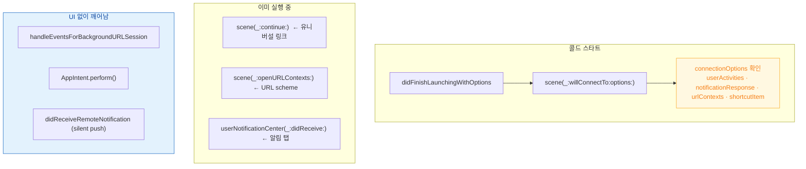

## 앱은 여러 진입점으로 시작되며 각 경로가 서로 다른 콜백을 탄다

### 개념 (What)

"앱이 실행됐다"는 하나가 아니다. 아이콘 탭, 딥링크, 알림 탭, 단축어, 백그라운드 전송 완료, 위젯 탭이 **각각 다른 콜백 조합**을 탄다.

하나의 경로만 구현하면 나머지 경로에서 **조용히 아무 일도 일어나지 않는다.** 크래시도 로그도 없어서 재현이 어렵다.

### 왜 필요한가 (Why)

특히 두 축이 곱해져 경우의 수가 늘어난다.

| | 앱이 종료 상태 (콜드) | 앱이 이미 실행 중 |
| :--- | :--- | :--- |
| **딥링크** | `willConnectTo` 의 `connectionOptions` | `scene(_:continue:)` |
| **알림 탭** | `didReceive` (앱 초기화 후) | `didReceive` |
| **단축어/App Intent** | `perform()` (**UI 없이 실행될 수 있음**) | `perform()` |
| **백그라운드 전송** | `handleEventsForBackgroundURLSession` (**창 없이**) | 동일 |

### 경로별 진입점



**세 번째 그룹이 가장 많이 누락된다.** 창이 하나도 없는 상태에서 앱이 깨어나므로, [SceneDelegate 가 아니라 AppDelegate](app-delegate-and-scene-delegate-own-different-things.md) 에 처리를 두어야 한다.

### 콜드 스타트에서 모든 경로를 받는 형태

```swift
func scene(_ scene: UIScene, willConnectTo session: UISceneSession,
           options: UIScene.ConnectionOptions) {
    setupWindow(scene)

    // 우선순위대로 확인한다. 하나라도 빠뜨리면 그 경로가 죽는다.
    if let activity = options.userActivities.first {
        route(activity)                                   // 유니버설 링크 / Handoff
    } else if let url = options.urlContexts.first?.url {
        route(url)                                        // URL scheme
    } else if let response = options.notificationResponse {
        route(response)                                   // 알림 탭
    } else if let shortcut = options.shortcutItem {
        route(shortcut)                                   // 홈 화면 빠른 실행
    } else if let restored = session.stateRestorationActivity {
        restore(from: restored)                           // 이전 상태 복원
    } else {
        showDefault()
    }
}
```

### 준비되지 않은 상태로 진입할 때

진입 경로가 앱 초기화보다 먼저 도착할 수 있다. 인증 복원이나 DB 마이그레이션이 끝나기 전에 라우팅이 오면 **무시되고 사라진다.**

```swift
private var pendingRoute: Route?

func route(_ target: Route) {
    guard isReady else { pendingRoute = target; return }   // 보류
    navigate(to: target)
}

func onReadyStateChanged() {
    if let p = pendingRoute { pendingRoute = nil; navigate(to: p) }
}
```

이 **보류 큐 패턴**은 [딥링크](../../00_foundations/worked-examples/03-universal-link-to-scene-restore.md)와 [푸시 탭](../../00_foundations/worked-examples/04-apns-to-notification-display-and-tap.md) 양쪽에 같이 필요하다.

### 검증 체크리스트

각 경로를 **앱 완전 종료 상태에서** 한 번씩 테스트한다.

- [ ] 아이콘 탭
- [ ] 유니버설 링크 (`xcrun simctl openurl booted "https://..."`)
- [ ] URL scheme
- [ ] 알림 탭 (실기기 또는 시뮬레이터 APNs 페이로드 드래그)
- [ ] 홈 화면 빠른 실행 (아이콘 길게 누르기)
- [ ] 위젯 탭
- [ ] Siri/단축어
- [ ] 백그라운드 전송 완료 후 재실행

### 관찰 가능한 증거

```swift
func scene(_ scene: UIScene, willConnectTo session: UISceneSession,
           options: UIScene.ConnectionOptions) {
    print("진입 경로 — activities:\(options.userActivities.count) " +
          "urls:\(options.urlContexts.count) " +
          "notification:\(options.notificationResponse != nil) " +
          "shortcut:\(options.shortcutItem != nil)")
}
```

```bash
# 시뮬레이터로 각 경로 트리거
xcrun simctl openurl booted "https://example.com/items/42"
xcrun simctl push booted com.example.app payload.json
```

### 연관 문서

- [AppDelegate 와 SceneDelegate 는 서로 다른 것을 소유한다](app-delegate-and-scene-delegate-own-different-things.md)
- [상태 복원은 스냅샷이 아니라 NSUserActivity 로 한다](state-restoration-uses-user-activity.md)
- [03-universal-link-to-scene-restore](../../00_foundations/worked-examples/03-universal-link-to-scene-restore.md)
- [01-icon-tap-to-first-frame](../../00_foundations/worked-examples/01-icon-tap-to-first-frame.md)

공식 문서: [UIScene.ConnectionOptions](https://developer.apple.com/documentation/uikit/uiscene/connectionoptions)
