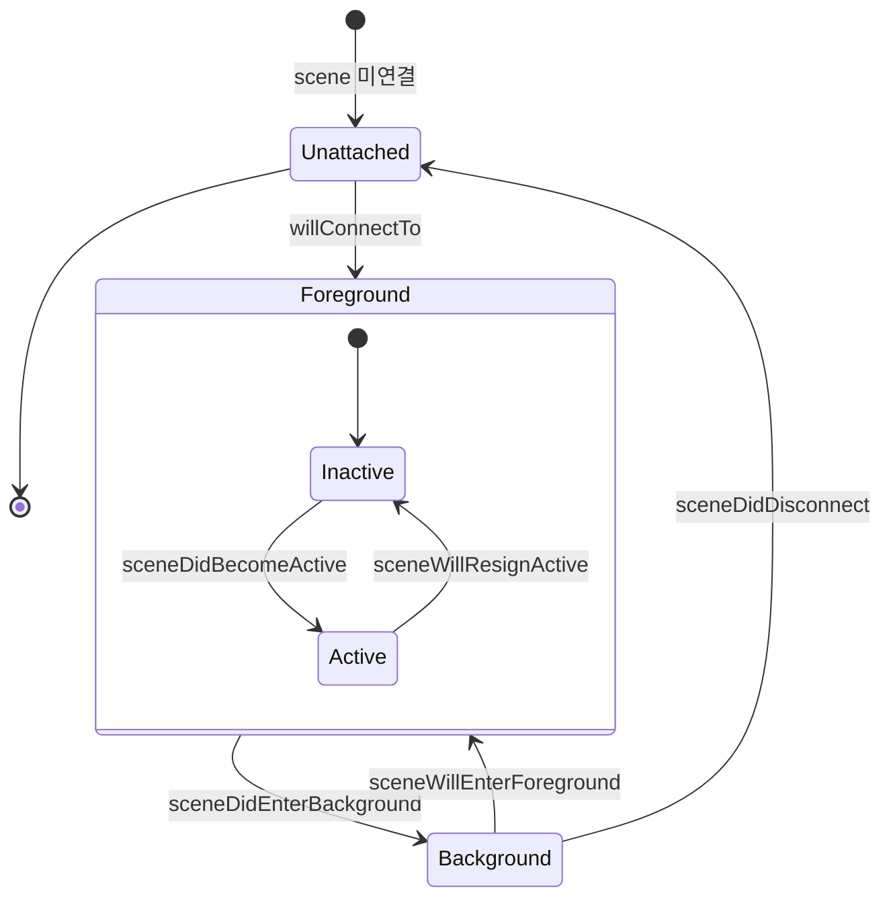

## 생명주기 단위는 앱이 아니라 scene 이며 한 앱이 여러 상태를 동시에 가질 수 있다

### 개념 (What)

iOS 13 이전에는 앱 하나가 화면 하나였다. `applicationDidEnterBackground` 는 "앱이 배경으로 갔다"는 뜻이었다.

멀티윈도우 이후에는 **scene 이 UI 의 단위**가 되었다. 한 앱이 iPad 에서 세 개의 창을 띄우면 scene 이 세 개이고, **각각 독립된 생명주기 상태**를 갖는다.

```
앱 프로세스 하나
├── Scene A: foregroundActive   (사용자가 보고 있음)
├── Scene B: foregroundInactive (Split View 의 비활성 쪽)
└── Scene C: background         (숨겨진 창)
```

즉 **"앱이 배경에 있다"는 말이 더 이상 하나의 상태를 가리키지 않는다.**

### 왜 필요한가 (Why)

1. **앱 단위 판단이 틀린다**: "배경으로 갔으니 타이머를 멈추자"를 앱 단위로 하면, 다른 창은 여전히 전경인데 멈춰 버린다.
2. **상태가 창마다 다르다**: 창 A 에서 편집 중인 문서와 창 B 에서 보고 있는 문서가 다르다. 전역 싱글턴에 "현재 문서"를 두면 창을 여는 순간 깨진다.
3. **프로세스는 하나다**: scene 이 여러 개여도 프로세스는 하나이므로 메모리와 [Jetsam 한도](../../01_system_internals/ipc-and-process/jetsam-memory-pressure-bands.md)를 공유한다. 창을 많이 열수록 종료 위험이 커진다.

### 상태와 전이



| 상태 | 의미 | 대표 상황 |
| :--- | :--- | :--- |
| `foregroundActive` | 보이고 이벤트를 받음 | 사용자가 조작 중 |
| `foregroundInactive` | 보이지만 이벤트를 못 받음 | 알림 오버레이, 전환 중, Split View 비활성 창 |
| `background` | 안 보임 | 다른 앱으로 전환, 창 숨김 |
| `unattached` | 아직 연결 안 됨 / 끊김 | 창 생성 전, 창 닫힘 후 |

**`foregroundInactive` 를 무시하면** 알림 배너가 뜬 동안 게임이 계속 진행되거나, Split View 의 비활성 창이 자원을 계속 쓴다.

### 실무 규칙

```swift
// ❌ 앱 단위로 판단 — 다른 창이 전경일 수 있다
func applicationDidEnterBackground(_ app: UIApplication) { stopTimer() }

// ✅ scene 단위로 판단
func sceneDidEnterBackground(_ scene: UIScene) { stopTimer(for: scene) }

// 전체 앱이 정말 배경인지 알아야 한다면 모든 scene 을 확인한다
var isAppFullyBackgrounded: Bool {
    UIApplication.shared.connectedScenes.allSatisfy { $0.activationState == .background }
}
```

**scene 별 상태 보관**

```swift
// scene 마다 자기 상태를 갖는다. 전역 싱글턴에 두면 창끼리 덮어쓴다.
final class SceneDelegate: UIResponder, UIWindowSceneDelegate {
    var documentID: UUID?          // 이 창이 보고 있는 문서
}
```

SwiftUI 에서는 `@Environment(\.scenePhase)` 가 **그 뷰가 속한 scene 의 상태**를 준다.

```swift
@Environment(\.scenePhase) private var scenePhase

.onChange(of: scenePhase) { _, phase in
    switch phase {
    case .active:   resume()
    case .inactive: pauseSensitiveUI()      // 스냅샷 대비 — 민감 정보 가리기
    case .background: saveState()
    @unknown default: break
    }
}
```

> [!IMPORTANT] `inactive` 에서 화면을 가려야 하는 이유
> 배경 전환 시 시스템이 **앱 전환기용 스냅샷**을 찍는다. 민감한 정보가 보이면 그대로 남는다. `inactive` 시점에 오버레이를 씌우는 것이 표준 대응이다.

### 관찰 가능한 증거

```swift
for scene in UIApplication.shared.connectedScenes {
    print(scene.session.persistentIdentifier, scene.activationState.rawValue)
}
```

```bash
log stream --device --predicate 'process == "SpringBoard"' --info | grep -i scene
```

**iPad 에서 Split View 로 같은 앱을 두 창 띄운 뒤** 한쪽만 조작해 보면 scene 단위 동작이 맞는지 즉시 드러난다.

### 연관 문서

- [AppDelegate 와 SceneDelegate 는 서로 다른 것을 소유한다](app-delegate-and-scene-delegate-own-different-things.md)
- [상태 복원은 스냅샷이 아니라 NSUserActivity 로 한다](state-restoration-uses-user-activity.md)
- [SpringBoard 와 FrontBoard 가 앱의 전경·배경 전이를 소유한다](../../01_system_internals/ipc-and-process/springboard-frontboard-lifecycle.md) - OS 쪽 관점
- [apple-ipados-multitasking](../../04_system_services/apple-ipados-multitasking.md)

공식 문서: [Scenes](https://developer.apple.com/documentation/uikit/scenes) · [scenePhase](https://developer.apple.com/documentation/swiftui/scenephase)
