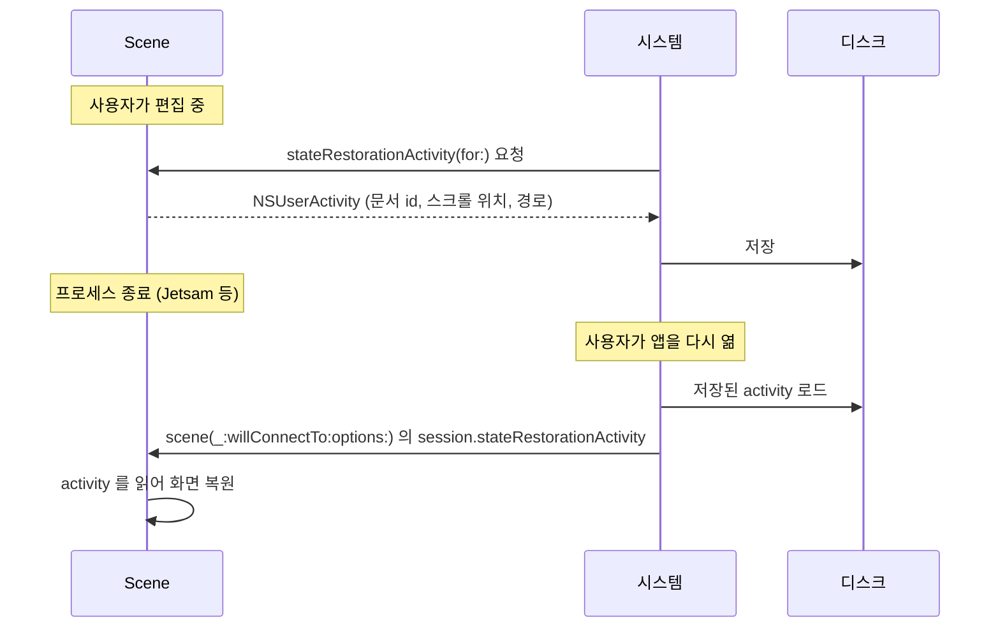

## 상태 복원은 스냅샷이 아니라 NSUserActivity 로 창마다 따로 한다

### 개념 (What)

앱 전환기에 보이는 화면은 **스냅샷 이미지**일 뿐 상태가 아니다. 시스템이 [메모리 압력으로 프로세스를 회수](../../01_system_internals/ipc-and-process/jetsam-memory-pressure-bands.md)하면 그 이미지 뒤의 상태는 사라진다. 사용자가 다시 열면 **콜드 스타트**다.

scene 기반 복원은 각 창이 자기 상태를 **`NSUserActivity`** 로 표현해 시스템에 맡기고, 다시 연결될 때 돌려받는 방식이다.

### 왜 필요한가 (Why)

1. **창마다 상태가 다르다**: 창 A 는 문서 1, 창 B 는 문서 2 를 보고 있다. 전역 저장으로는 표현할 수 없다.
2. **딥링크와 같은 통로**: `NSUserActivity` 는 Handoff·Spotlight·[유니버설 링크](../../00_foundations/worked-examples/03-universal-link-to-scene-restore.md)에도 쓰인다. 하나의 라우팅 코드를 재사용할 수 있다.
3. **시스템이 저장 시점을 정해 준다**: 앱이 "언제 저장할지" 고민하지 않아도 된다.

### 흐름



### 구현

```swift
final class SceneDelegate: UIResponder, UIWindowSceneDelegate {

    // 1) 시스템이 물어볼 때 현재 상태를 activity 로 표현한다
    func stateRestorationActivity(for scene: UIScene) -> NSUserActivity? {
        let activity = NSUserActivity(activityType: "com.example.editing")
        activity.userInfo = [
            "documentID": currentDocumentID.uuidString,
            "scrollOffset": currentScrollOffset,
            "path": encodedNavigationPath          // 내비게이션 경로까지
        ]
        return activity
    }

    // 2) 창이 연결될 때 돌려받는다
    func scene(_ scene: UIScene, willConnectTo session: UISceneSession,
               options: UIScene.ConnectionOptions) {
        // 우선순위: 딥링크 > 복원 > 기본 화면
        if let activity = options.userActivities.first {
            route(activity)                                  // 딥링크로 진입
        } else if let activity = session.stateRestorationActivity {
            restore(from: activity)                          // 이전 상태 복원
        } else {
            showDefault()
        }
    }
}
```

**우선순위 순서가 중요하다.** 사용자가 링크를 탭해 앱을 열었다면 복원보다 링크가 우선이다.

SwiftUI 에서는 `.onContinueUserActivity` 와 `@SceneStorage` 를 쓴다.

```swift
@SceneStorage("selectedTab") private var selectedTab: String = "home"
// scene 별로 자동 저장/복원된다. 값 타입 소량 데이터에 적합.
```

### 무엇을 저장할 것인가

**화면 객체가 아니라 그것을 다시 만들 수 있는 최소 데이터**를 저장한다.

| 저장한다 | 저장하지 않는다 |
| :--- | :--- |
| 문서/항목 식별자 | 문서 내용 전체 (원본에서 다시 읽는다) |
| 내비게이션 경로 | 뷰 컨트롤러 인스턴스 |
| 스크롤 위치, 선택 상태 | 이미지·캐시 |
| 편집 중인 텍스트 (**미저장 내용은 예외**) | 네트워크 응답 |

> [!IMPORTANT] 미저장 편집 내용은 별도로 저장한다
> `NSUserActivity` 는 크기 제한이 있고 시스템이 저장을 보장하지도 않는다. **사용자가 잃으면 안 되는 데이터**는 [앱 컨테이너에 직접 저장](../../01_system_internals/storage/app-container-directory-policies.md)하고, activity 에는 그것을 찾을 식별자만 넣는다.

### 테스트 방법 — 이것이 가장 자주 틀린다

**앱 전환기 스와이프로 테스트하면 안 된다.** 그것은 사용자 강제 종료(`0xdeadfa11`)이고, 시스템은 **의도적으로 상태를 복원하지 않는다.**

| 재현하려는 것 | 방법 |
| :--- | :--- |
| 정지 후 복귀 | 홈으로 나갔다 돌아오기 (복원 코드 실행 안 됨) |
| **시스템 회수 후 재실행** | Xcode 분리 → 배경 전환 → 다른 앱들로 메모리 압력 → 복귀 |
| Xcode 로 강제 재현 | 앱 실행 후 **Xcode 의 Stop 버튼**으로 종료 → 기기에서 다시 실행 |

세 번째가 가장 실용적이다. Xcode Stop 은 프로세스만 죽이므로 시스템은 복원을 시도한다.

### 관찰 가능한 증거

```swift
func stateRestorationActivity(for scene: UIScene) -> NSUserActivity? {
    print("복원 상태 저장 요청됨: \(Date())")   // 시스템이 언제 묻는지 확인
    return activity
}
```

```bash
log stream --device --predicate 'process == "SpringBoard"' --info | grep -i restor
```

### 연관 문서

- [생명주기 단위는 앱이 아니라 scene 이다](scene-is-the-lifecycle-unit-not-the-app.md)
- [AppDelegate 와 SceneDelegate 는 서로 다른 것을 소유한다](app-delegate-and-scene-delegate-own-different-things.md)
- [05-termination-recovery-of-edit-state](../../00_foundations/worked-examples/05-termination-recovery-of-edit-state.md)
- [NavigationStack 은 화면 스택이 아니라 경로 상태를 그린다](../swiftui/navigation-path-is-state.md)

공식 문서: [Restoring your app's state](https://developer.apple.com/documentation/uikit/restoring-your-app-s-state)
