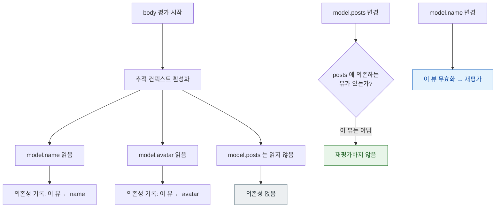

## AttributeGraph 는 diff 가 아니라 의존성 그래프로 무효화 범위를 정한다

### 개념 (What)

SwiftUI 가 "무엇을 다시 그릴지" 정하는 방식은 React 의 가상 DOM diff 와 다르다. 전체 트리를 만들어 비교하는 것이 아니라, **각 뷰가 실제로 읽은 값을 기록해 두는 의존성 그래프(AttributeGraph)** 를 유지한다.

- `body` 를 평가하는 동안 어떤 상태를 **읽으면** 그 뷰가 그 상태에 의존한다고 기록된다.
- 그 상태가 바뀌면 **기록된 뷰만** 무효화된다.

핵심은 **"읽었는가"** 다. 참조를 들고 있어도 읽지 않았으면 의존하지 않는다.

### 왜 필요한가 (Why)

1. **불필요한 재평가의 원인이 여기 있다**: 뷰가 예상보다 자주 다시 그려진다면, 대개 필요 없는 값까지 읽고 있는 것이다.
2. **`@Observable` 과 `ObservableObject` 의 결정적 차이**: 전자는 **프로퍼티 단위**로 의존성을 기록하고, 후자는 **객체 단위**로 기록한다.
3. **비용이 트리 크기가 아니라 의존성 폭에 비례한다**: 뷰가 1000 개여도 하나만 의존하면 하나만 갱신된다.

### 내부 메커니즘 (How)



### `@Observable` vs `ObservableObject`

```swift
// Legacy: 객체 단위 통지 — count 만 바뀌어도 name 만 읽는 뷰까지 갱신된다
final class LegacyModel: ObservableObject {
    @Published var name = ""
    @Published var count = 0
}

// iOS 17+: 프로퍼티 단위 추적 — name 을 읽은 뷰는 count 변경에 반응하지 않는다
@Observable final class Model {
    var name = ""
    var count = 0
}
```

| | `ObservableObject` | `@Observable` |
| :--- | :--- | :--- |
| 추적 단위 | **객체** | **프로퍼티** |
| 읽지 않은 값 변경 시 | 갱신됨 (낭비) | 갱신 안 됨 |
| 선언 | `@Published` 각각 | 매크로가 자동 처리 |

### 의존성을 좁히는 세 가지 방법

**1. 뷰를 쪼갠다** — 가장 효과가 크다

```swift
// ❌ 하나의 뷰가 모든 속성을 읽는다 → 무엇이 바뀌어도 전체 재평가
struct Dashboard: View {
    let model: Model
    var body: some View {
        VStack { Text(model.title); Chart(model.data); Footer(model.count) }
    }
}

// ✅ 각 하위 뷰가 자기가 쓰는 것만 읽는다
struct Dashboard2: View {
    let model: Model
    var body: some View {
        VStack { TitleView(model: model); ChartView(model: model); FooterView(model: model) }
    }
}
```

**2. 필요한 값만 전달한다** — 객체 대신 값을 넘기면 의존성이 명시적으로 좁아진다.

**3. `@Observable` 로 마이그레이션한다** — 프로퍼티 단위 추적으로 바뀐다.

### 관찰 가능한 증거

```swift
let _ = Self._printChanges()
```

출력의 의미:

| 출력 | 뜻 |
| :--- | :--- |
| `@self` | 뷰 값 자체가 달라짐 (부모가 다른 값을 넘김) |
| `@identity` | [identity 가 바뀜](view-identity-determines-state-lifetime.md) — 상태가 리셋된다 |
| `_propertyName` | 그 상태가 바뀌어 무효화됨 |

`@self` 가 반복해서 보이면 부모가 매번 다른 값을 만들어 넘기고 있다는 뜻이다.

### 연관 문서

- [SwiftUI 의 View 는 화면 객체가 아니라 화면을 서술한 값이다](view-is-a-value-not-an-object.md)
- [소유 관계에 따라 property wrapper 를 고른다](state-ownership-property-wrappers.md)
- [apple-observation-framework](../../01_language_concurrency/apple-observation-framework.md) - `@Observable` 매크로 내부
- [히치는 평균 FPS 가 아니라 사용자가 실제로 본 지연을 잰다](../../01_system_internals/graphics-and-media/hitches-measure-user-visible-jank.md)

공식 문서: [Observation](https://developer.apple.com/documentation/observation) · [WWDC 2023: Discover Observation in SwiftUI](https://developer.apple.com/videos/play/wwdc2023/10149/)
