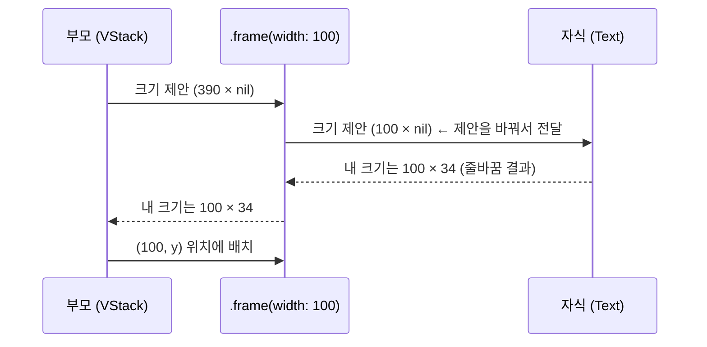

## SwiftUI 레이아웃은 부모 제안·자식 선택·부모 배치의 3단계 협상이다

### 개념 (What)

Auto Layout 은 **제약 시스템을 풀어** 크기를 정한다. SwiftUI 는 다르다. 부모와 자식이 **정해진 3단계 대화**를 나눌 뿐이며, 방정식을 풀지 않는다.

1. **부모가 크기를 제안한다** (`ProposedViewSize`)
2. **자식이 자기 크기를 스스로 정한다** — 제안을 따를 수도, 무시할 수도 있다
3. **부모가 자식을 배치한다**

결정권은 **자식에게** 있다. 부모는 제안만 할 뿐 강제하지 못한다. 이 한 문장이 SwiftUI 레이아웃 디버깅의 거의 전부다.

### 왜 필요한가 (Why)

"왜 이 뷰가 내가 원하는 크기가 안 되지"의 답은 항상 셋 중 하나다.

- 부모가 그 크기를 **제안하지 않았다**
- 자식이 제안을 **무시하고 자기 크기를 골랐다**
- 중간 modifier 가 **제안을 바꿔서 전달했다**

### 자식이 제안에 반응하는 방식

| 뷰 | 제안에 대한 반응 |
| :--- | :--- |
| `Text` | 제안 폭 안에서 줄바꿈해 **필요한 만큼만** 차지 |
| `Image` | 기본은 제안을 **무시하고** 원본 크기 (`.resizable()` 이면 제안을 따름) |
| `Color`, `Rectangle` | 제안을 **전부** 차지 |
| `Spacer` | 남는 공간을 차지 |
| `VStack`/`HStack` | 자식들에게 나눠 제안한 뒤 합산 |
| `.frame(width:height:)` | 자식에게 그 크기를 제안하고, **자기는 그 크기**가 됨 |



**`.frame` 은 자식을 강제하지 않는다.** 자식에게 그 크기를 *제안*하고, 자식이 무시해도 `.frame` 자신은 지정된 크기를 차지한다. 그래서 자식이 프레임 밖으로 삐져나올 수 있다.

### 제안 크기의 세 가지 특수값

| 제안 | 의미 | 어디서 |
| :--- | :--- | :--- |
| `nil` (unspecified) | "네가 원하는 만큼" | `fixedSize()`, ScrollView 의 스크롤 축 |
| `.zero` | "최소로 줄이면 얼마?" | 레이아웃 계산 중 |
| `.infinity` | "최대로 늘리면 얼마?" | `.frame(maxWidth: .infinity)` |

`.frame(maxWidth: .infinity)` 가 "꽉 채우기"로 동작하는 이유는 **부모의 제안을 그대로 자식에게 넘기면서 자기는 최대를 취하기** 때문이다.

### 자주 겪는 상황

```swift
// 텍스트가 잘린다 → 부모가 충분한 폭을 제안하지 않았다
Text("아주 긴 문장").fixedSize(horizontal: false, vertical: true)
// fixedSize: "제안을 무시하고 이상적 크기를 써라"

// 이미지가 화면을 뚫는다 → Image 는 기본적으로 제안을 무시한다
Image("photo").resizable().scaledToFit()

// 버튼 두 개를 같은 폭으로 → 각자 maxWidth 로 남는 공간을 균등 요구
HStack {
    Button("취소") { }.frame(maxWidth: .infinity)
    Button("확인") { }.frame(maxWidth: .infinity)
}
```

### 관찰 가능한 증거

```swift
// 실제로 어떤 크기가 정해졌는지 오버레이로 확인
.overlay(GeometryReader { g in
    Color.clear.onAppear { print("실제 크기: \(g.size)") }
})

// 경계를 눈으로 보기
.border(.red)
```

Xcode 의 **View Debugger**(Debug > View Debugging > Capture View Hierarchy)로 SwiftUI 뷰의 실제 프레임을 계층별로 확인할 수 있다. `.border()` 를 여러 겹 붙여 어느 단계에서 크기가 달라지는지 좁히는 것이 가장 빠른 진단이다.

### 연관 문서

- [modifier 는 뷰를 감싸므로 순서가 의미를 바꾼다](modifier-order-changes-semantics.md)
- [SwiftUI 의 View 는 화면 객체가 아니라 화면을 서술한 값이다](view-is-a-value-not-an-object.md)
- [Auto Layout 은 제약 시스템을 푼다](../uikit/autolayout-solves-a-constraint-system.md) - UIKit 의 다른 접근

공식 문서: [Layout](https://developer.apple.com/documentation/swiftui/layout) · [WWDC 2022: Compose custom layouts with SwiftUI](https://developer.apple.com/videos/play/wwdc2022/10056/)
